# Model

Het staat model voor digitale tuintjes welke bij 'Het web is voor iedereen' door studenten worden gemaakt.

## Learning Log

### 10 sept - Huiswerk voor Workshop 3

<strong>Opdracht 11 - Uitgangspunten voor schetsen</strong>

Voor deze opdracht moest ik ideeën uit mijn Crazy 8 kiezen en deze verder uitwerken naar vijf mobile-first schetsen. Hierbij moest ik niet meer alleen snel ideeën tekenen, maar beter nadenken over hoe de schermen echt zouden werken. Ik moest uitgaan van een single column, realistische verhoudingen en de echte hoeveelheid content. Ook moest ik rekening houden met leesbaarheid, ongeveer 35 tekens per regel, een font-size van minimaal 16px/1em en voldoende ruimte tussen elementen. De inzichten uit mijn Visual Research, Crazy 8 en de beoordeling daarvan moest ik hierin meenemen.

Ik heb schetsen gemaakt van zowel mijn homescherm als verschillende pagina's waar je terechtkomt wanneer je op onderdelen van het homescherm klikt. Hiervoor heb ik de afmetingen van mijn eigen telefoon aangehouden, zodat ik beter kon inschatten hoeveel ruimte ik daadwerkelijk op een mobiel scherm heb en de verhoudingen realistischer kon tekenen.

Bij het uitwerken heb ik ook opnieuw gekeken naar mijn Crazy 8-beoordeling en geprobeerd mijn ontwerpen zo webby mogelijk te maken. Mijn homescherm heb ik bijvoorbeeld veranderd naar een close-up van een bureau met verschillende muziekgerelateerde objecten. Deze objecten zijn grote klikbare elementen, waardoor ze niet alleen onderdeel zijn van de omgeving, maar ook als navigatie werken en makkelijker te bedienen zijn op mobiel. Bovenaan heb ik daarnaast een horizontaal scrollbaar menu toegevoegd. Zo hoeft een gebruiker niet per se via de objecten te zoeken, maar kan die ook direct naar een onderdeel navigeren.

Ook heb ik mijn Visual Research verder verwerkt. De nostalgische sfeer komt bijvoorbeeld terug in de Polaroids en oude muziekobjecten. Bij de Polaroids heb ik nu ook daadwerkelijk nagedacht over de content die erin komt, zoals een herinnering, jaartal en bijbehorend nummer. De warme, persoonlijke en cozy uitstraling uit mijn Visual Research wil ik later verder versterken met warme kleuren, licht en de visuele effecten die ik eerder heb onderzocht.

Daarnaast heb ik kennis uit mijn deep dives meegenomen. Zo heb ik bij mijn Aura-pagina een idee uit de deep dive over kleur verder toegepast: ik wil een gekleurde gloed maken die pulseert en zo mijn muziekaura voorstelt. Bij andere schermen heb ik nagedacht over beweging, bijvoorbeeld een draaiende plaat en kaarten die je kunt doorbladeren. Hierdoor wordt de Garden niet alleen visueel, maar ook interactief en dynamisch.

Tot slot heb ik bewuster gekeken naar visuele hiërarchie: wat is de titel, wat is ondersteunende tekst, wat moet als eerste opvallen en waar zitten de interactieve onderdelen? Door mijn Crazy 8 niet letterlijk over te nemen, maar deze te combineren met de feedback uit de beoordeling, mijn Visual Research en technieken uit de deep dives, zijn de schetsen een concretere en beter onderbouwde versie van mijn eerste ideeën geworden.

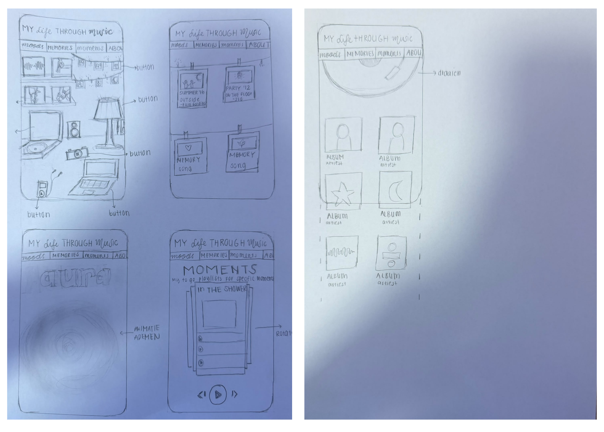

### 9 sept - Workshop 2

<strong>Presentatie</strong>

Mijn presentatie staat hier

[Bekijk mijn presentatie](oefeningen/presentatie/index.html)

#### Vragen na de presentatie

Na mijn presentatie heeft Dewi wat vragen gesteld die ik heb beantwoord:

<strong> 1. Wat ben je door het verzamelen van je inspiratie over je onderwerp te weten gekomen? </strong> 
Ik kwam er vooral achter dat mijn beleving van muziek veel breder is dan alleen welke artiesten of nummers ik leuk vind. Ik had er eerst nooit zo over nagedacht en had ook niet door dat muziek zo grote impact heeft op mijn leven. Muziek zit eigenlijk in heel veel dagelijkse momenten en is voor mij zowel digitaal als fysiek.

<strong> 2. Hoe wil je voorkomen dat je Digital Garden gewoon een website over je favoriete muziek wordt? </strong> 
Door niet alleen artiesten en nummers te laten zien, maar vooral mijn eigen ervaringen centraal te zetten. Dus bijvoorbeeld wanneer ik muziek luister, welke herinneringen erbij horen, concerten waar ik ben geweest, karaoke vanuit mijn cultuur en het zelf maken van muziek.

<strong> 3. Welke inspiratie kun je uit je afbeeldingen halen? Stijl, gevoel, vorm enz. </strong> 
Uit mijn afbeeldingen haal ik vooral inspiratie uit de verschillende sferen die muziek voor mij kan hebben. In mijn concertfoto's zie je bijvoorbeeld veel donkere achtergronden met felle en gekleurde verlichting. Andere foto's zijn juist rustiger en persoonlijker. Het is niet 1 vibe zegmaar, maar meerdere vibes.

Ook zie ik veel dingen terug die ik later misschien als vorm of interactie kan gebruiken, zoals albumcovers, Spotify, vinylplaten, muziekspelers, soundwaves en knoppen zoals play en pause.

<strong> 4. Vul deze zin aan: </strong> 
<strong>Ik wil mijn Digital Garden laten gaan over...</strong> 
mijn persoonlijke beleving van muziek en de verschillende manieren waarop muziek onderdeel is van mijn leven.

<strong>...en wil dat laten zien door ... aan content te tonen.</strong> 
eigen foto's, muziek, herinneringen, concerten, albumcovers, artiesten, korte teksten en interactieve elementen.

<strong>Ik begin met een stukje eigen content over...</strong> 
muziek in mijn dagelijks leven en de verschillende momenten waarop muziek bij mij aanwezig is.

<strong>Als het begin is gemaakt kan ik mijn Garden verder uitbreiden door...</strong> 
steeds meer persoonlijke herinneringen, muziekfases, concerten, moods, karaoke, instrumenten en andere ervaringen met muziek toe te voegen.

<strong> 5. Wat is het karakter/de uitstraling/het gevoel dat bij het onderwerp past? </strong> 
Ik denk dat mijn onderwerp vooral persoonlijk, nostalgisch en levendig moet voelen en gewoon een warm cozy gevoel krijg wanneer je op de website kijkt. Aan de ene kant heb ik rustige en emotionele kanten van muziek, bijvoorbeeld muziek die bij herinneringen hoort. Aan de andere kant heb ik juist hele energieke dingen zoals concerten, dansen en karaoke. Ik wil die verschillende gevoelens uiteindelijk ook terug laten komen in mijn Digital Garden.

<strong>Visual Research</strong>

#### Opdracht 5 - Een sfeerwoord als uitgangspunt

Voor het visuele onderzoek moest ik eerst sfeerwoorden kiezen die passen bij mijn onderwerp My Life Through Music. Ik heb gekozen voor nostalgisch, levendig en comfortabel/cozy. Nostalgisch omdat muziek mij terugbrengt naar herinneringen en bepaalde periodes in mijn leven, levendig omdat muziek mij veel energie kan geven maar mij ook gewoord alive laat voelen en comfortabel/cozy omdat muziek voor mij ook vertrouwd en ontspannend voelt. Ik hou ervan om altijd muziek aan te hebben, ook instrumenteel, en dat geeft mij gewoon een warm en cozy gevoel. Vanuit deze drie woorden ben ik verdergegaan met mijn visuele onderzoek.

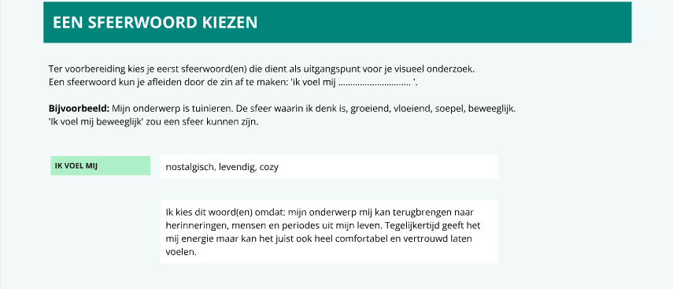

#### Opdracht 6 – Directe visuele vertaling

Bij deze opdracht moest ik vanuit mijn sfeerwoorden op zoek gaan naar beelden die daar voor mij direct bij passen. Voor levendig heb ik vooral beelden gekozen met veel beweging, zoals dansende en bewegende mensen, concerten, vuurwerk en andere beelden waar veel energie in zit. Voor comfortabel/cozy kwam ik juist veel uit op warme oranje en bruine kleuren, lichtjes, kaarsen en gezellige kamers. Daar krijg ik gewoon een warm en cozy gevoel mij. Bij nostalgisch heb ik meer gekeken naar een retro en oude uitstraling, zoals een platenspeler, een oude muziekspeler, grainy foto's en foto's die een beetje vervaagd of onscherp zijn. Zo begon ik ook steeds meer overeenkomsten tussen de beelden te zien.

#### Opdracht 7 – Directe visuele vertaling

Daarna moest ik de kenmerken uit opdracht 6 abstracter gaan vertalen naar vorm, kleur en typografie. Ik heb daarom typografische en grafische posters verzameld die aansloten bij mijn sfeerwoorden. Ik koos veel posters met blur en vervormde of golvende typografie, omdat dit voor mij het levendige en de beweging uit mijn eerdere beelden terugbrengt. Grain en vervaagde effecten heb ik gekozen omdat dit een wat oudere en nostalgische uitstraling geeft. Daarnaast kwamen warme oranje, rode en bruine kleuren veel terug, omdat deze voor mij juist het comfortabele en cozy gevoel geven. Zo heb ik mijn sfeerwoorden omgezet naar kenmerken die ik later kan gebruiken in mijn ontwerp.

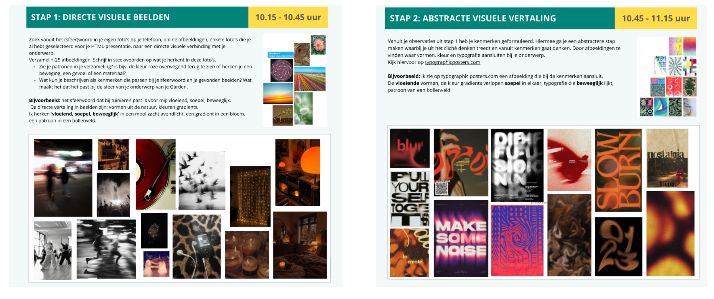

#### Opdracht 8 – Uitgangspunten voor schetsen

Bij deze opdracht moest ik uit mijn abstracte vertaling vier posters kiezen die mij het meest inspireerden. Per poster heb ik gekeken welke kenmerken passen bij mijn sfeerwoorden, hoe ik deze kenmerken kan gebruiken in mijn ontwerp en wat ik hiermee concreet zou kunnen gaan schetsen. Zo heb ik mijn visuele onderzoek vertaald naar echte uitgangspunten voor mijn ontwerp. De bijbehorende uitleg per poster is te zien in de afbeeldingen hieronder.

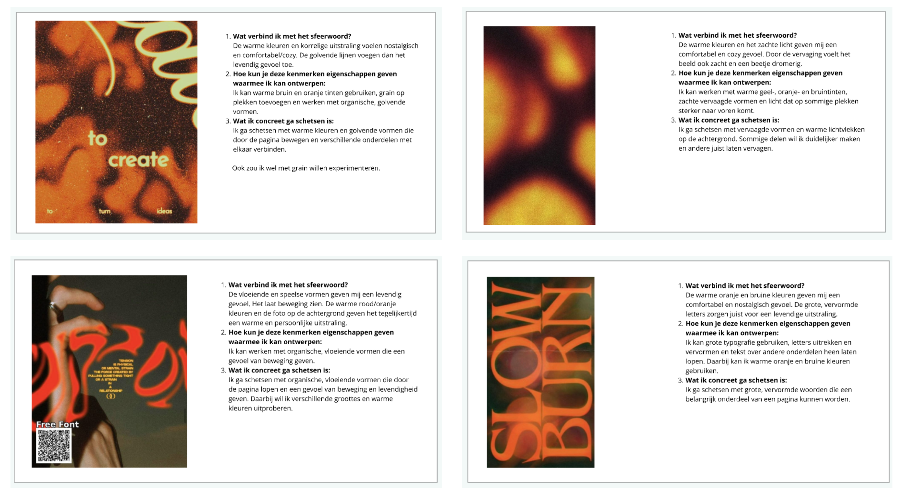

<strong>Crazy 8</strong>

#### Opdracht 9 – Schetsoefening Crazy 8

<strong>Mijn eerste crazy 8</strong> 
Hierna heb ik de Crazy 8 gedaan. Hierbij moest ik in korte tijd verschillende ideeën schetsen, ongeveer 40 seconden per schets. Ik heb hierbij mijn sfeerwoorden als uitgangspunt gebruikt. Voor nostalgisch heb ik bijvoorbeeld Polaroids aan een lijn getekend waar ik herinneringen en muziek aan kan koppelen, een tijdlijn waar je doorheen kan scrollen en oude LP’s die over elkaar liggen die je kan aanklikken. Voor levendig heb ik juist gekeken naar beweging, zoals een draaiende platenspeler en golvende vormen voor knoppen. Zo heb ik snel verschillende manieren bedacht waarop mijn sfeerwoorden terug kunnen komen in mijn Garden.

<strong>Mijn tweede crazy 8</strong> 
De dag daarna ben ik opnieuw naar mijn Crazy 8 gaan kijken en merkte ik dat deze nog niet helemaal compleet voelde. Ik had namelijk vooral schermen geschetst die je te zien krijgt nadat je ergens op hebt geklikt, maar nog niet echt onderzocht hoe mijn homescherm/beginscherm eruit zou kunnen zien. Daarom heb ik nog een Crazy 8 gedaan, maar dit keer alleen gericht op verschillende mogelijkheden voor mijn homepage. Ook hierbij heb ik weer ongeveer 40 seconden per schets gebruikt, zodat ik snel ideeën op papier kon zetten zonder er te lang over na te denken.

Ik ben hierbij eerst teruggegaan naar de uitkomsten van mijn Visual Research. Bij mijn eerste schetsen heb ik vooral gekeken naar het sfeerwoord comfortabel/cozy. Daarom heb ik bijvoorbeeld kamers en een bureauomgeving getekend waarin alle verschillende objecten klikbare onderdelen kunnen zijn. In de uiteindelijke vormgeving zou ik dit willen versterken met warme verlichting en vooral oranje en bruine kleuren, die ook veel terugkwamen in mijn Visual Research.

Daarna ben ik meer gaan kijken naar nostalgie. Zo heb ik een idee gemaakt waarbij LP's naast elkaar de verschillende menu-items vormen. Ook heb ik een wat rommeligere verzameling van objecten geschetst, zoals een iPod, LP, camera en piano. Deze objecten verwijzen naar verschillende onderdelen van mijn muziekbeleving en geven tegelijkertijd die oudere en persoonlijke uitstraling die ik bij mijn visuele onderzoek had gevonden.

Tijdens het snel schetsen ontstonden vervolgens ook ideeën die ik vooraf nog niet had bedacht. Zo heb ik bijvoorbeeld een homepage gemaakt die lijkt op een playlist, een indeling met verschillende albumcovers en een ontwerp met een grote koptelefoon waarbij je tijdens het scrollen het snoer volgt en onderweg verschillende menu-items tegenkomt.

Door deze tweede Crazy 8 merkte ik dus dat mijn Visual Research vooral als startpunt werkte, maar mij niet beperkte tot alleen die eerste ideeën. De warme kleuren, nostalgische objecten, beweging en vloeiende vormen gaven mij een richting om vanuit te beginnen. Door daarna snel verschillende composities te schetsen, ontstonden vanzelf weer nieuwe ideeën en manieren van navigeren. Hierdoor heb ik uiteindelijk veel verschillende mogelijkheden voor mijn homepage kunnen onderzoeken in plaats van meteen vast te blijven zitten aan mijn eerste idee.

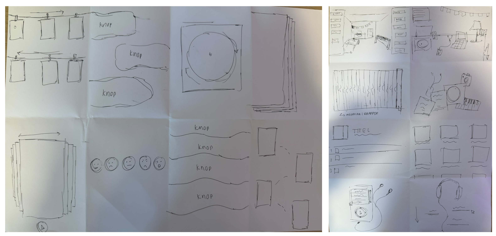

#### Opdracht 10 – Crazy 8 beoordelen

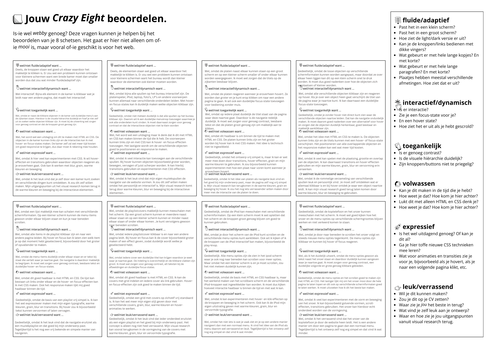

<strong>Checkout</strong>

<strong> 1. Leg uit waar het Visual Research in 3 stappen naartoe werkt </strong> 
Het Visual Research helpt mij om vanuit mijn sfeerwoorden uiteindelijk tot concrete ontwerpkeuzes te komen. Ik ben begonnen met directe beelden, heb deze daarna vertaald naar abstracte kenmerken zoals kleur, vorm en typografie en heb daar uiteindelijk uitgangspunten van gemaakt waarmee ik kon gaan schetsen.

<strong> 2. Vertel in 2 zinnen waar jouw Garden over gaat, en met welke content je dat gaat doen (beeld, tekst, sound, animatie enz).</strong> 
Mijn Garden My Life Through Music gaat over hoe muziek onderdeel is van mijn leven en verbonden is aan herinneringen, momenten, ervaringen en mensen. Daarnaast wil ik mijn eigen muzieksmaak delen, zoals mijn favoriete nummers en artiesten, muziek die ik zou aanraden, maar ook dingen die ik juist helemaal niet leuk vind. Hiervoor wil ik onder andere foto's, tekst, muziek/sound, animaties en interactieve elementen gebruiken.

<strong> 3. Vertel kort welk idee van de Crazy 8 je het liefst zou willen uitvoeren/ verder zou willen onderzoeken.</strong> 
Ik wil vooral het idee van de interactieve kamer verder onderzoeken. Hierbij kunnen verschillende objecten in de kamer als navigatie werken en wil ik met warme kleuren en licht een cozy sfeer creëren. Ik vind dit interessant omdat bezoekers hierdoor zelf kunnen rondkijken en mijn Garden kunnen ontdekken in plaats van alleen een standaard menu te volgen.

### 8 sept - Deepdive

<strong>Light & Dark Theme</strong>

Vandaag ben ik begonnen met de deep dive Light and Dark themes. Voordat ik aan de eerste oefening begon, heb ik eerst de twee teksten gelezen die erbij stonden. Bij custom properties herkende ik eigenlijk bijna alles al, omdat ik hier tijdens de vorige deep dive over fonts, kleuren en effecten ook al mee had gewerkt. Daardoor snapte ik dit gedeelte vrij snel.

Daarna heb ik de intro over Light and Dark themes gelezen. Hier werd vooral uitgelegd hoe je in CSS een light en dark theme kunt maken en hoe je ervoor zorgt dat de website rekening houdt met de voorkeur van de gebruiker. Hierbij werd onder andere uitgelegd hoe color-scheme, light-dark() en @media (prefers-color-scheme: dark) werken.

Met deze informatie kon ik oefening 1 gaan maken

#### Oefening 1

Bij oefening 1 moest ik zelf een light en dark theme maken. Ik ben daarom eerst kleuren gaan kiezen die goed bij elkaar passen en waarbij er ook echt een duidelijk verschil te zien is tussen de lichte en donkere versie. Ik wilde wel dat beide themes dezelfde uitstraling en dezelfde soort kleuren behielden, zodat het nog steeds als één ontwerp voelde.

n het begin kreeg ik het alleen niet meteen werkend. Zoals je op de afbeelding kunt zien, had ik bij mijn custom properties light dark() geschreven met een spatie ertussen. Daardoor werden mijn kleuren niet goed gelezen en veranderde het theme dus niet zoals ik wilde. Ik heb hier best even naar moeten zoeken voordat ik doorhad dat het light-dark() moest zijn. Nadat ik dit had aangepast werkte het wel.

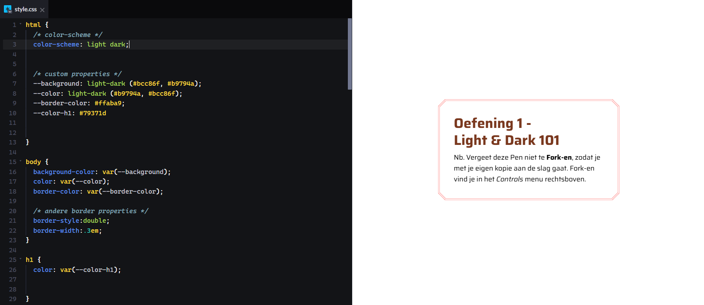

In het begin kreeg ik het alleen niet meteen werkend. Zoals je op de eerste afbeelding kunt zien, had ik bij mijn custom properties light dark() geschreven met een spatie ertussen. Daardoor werden mijn kleuren niet goed gelezen en veranderde het theme dus niet zoals ik wilde. Ik heb hier best even naar moeten zoeken voordat ik doorhad dat het light-dark() moest zijn. Nadat ik dit had aangepast werkte het wel.

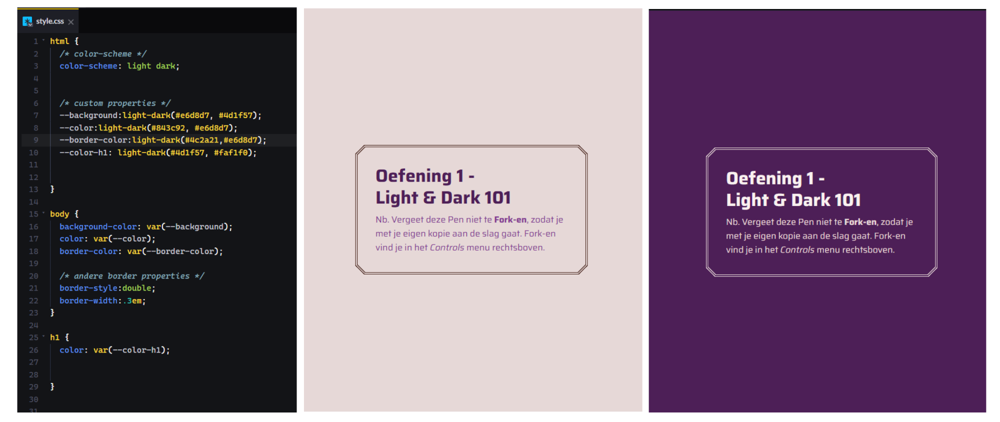

#### Oefening 2

Bij deze opdracht moest ik een light en dark theme maken voor de kattenwinkel. Hierbij moest ik de custom properties in de html-selector definiëren en deze daarna op de juiste plekken in mijn CSS gebruiken.

Deze opdracht ging een stuk makkelijker dan de eerste oefening. Bij oefening 1 had ik al ontdekt welke fout ik maakte met light-dark() en daardoor wist ik nu meteen hoe ik dit goed moest schrijven.

Ik heb aparte properties gemaakt voor de achtergrond, header en verschillende tekstkleuren. Hier moest ik wel voor terug in de HTML kijken, om te kijken wat voor selector er voor wat was gebruikt zodat ik dat in mijn CSS kon targeten. Per property heb ik met light-dark() een kleur voor de lichte en donkere versie ingesteld. Daarna heb ik die properties gekoppeld aan de juiste onderdelen, zoals body, header en de headings. Hierdoor merkte ik dat ik de theorie uit de eerste tekst nu echt beter begon toe te passen en beter wist hoe de opbouw van zo’n light en dark theme in CSS werkt.

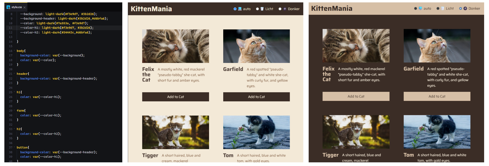

#### Voorbereiding oefening 3

Voordat ik aan de volgende opdracht begon, heb ik eerst de tekst over responsive afbeeldingen gelezen. Hier heb ik vooral geleerd dat je niet alleen rekening moet houden met light en dark mode, maar ook met verschillende schermgroottes. Met het <picture>-element en meerdere <source>-elementen kun je bepalen welke afbeelding er wordt gebruikt op bijvoorbeeld een klein of groot scherm. Met media queries kun je daar voorwaarden aan koppelen, zoals de breedte van het scherm of prefers-color-scheme.

Ik vond dit eigenlijk best interessant, omdat ik hier in jaar 1 nog helemaal niet echt mee bezig was. Daardoor kon een website die er op mijn laptop goed uitzag, er op een groter scherm ineens heel anders uitzien. Nu begrijp ik beter dat je bij het ontwerpen en bouwen rekening moet houden met verschillende devices en situaties, zodat je website niet alleen op je eigen scherm goed werkt.

Daarnaast heb ik geleerd dat je afbeeldingen en iconen ook kunt aanpassen aan light en dark mode. Dat kan bijvoorbeeld met een inline SVG, een CSS-filter of met verschillende afbeeldingen binnen een <picture>-element. Vooral het responsive gedeelte vond ik handig om te leren, omdat ik dit later kan gebruiken om ervoor te zorgen dat mijn website op meerdere apparaten goed blijft werken.

#### Oefening 3

Daarna ben ik verdergegaan met oefening 3, waarbij ik de theorie over responsive afbeeldingen en light/dark mode moest toepassen. Voor deze opdracht moest ik van één afbeelding in totaal vier varianten maken: een grote lichte versie, een grote donkere versie, een kleine lichte versie en een kleine donkere versie. De lichte afbeelding hadden we al gekregen en met AI heb ik daar een donkere variant van gemaakt. Daarna heb ik van beide versies ook nog een kleinere variant gemaakt.

Vervolgens heb ik deze vier afbeeldingen in mijn project gezet en gebruikt binnen een <picture>-element. Ik heb hierbij met <source> aangegeven welke afbeelding gebruikt moet worden op basis van de schermgrootte en of de gebruiker een light of dark theme heeft ingesteld. Voor de donkere versies heb ik prefers-color-scheme: dark gebruikt en voor de grotere afbeeldingen heb ik ook een voorwaarde met de breedte van het scherm toegevoegd.

Ik wist deze code nog niet helemaal uit mijn hoofd, dus ik heb het voorbeeld uit de theorie erbij gehouden. Vanuit dat voorbeeld heb ik de structuur overgenomen en daarna mijn eigen bestandsnamen en voorwaarden ingevuld. Hierdoor begreep ik wel beter hoe de verschillende <source>-regels samenwerken en dat de browser uiteindelijk zelf de afbeelding kiest die het beste past bij de situatie van de gebruiker.

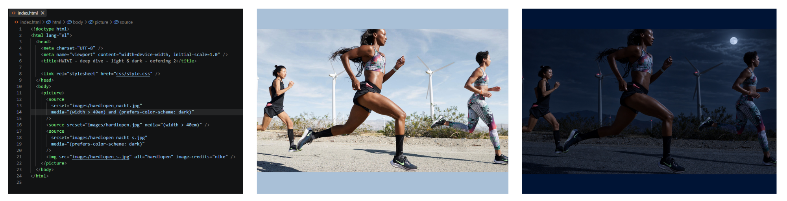

### 7 sept - Workshop 1

<strong>Sprintplanning</strong>

<strong>Verkenning onderwerp</strong>

#### Opdracht 1 – Rangschikken

#### Opdracht 2 – Eigen verkenning

<strong>Vanuit de inventarisatie</strong>

Voor mijn Digital Garden wil ik iets maken rondom muziek en hoe muziek een rol speelt in mijn leven. Ik heb voor dit idee gekozen omdat muziek echt een dagelijks onderdeel van mijn leven is. Er staat bijna de hele dag wel muziek aan in mijn kamer, maar ook als ik onderweg ben luister ik eigenlijk altijd wel naar muziek. Daarom leek het me leuk om mijn Digital Garden hierover te maken en te laten zien welke rol muziek in mijn dagelijks leven speelt. Ik wil niet alleen mijn favoriete nummers en artiesten laten zien, maar vooral laten zien welke muziek ik luister op verschillende momenten, welke gevoelens ik bij muziek krijg en welke herinneringen ik aan bepaalde nummers heb.

Tijdens het bekijken van de verschillende websites zag ik veel interactieve elementen en websites die bijna als een soort eigen wereld of kamer waren opgebouwd. Je navigeerde niet alleen via een standaard menu, maar kon op verschillende onderdelen en voorwerpen klikken om weer ergens anders terecht te komen. Dat vond ik heel leuk, omdat je hierdoor zelf de website kunt ontdekken en niet één vaste route hoeft te volgen.

Hierdoor kwam ik op het idee om mijn Digital Garden misschien ook als een soort interactieve kamer rondom muziek te maken. In de kamer zouden dan verschillende voorwerpen kunnen staan, zoals een koptelefoon, cd's, posters of een platenspeler, die je naar verschillende onderdelen van mijn garden brengen.

Dit is voor nu nog maar een idee en ook wel een uitdaging, omdat ik nog niet goed weet hoe ik zoiets moet maken met HTML en CSS. Juist daarom lijkt het me interessant om tijdens deze sprint te kijken hoeveel hiervan mogelijk is en wat ik zelf kan leren maken.

<strong>Welke webby dingen wil ik gebruiken?</strong>

Bij de websites die ik heb bekeken vond ik het vooral leuk als je niet meteen wist wat er allemaal te vinden was en zelf dingen moest ontdekken. Dat wil ik ook in mijn website verwerken en ik wil het natuurlijk zo webby mogelijk maken.

Ik wil bijvoorbeeld gebruikmaken van hover-effecten, klikbare voorwerpen, animaties en verschillende pagina's die met elkaar verbonden zijn. Ook lijkt het me leuk als bepaalde dingen pas zichtbaar worden wanneer je erop klikt of er met je muis overheen gaat. De garden hoeft hierdoor niet in één vaste volgorde bekeken te worden. Je kunt zelf bepalen waar je naartoe gaat en misschien ook verborgen dingen tegenkomen.

<strong>Eigen content, toon, context en doel</strong>

Mijn onderwerp is muziek, maar vooral mijn eigen ervaring met muziek. Ik wil bijvoorbeeld iets vertellen over:

- muziek die bij verschillende moods past
- muziek die ik op bepaalde momenten luister, zoals tijdens het studeren, klaarmaken of 's avonds
- nummers waar ik herinneringen aan heb
- mijn favoriete artiesten en nummers
- muziekfases die ik heb gehad
- nummers die ik vroeger veel luisterde
- nummers die ik nooit skip
- muziek die ik op dit moment veel luister
- guilty pleasures

De toon wil ik persoonlijk, casual en soms een beetje grappig houden. Het moet niet voelen alsof ik informatie over muziek probeer uit te leggen. Het doel is juist dat iemand door mijn garden een beetje kan ervaren hoe ik muziek beleef en welke plek muziek in mijn leven heeft.

<strong>Content van anderen</strong>

Ik zal waarschijnlijk ook content van anderen gebruiken, omdat mijn onderwerp muziek is. Denk bijvoorbeeld aan albumcovers, artiesten, songtitels, links naar muziek en misschien korte verwijzingen naar lyrics. Daarbij wil ik steeds duidelijk maken van wie de originele content is en waar het vandaan komt.

Ik wil die content niet zomaar verzamelen en neerzetten, maar er mijn eigen verhaal en ervaring aan toevoegen. Een albumcover staat er bijvoorbeeld niet alleen omdat ik hem mooi vind, maar omdat ik vertel wat dat album voor mij betekent of waar het mij aan doet denken.

<strong>Hoe kan mijn content worden ervaren?</strong>

Ik wil dat mijn garden niet alleen iets is wat je leest en bekijkt, maar iets waar je zelf doorheen kunt gaan en dingen kunt ontdekken.

Muziek kan natuurlijk ook echt gehoord worden, bijvoorbeeld doordat je nummers kunt afspelen of via links kunt beluisteren. Visueel wil ik verschillende gevoelens en soorten muziek ook anders laten aanvoelen met kleur, typografie, afbeeldingen en beweging.

Bij rustige of late-night muziek kan een gedeelte bijvoorbeeld donkerder en rustiger zijn, terwijl muziek voor tijdens het klaarmaken juist drukker en vrolijker kan voelen. Door te klikken, hoveren en zelf een route door de garden te kiezen wil ik ervoor zorgen dat iedere bezoeker mijn muziekwereld op zijn eigen manier kan ontdekken.

<strong>Checkout</strong>

<strong>1. Leg uit wat een digital garden is en waarom dat anders is dan een reguliere website.</strong>
Een digital garden is eigenlijk een soort online plek waar je allemaal dingen verzamelt die je interessant vindt of waar je mee bezig bent. Het hoeft niet allemaal helemaal af te zijn en je kan dingen steeds blijven aanpassen of uitbreiden. Bij een normale website is alles vaak veel meer af en heeft het een duidelijke structuur waar je als bezoeker doorheen gaat. Bij een digital garden mag het juist wat vrijer en persoonlijker zijn. Er is niet 1 bepaalde route die je moet doorlopen, maar er zijn meerdere waaruit je kan kiezen.

<strong>2. Leg uit wat een website 'webby' maakt en welke websites jou het meeste inspireren.</strong>
Een website is webby als hij echt gebruikmaakt van de mogelijkheden van het web, bijvoorbeeld interactie, hover-effecten, animaties, een responsive ontwerp en dingen die je zelf kunt ontdekken. De websites die mij het meest inspireren zijn vooral de websites die als een soort interactieve wereld zijn opgebouwd, waarbij je op verschillende voorwerpen kunt klikken en niet één vaste route hoeft te volgen.

<strong>3. Vertel waar jij mee aan de slag wilt gaan bij het maken van jouw eigen digital garden (let op: dit zijn jouw eerste ideeën, dit kan en mag veranderen in de loop van het programma.)</strong>
Ik wil aan de slag gaan met een Digital Garden rondom muziek en hoe ik muziek beleef in mijn dagelijks leven. Ik wil vooral experimenteren met interactieve elementen, zoals klikbare voorwerpen, hover-effecten en animaties, zodat je zelf door mijn muziekwereld kunt ontdekken.

### 4 sept - Deepdives

<strong>Praktische CSS</strong>

#### Voorbereidingen:

Vandaag ben ik begonnen met de Deepdive Praktische CSS. Voor de voorbereiding moesten we eerst een CodePen-account aanmaken, daarna opdracht 1 maken en als laatste de CSS Diner game spelen. Met deze opdrachten gingen we alvast oefenen met HTML en CSS voordat we tijdens de deepdive verder de stof in gingen.

##### Opdracht 1 – Een lelijke HTML-pagina maken

Bij de eerste opdracht was het de bedoeling om een simpele HTML-pagina te maken zonder deze mooi te maken met CSS. We kregen een vaste structuur met verschillende HTML-elementen die we moesten gebruiken, zoals een main, h1, h2, meerdere p-elementen, een img, een ul met li's en een blockquote.

Ik heb ervoor gekozen om mijn pagina over herfst te maken, omdat dit mijn favoriete seizoen is en de herfstperiode nu ook weer begint. Ik heb de gegeven structuur aangehouden en deze gevuld met mijn eigen content. Zo heb ik verschillende headings en stukjes tekst toegevoegd, een afbeelding gebruikt, een lijst gemaakt met dingen die voor mij bij de herfst horen en een quote toegevoegd. Het eindresultaat was expres nog een hele simpele en "lelijke" HTML-pagina, omdat het bij deze opdracht vooral ging om de structuur van HTML en nog niet om de vormgeving met CSS.

Dat kwam er uiteindelijk zo uit te zien:

##### CSS Diner Game

Daarna heb ik de CSS Diner game gespeeld. In deze game moest ik met verschillende CSS-selectors de juiste objecten selecteren. Hier heb ik best wel even over gedaan, omdat ik niet alles meer wist en er ook veel dingen tussen zaten die nieuw voor mij waren.

Ik heb er wel zeker wat dingen uit meegenomen. Zo begrijp ik nu beter hoe je met CSS heel specifiek bepaalde elementen kunt selecteren en wat het verschil is tussen bijvoorbeeld een element, class en verschillende selectors zoals :first-child of :nth-child(). Vooral bij de wat moeilijkere levels moest ik goed naar de HTML-structuur kijken om te begrijpen welk element ik precies moest aanspreken.

Ik blijf CSS-selectors nog wel een beetje lastig vinden, vooral omdat er zoveel verschillende manieren zijn om iets te selecteren. Ik denk dat dit vooral iets is wat makkelijker wordt als ik het vaker ga gebruiken tijdens het maken van websites.

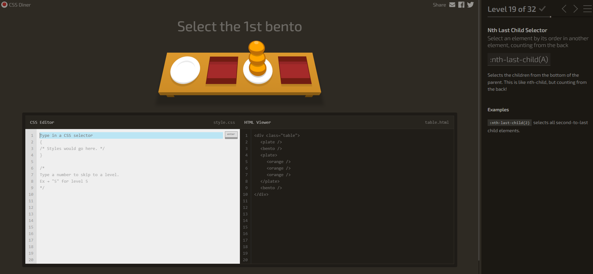

#### Huiswerk:

Ik ben verder gegaan met het ontwikkelen van mijn HTML-pagina die ik in de voorbereidingen heb gemaakt. Ik heb deze met CSS leesbaarder en duidelijker gemaakt. Ik heb hierbij vooral gewerkt aan de leesbaarheid, witruimte en hiërarchie. Zo heb ik onder andere de tekstbreedte, lettertypes, tekstgroottes en ruimtes tussen verschillende elementen aangepast.

Een belangrijk onderdeel dat ik uit deze opdracht heb meegenomen zijn custom properties. Ik begrijp nu eindelijk goed hoe ik ze moet maken en waarom ze zo handig zijn. In plaats van steeds dezelfde waarde op verschillende plekken individueel aan te passen, kun je deze op één plek veranderen en wordt het overal toegepast. Hier heb ik tijdens deze opdracht dan ook veel gebruik van gemaakt door bijvoorbeeld een custom property van kleur te maken die ik op meerdere plekken heb toegevoegd in de pagina, of voor witruimtes.

Ook heb ik gewerkt met calc() en clamp(). Vooral clamp() vond ik nog wat lastig, maar ik begrijp nu beter waarvoor het gebruikt wordt. Als laatste heb ik interactie toegevoegd met onder andere :hover en :focus en een formulier toegevoegd.

Ik heb vooral geleerd dat CSS niet alleen gaat om een website mooier maken, maar ook om ervoor te zorgen dat een pagina duidelijk, consistent en prettig te gebruiken is.

Mijn uiteindelijke HTML-Pagina:
https://codepen.io/editor/Rianne-Maria/pen/01a067cf-330c-79e7-a191-3e2bded8e517

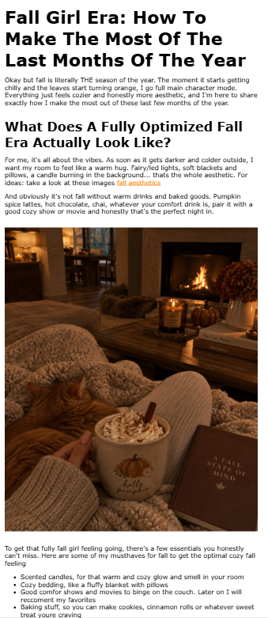
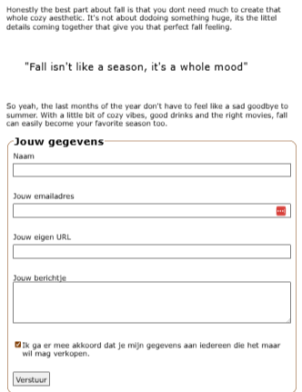

<strong>Fonts met kleur en effecten</strong>

#### Voorbereidingen:

Voor de deepdive heb ik eerst verschillende teksten gelezen over het gebruiken van lettertypes op websites. Hieruit heb ik vooral geleerd dat er verschillende manieren zijn om fonts te gebruiken en dat de keuze die je maakt ook invloed kan hebben op de snelheid en betrouwbaarheid van je website.

Ik heb geleerd dat web-safe fonts makkelijk te gebruiken zijn, omdat deze al op veel apparaten aanwezig zijn. Van vorig jaar wist ik al hoe je font-families kunt stacken. Hierbij zet je meerdere fonts achter elkaar, zodat de browser een ander font kan gebruiken wanneer de eerste niet beschikbaar is.

Een belangrijk ding dat ik heb meegenomen is dat je beter geen externe webfont-services, zoals Google Fonts of Adobe Fonts, kunt gebruiken voor deze opdracht. Deze kunnen onder andere extra laadtijd veroorzaken. Dit was wel handig om te weten want voorheen gebruikte ik dit wel altijd. In plaats daarvan heb ik geleerd hoe ik met @font-face zelf font-bestanden aan mijn website kan toevoegen.

##### Oefening 1 – @font-face

Met deze informatie ben ik begonnen aan oefening 1. Ik heb deze oefening eerst helemaal zelf gemaakt zonder naar het antwoord te kijken, zodat ik kon testen hoeveel ik van de voorbereiding had begrepen en zelf kon toepassen.

Na het nakijken merkte ik dat ik nog automatisch pixels (px) gebruik voor font-size, terwijl in het antwoord em werd gebruikt. Dit is iets wat ik mezelf nog moet aanleren, omdat ik em eigenlijk nooit eerder heb gebruikt. Ook was ik vergeten om een fallback font achter mijn eigen font te zetten.

Daarnaast had ik geen font-style en font-display gebruikt. Ik weet op dit moment nog niet helemaal goed wanneer ik deze moet gebruiken en welke waarde ik dan moet kiezen. Dit is dus iets waar ik tijdens de volgende oefeningen nog extra op wil letten.

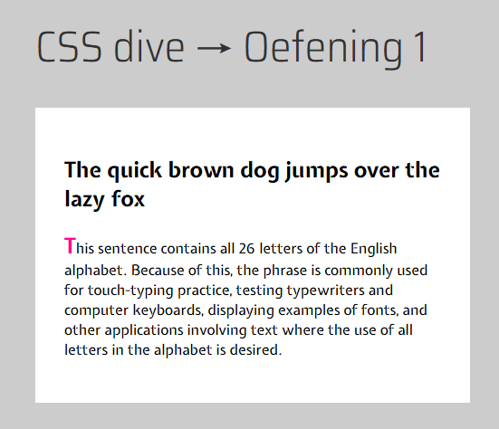
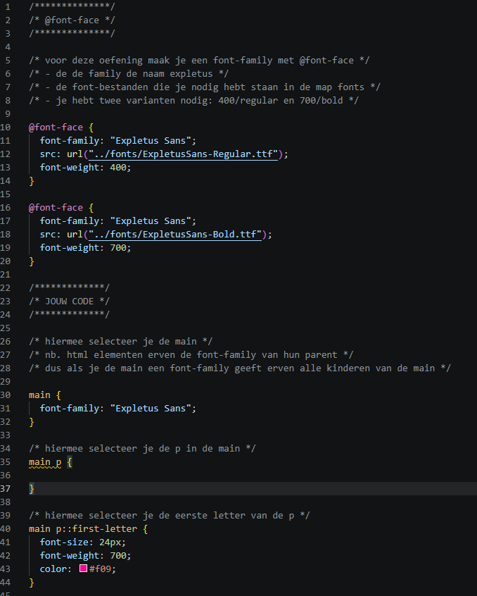

#### Huiswerk:

##### Oefening 2 – Fonts, kleur en effecten

Bij oefening 2 moest ik twee voorbeelden zo goed mogelijk namaken met CSS. Hierbij heb ik vooral gebruikgemaakt van de tips en CSS-code die al bij de oefening stonden en ben ik vanuit daar verder gaan werken.

Uit de theorie heb ik meegenomen hoe je met @font-face zelf fonts inlaadt en hoe belangrijk het is om daarbij goed met font-family, font-weight en verschillende fontvarianten te werken. Ook heb ik deze keer bewust geprobeerd om em te gebruiken in plaats van px bij de font-size. Dit ging voor mijn gevoel best goed en ik begin steeds beter te begrijpen hoe ik hiermee moet werken.

Voor de text-shadow moest ik nog wel even opzoeken hoe ik deze precies moest opbouwen, omdat ik dat alweer een beetje vergeten was. De letter-spacing heb ik vooral op gevoel aangepast om het zo dicht mogelijk op het voorbeeld te laten lijken.

Wat ik nog beter had kunnen doen is mijn @font-face completer opbouwen, bijvoorbeeld met font-style, en een fallback font toevoegen. Ook wil ik beter leren welke waardes en eenheden ik het beste kan gebruiken in plaats van deze vooral op gevoel te bepalen.

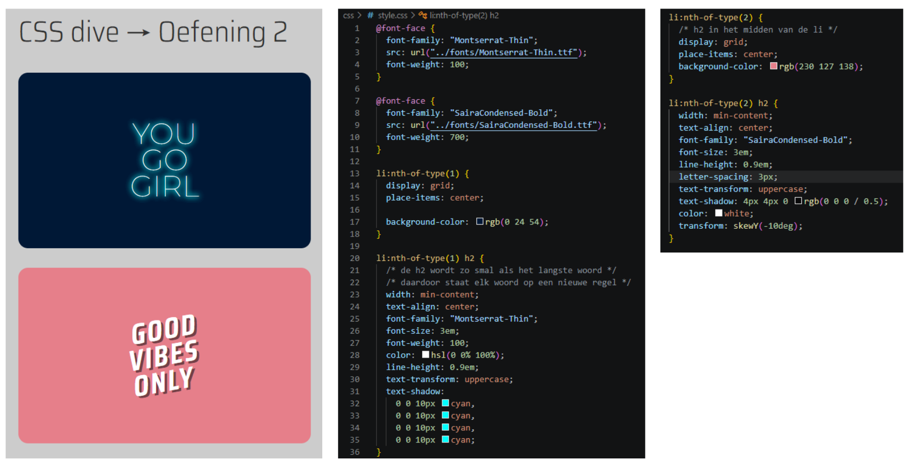

##### Oefening 3 – Fonts, kleur en effecten

<strong>Myst</strong>

Voor oefening 3 mocht ik zelf een aantal voorbeelden uitkiezen om na te maken. Ik ben begonnen met Myst, omdat dit een van de makkelijkere voorbeelden was en ik eerst even in de opdracht wilde komen. Ik heb de CSS-tips uit de opdracht aangehouden en gewerkt met onder andere text-transform en text-shadow. Door de vorige oefening wist ik nu al beter hoe een shadow was opgebouwd, waardoor ik deze dit keer zelf kon maken zonder het op te zoeken. Dit ging eigenlijk best goed, dus daarna wilde ik mezelf wat meer uitdagen.

<strong>Puff</strong>

Daarna ben ik naar een wat moeilijker voorbeeld gegaan en heb ik Puff gekozen. Hierbij heb ik opnieuw het font met @font-face toegevoegd en vanuit de CSS-tips gewerkt. De groene rand om de letters en de gele/groene glow vond ik een stuk lastiger. Ik wist nog niet hoe ik zo'n dikke rand om tekst kon maken en hoe ik het kleurverloop op de achtergrond moest aanpakken. Hiervoor heb ik opgezocht hoe -webkit-text-stroke en een radial-gradient werken. Uiteindelijk kreeg ik het effect redelijk goed nagemaakt. Hierdoor heb ik vooral geleerd dat je met CSS veel verder kunt gaan met tekst dan alleen een kleur, font en shadow.

<strong>Bananas</strong>

Omdat ik Puff nog best lastig vond, wilde ik nog een voorbeeld uit dezelfde categorie proberen. Hiervoor koos ik Bananas omdat toen ik die zag, ik geen idee had hoe ik die moest gaan maken. Ik heb eerst zoveel mogelijk zelf geprobeerd en de gegeven CSS-tips gebruikt als richting. Zo heb ik gewerkt met een background-image, background-size, border, border-radius, letter-spacing en rotate. Het lastigste vond ik het maken van de twee kleuren in het ovale vlak achter de tekst. Ik wist niet hoe ik dit moest aanpakken en heb daarom opgezocht hoe een linear-gradient werkt. De rest heb ik zoveel mogelijk zelf gemaakt.

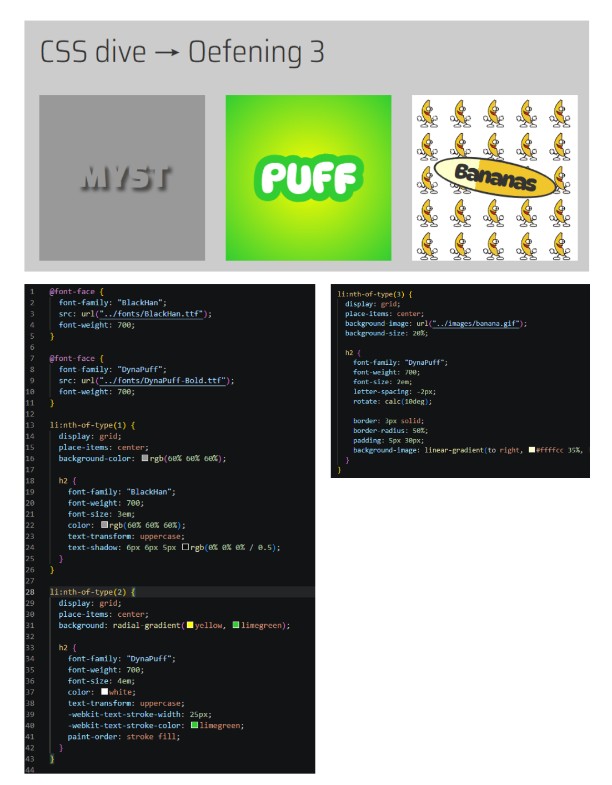

Bij deze drie oefeningen merkte ik vooral dat ik de theorie over fonts, font-weights en @font-face steeds makkelijker begin toe te passen. Ook begin ik beter te begrijpen hoe verschillende CSS-effecten gecombineerd kunnen worden om uiteindelijk een compleet ontwerp na te maken.

##### Oefening 4 – Transitions

Bij oefening 4 moest ik verder met de blokjes van oefening 3 en hier transitions aan toevoegen die zichtbaar worden wanneer je eroverheen hovert. Met transitions heb ik in het eerste jaar al best veel gewerkt, dus ik wist nog goed hoe ik dit moest aanpakken.

Ik heb daarom zelf twee verschillende effecten gemaakt. Bij de ene verandert onder andere de grootte en kleur wanneer je eroverheen hovert en bij de andere laat ik de tekst draaien. Met transition heb ik ervoor gezorgd dat deze veranderingen niet in één keer gebeuren, maar vloeiend worden uitgevoerd.

Deze oefening was voor mij vooral een goede herhaling. Ik wist nog dat transitions handig zijn om feedback te geven op een interactie. Een gebruiker kan hierdoor bijvoorbeeld duidelijker zien dat iets klikbaar of interactief is. Het kan een website daarnaast wat levendiger maken, zolang je de effecten niet te veel gebruikt.

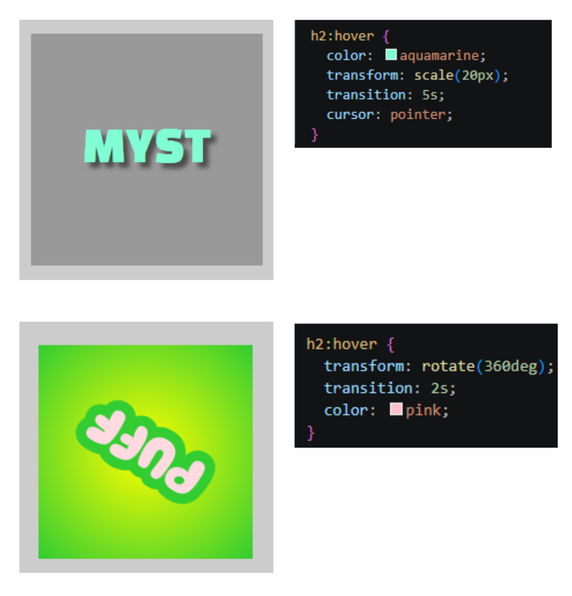

### 2 sept - Deepdives

<strong>HTML & CSS Basics</strong>

Voorbereidende vragen:

1. Hoe weet ik wanneer iets in HTML hoort en wanneer ik CSS moet gebruiken?
   -> HTML gebruik je voor de inhoud, structuur en betekenis van een website. Hiermee geef je bijvoorbeeld aan wat een titel, paragraaf, afbeelding, link of lijst is. CSS gebruik je daarna om te bepalen hoe deze onderdelen eruitzien, bijvoorbeeld de kleur, grootte, het lettertype, de achtergrond en de positie.

2. Wanneer gebruik je px en wanneer is het beter om em te gebruiken?
   -> px is handig wanneer je een vaste en specifieke grootte wilt instellen. em is vooral handig wanneer je wilt dat de grootte van een element meeschaalt met de tekstgrootte.
   Dit is bijvoorbeeld handig bij titels. Als je wilt dat een titel altijd twee keer zo groot is als de normale tekst, kun je 2em gebruiken. Wanneer je later de normale tekst groter of kleiner maakt, verandert de titel automatisch mee.

3. Wanneer is het handig om meerdere stylesheets te gebruiken in plaats van alles in één CSS-bestand te zetten?
   -> Bij een kleine website is het vaak overzichtelijk om alle CSS in één stylesheet te bewaren. Wanneer een website groter wordt en verschillende soorten pagina's heeft, kunnen meerdere stylesheets handig zijn om de code overzichtelijk te houden.

   Je kunt bijvoorbeeld een styles.css gebruiken voor de algemene vormgeving van de hele website en daarnaast een product.css voor alleen productpagina's en een blog.css voor blogpagina's.
   

<strong>MMD, Micro-interacties, Forms</strong>

### 31 aug - Kickoff

<strong>Checkout</strong>

1. Leg uit wat een source hosting platform is en voor welke jij gekozen hebt.
   Een source hosting platform is een plek waar je de code van je website online kunt opslaan en beheren. Ik heb gekozen voor GitHub.

2. Vertel welke domeinnaam jij gekozen hebt en hoe je die hebt gekoppeld aan jouw pagina.
   Ik heb mijn eigebn domeinnaam "yanaarchives.nl" gekozen en heb deze gekoppeld aan GitHub door de DNS-records van mijn domein aan te passen zoals de ip adressen.

3. Beschrijf hoe je aanpassingen aan jouw pagina kunt maken en hoe je ervoor zorgt dat die op het web gepubliceerd worden.
   Ik pas mijn website aan in VSCodium. Daarna commit ik mijn wijzigingen en sync ik ze naar GitHub. Die publiceert de nieuwe aanpassingen vervolgens op mijn website.

Een fork van de model repository gemaakt en gepubliceerd via mijn eigen Github omgeving.

