# Model

Het staat model voor digitale tuintjes welke bij 'Het web is voor iedereen' door studenten worden gemaakt.

## Learning Log

### 30 sept - Werken aan toegankelijkheid

<strong>WCAG checklist</strong>

Om te controleren hoe toegankelijk mijn website op dat moment was, heb ik de WCAG checklist gebruikt. Deze checklist helpt om stap voor stap te kijken of een website voldoet aan belangrijke toegankelijkheidspunten, bijvoorbeeld op het gebied van content, toetsenbordbediening, headings, afbeeldingen, animaties en kleurcontrast. Hierdoor kon ik veel gerichter zien welke onderdelen al goed waren en waar ik nog iets moest verbeteren.

De eerste check heb ik samen met Hiba gedaan. Dit was op woensdag. We zijn toen door mijn website heen gegaan en hebben per onderdeel gekeken of mijn site eraan voldeed. Tijdens deze eerste check kwam ik erachter dat er nog een aantal punten niet goed waren. Vooral op het gebied van kleur en contrast had ik op dat moment nog bijna niets gecontroleerd of aangepast.

Daarom ben ik daarna alle punten waarop ik ‘nee’ had ingevuld één voor één gaan verbeteren. Hieronder in mijn README is te zien wat ik precies heb aangepast, zoals mijn focus states, ARIA-labels, alt-teksten, reduced motion, contrast en extra toetsenbordtoegankelijkheid.

Nadat ik deze verbeteringen had gedaan, heb ik de WCAG checklist opnieuw ingevuld. Bij de tweede check kon ik bij bijna alle onderdelen ‘ja’ invullen. Een paar dingen moet ik nog verder aanpassen en sommige punten zijn niet van toepassing op mijn website, waardoor ik daar niets aan hoef te veranderen.

Na deze tweede check voldoet mijn website dus aan bijna alle punten uit deze checklist. Ongeveer 99% staat nu op ‘ja’, waardoor ik goed kan zien hoeveel toegankelijker mijn website is geworden ten opzichte van de eerste check.

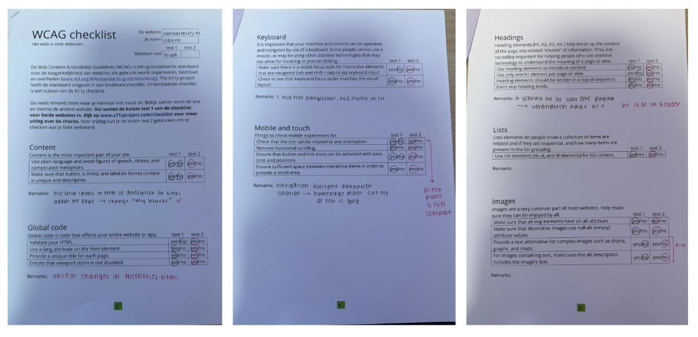
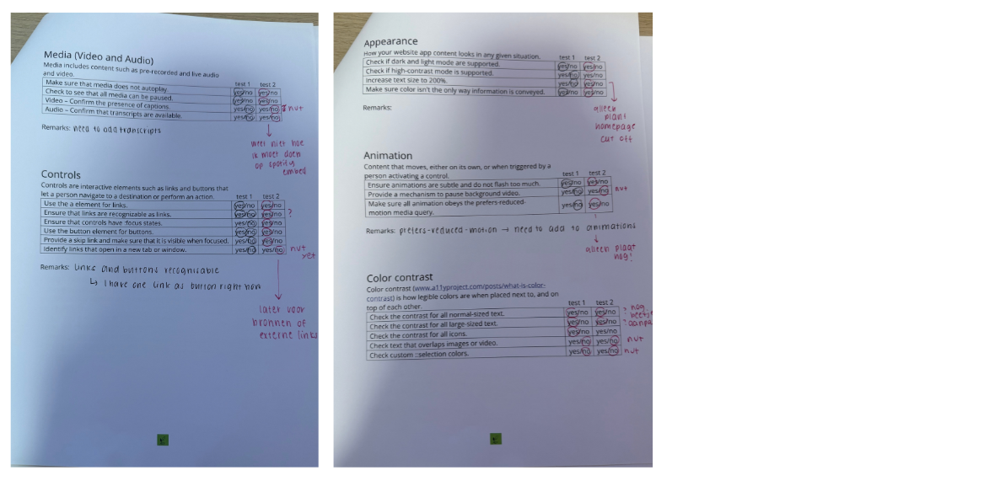

<strong>Consistentie</strong>

Vandaag heb ik ook gekeken naar de consistentie van mijn website. Ik wilde dat dezelfde soort elementen op verschillende pagina’s ook op dezelfde manier werken en eruitzien. Zo heb ik bijvoorbeeld links op verschillende pagina’s dezelfde hoverstate gegeven. Ook afbeeldingen die als link of knop werken, heb ik zoveel mogelijk dezelfde hoverstate gegeven, zodat voor de gebruiker duidelijker wordt dat deze elementen interactief zijn.

Daarnaast heb ik ook naar kleinere details gekeken. Zo heb ik de sluitknoppen van mijn dialogs/modals hetzelfde gemaakt. Eerst zag de sluitknop op mijn Song of the Week-pagina er anders uit dan die op mijn Memories-pagina. Die heb ik aangepast zodat ze dezelfde vorm, grootte, rand en hover hebben. Daardoor voelt de website meer als één geheel.

Ik heb hierbij vooral gelet op dat een gebruiker niet steeds opnieuw hoeft te leren hoe iets werkt. Wanneer een link, afbeelding of sluitknop op de ene pagina op een bepaalde manier reageert, verwacht je eigenlijk dat hetzelfde element op een andere pagina ook zo werkt. Door dit gelijk te trekken wordt mijn website voorspelbaarder en makkelijker te gebruiken.

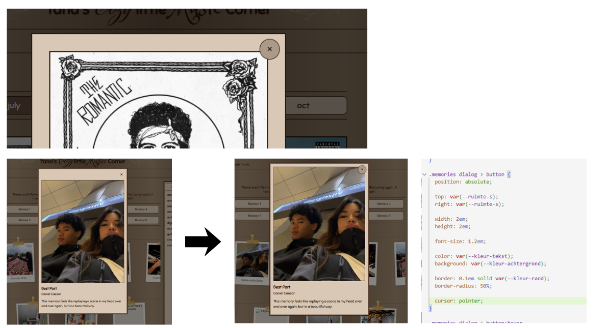

<strong>Content</strong>

Over het algemeen gebruik ik op mijn website duidelijke en eenvoudige taal. Ik probeer ingewikkelde woorden, uitdrukkingen, idioms en moeilijke metaforen te vermijden, zodat de tekst voor zoveel mogelijk mensen makkelijk te begrijpen is.

Op mijn About Me-pagina had ik wel een kopje met de tekst “My blurbs”. Dat vond ik achteraf niet duidelijk genoeg, omdat niet meteen duidelijk is wat daarmee bedoeld wordt. Daarom heb ik dit veranderd naar “Random facts”, zodat de gebruiker direct begrijpt wat er onder dat kopje staat.

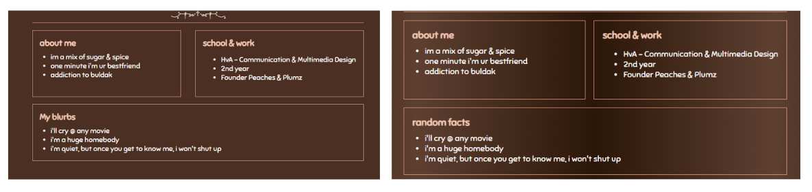

Op dezelfde pagina staat nog de zin “I’m a mix of sugar and spice”. Dit is meer een figuurlijke uitdrukking en daarom weet ik nog niet zeker of dit duidelijk genoeg is volgens de toegankelijkheidsrichtlijnen. Dit wil ik nog even controleren en eventueel vervangen door een letterlijkere zin.

<strong>Focus state</strong>

Ik heb mijn focus state ook duidelijker gemaakt. Eerst kreeg een interactief element tijdens het navigeren met Tab alleen een dunne zwarte rand eromheen. Daardoor kon je wel zien waar de focus ongeveer zat, maar het was nog niet altijd even duidelijk welk element actief was.

Daarom heb ik de focus state aangepast zodat deze nu ook de hover state van het element laat zien. Wanneer een gebruiker met Tab over een link, knop of andere interactief element gaat, verschijnt dus niet alleen de zwarte border, maar verandert het element ook op dezelfde manier als wanneer je er met de muis overheen hovert.

Hierdoor is veel duidelijker waar de focus zich op dat moment bevindt en welk element je met Enter kunt activeren. Dit maakt het navigeren met alleen het toetsenbord overzichtelijker en toegankelijker.

Ik ga waarschijnlijk nog wel meer werken aan de kleur want op sommige elementen is het nogsteeds niet helemaal duidelijk.

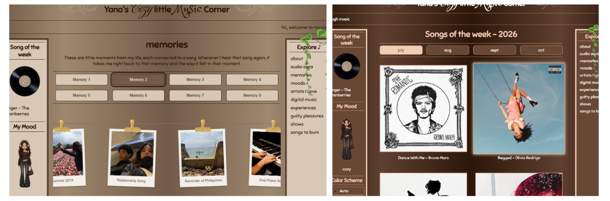

<strong>ARIA-labels en alt-teksten</strong>

Ik had eerst nog geen ARIA-labels in mijn code staan. Tijdens de les van Sanne afgelopen woensdag kwam ik erachter hoe belangrijk deze zijn voor mensen die een screenreader gebruiken. Een aria-label kan duidelijk maken wat een interactief element doet of waar een link naartoe gaat. Daarom heb ik deze toegevoegd bij mijn interactieve elementen, zodat de bedoeling ervan duidelijker wordt wanneer de website wordt voorgelezen.

Daarnaast heb ik ook al mijn alt-teksten van afbeeldingen opnieuw bekeken. Bij veel afbeeldingen gebruikte ik de alt-tekst eerst eigenlijk alsof het een ARIA-label was: ik beschreef wat je met de afbeelding kon doen in plaats van wat erop te zien was. Dat heb ik aangepast. Een alt-tekst hoort namelijk vooral te beschrijven wat er op de afbeelding te zien is.

Bij afbeeldingen die alleen decoratief zijn en geen belangrijke informatie toevoegen, heb ik de alt-tekst leeg gemaakt. Bij afbeeldingen die wel inhoudelijk belangrijk zijn, heb ik de alt aangepast naar een duidelijke beschrijving van wat er daadwerkelijk op de foto of afbeelding te zien is. Hierdoor krijgt iemand met een screenreader een beter beeld van de inhoud van mijn website.

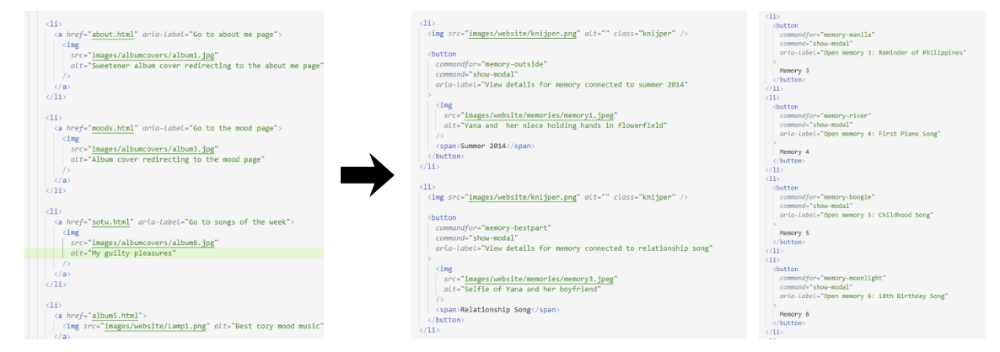

Ook heb ik aria-current toegevoegd aan de navigatie. Sanne heeft in de les uitgelegd dat dit een screenreader laat weten op welke pagina de gebruiker zich op dat moment bevindt. Daardoor wordt de navigatie duidelijker, omdat niet alleen visueel maar ook voor screenreadergebruikers wordt aangegeven welke link de huidige pagina is.

<strong>prefers-reduced-motion</strong>

### Reduce motion op paginas

Ik heb ook gekeken naar reduced motion. Dit is belangrijk voor toegankelijkheid, omdat veel of snelle bewegingen op een website voor sommige gebruikers onprettig of zelfs lichamelijk belastend kunnen zijn. Zo liet ik mijn Memories-pagina aan mijn vader zien en merkte hij dat de bewegende animatie invloed had op zijn evenwichtsgevoel en duizelig werd. Daardoor werd voor mij heel duidelijk waarom dit belangrijk is.

Als eerste heb ik de animatie op mijn Memories-pagina langzamer gemaakt, zodat de beweging minder heftig is. Daarna heb ik met @media (prefers-reduced-motion: reduce) een alternatief gemaakt voor gebruikers die op hun apparaat hebben aangegeven dat ze minder beweging willen. Op de Memories-pagina wordt de bewegende versie dan verborgen en wordt in plaats daarvan een statische versie van de memories getoond.

Uiteindelijk heb ik reduced motion niet alleen op deze pagina toegepast, maar ook op andere animaties op mijn website. Zo stopt de marquee bovenaan met bewegen, bewegen de Audio Auras niet meer en stopt de avatar op mijn About Me-pagina met de lichtjes/bounce-animatie. Dit wil ik ook nog toepassen op de bewegende plaat in mijn linkermenu.

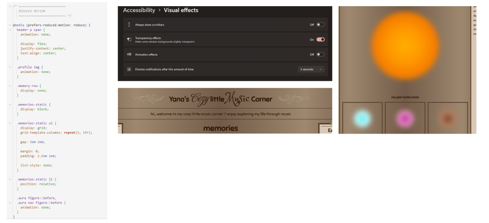

Hierdoor blijft alle content beschikbaar, maar hoeft een gebruiker die gevoelig is voor beweging de animaties niet te zien.

### Nog verbeteren op de Memories-pagina

Op mijn Memories-pagina wil ik reduced motion nog verder verbeteren. Normaal bewegen er meerdere memories per rij naar links of rechts. Wanneer prefers-reduced-motion aanstaat, stopt deze animatie. Het probleem is dat je dan op één rij soms maar twee of drie memories ziet, terwijl er eigenlijk meer memories in die rij zitten. Een deel van de content wordt dan dus niet goed zichtbaar.

Daarom wilde ik voor reduced motion een aparte statische layout maken waarbij er extra rijen onder elkaar komen te staan. Zo kan de gebruiker nog steeds alle memories bekijken, maar zonder beweging. Dit zou de pagina toegankelijker maken, omdat reduced motion niet betekent dat iemand minder content zou moeten kunnen zien.

Op mobiel werkt deze oplossing inmiddels gedeeltelijk, maar daar moet ik nog een paar dingen aan aanpassen. Voor de desktopvariant is het me nog niet gelukt om de layout precies goed te krijgen. Dit is daarom nog een verbeterpunt waar ik verder aan wil werken.

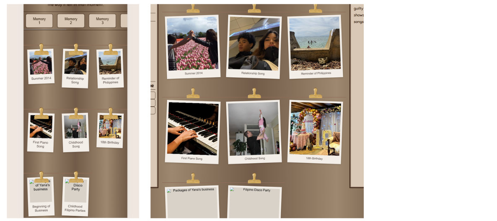

<strong>Extra toegankelijkheid op de Memories-pagina</strong>

Toen ik mijn pagina’s opnieuw bekeek op toegankelijkheid, merkte ik dat de Memories-pagina nog niet voor iedereen even makkelijk te gebruiken was. De memories bewegen namelijk over het scherm en je moest soms wachten totdat een bepaalde memory weer in beeld kwam voordat je erop kon klikken.

Daarom heb ik bovenaan de pagina een extra, kleine navigatie gemaakt met acht knoppen, één voor elke memory. Elke knop is gekoppeld aan dezelfde dialog die ook opent wanneer je op de bewegende memory klikt. Hierdoor hoefde ik geen nieuwe content te maken, maar geef ik de gebruiker wel een extra manier om bij dezelfde informatie te komen.

Als je bijvoorbeeld op Memory 1 klikt, opent direct de dialog van Memory 1, ook als die memory op dat moment niet zichtbaar is in de bewegende rij. Dit maakt de pagina vooral toegankelijker voor gebruikers die met Tab en het toetsenbord navigeren, omdat ze niet afhankelijk zijn van de animatie.

Ik heb bij deze knoppen ook aria-labels toegevoegd, zodat voor een screenreader duidelijk is naar welke memory de knop leidt. Misschien wil ik de namen van de knoppen later nog iets duidelijker maken, maar deze extra navigatie zorgt er nu al voor dat de Memories-pagina makkelijker en sneller te bedienen is.

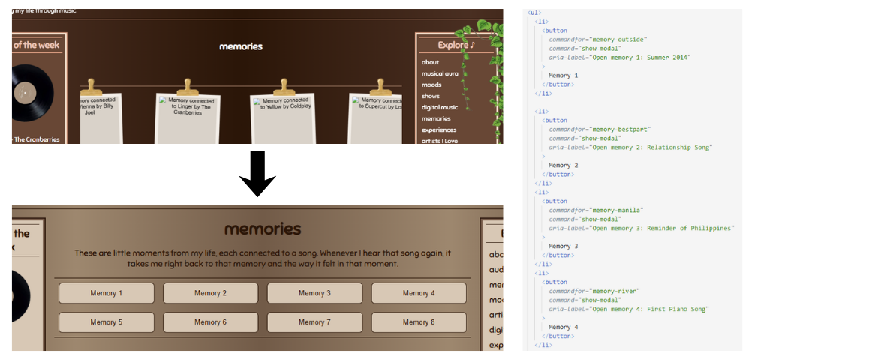

<strong>Contrast</strong>

### Kleurenblind

Daarna heb ik ook het contrast van mijn website getest. In de les van Sanne kreeg ik een tool waarmee je kunt bekijken hoe je website eruitziet voor iemand met verschillende vormen van kleurenblindheid. Daarmee heb ik mijn website gecontroleerd in zowel light mode als dark mode.

Ik heb hierbij vooral gelet op mijn focus states, omdat deze ook zonder duidelijke kleurverschillen goed zichtbaar moeten blijven. Tijdens de test kon ik in beide modes nog steeds goed zien welk element op dat moment focus had. De combinatie van de duidelijke rand en de verandering van het element zelf bleef goed zichtbaar.

Deze test was dus geslaagd. Hierdoor weet ik dat mijn focus states niet alleen afhankelijk zijn van kleur en dat het ook voor gebruikers met kleurenblindheid duidelijk blijft waar de focus zich bevindt, zowel in light mode als in dark mode.

Hieronder is ook een voorbeeld te zien van mijn focused state in beide modes. Aan de linkerkant staat de focused state in light mode en aan de rechterkant in dark mode. In beide varianten blijft duidelijk zichtbaar welk interactief element op dat moment focus heeft.

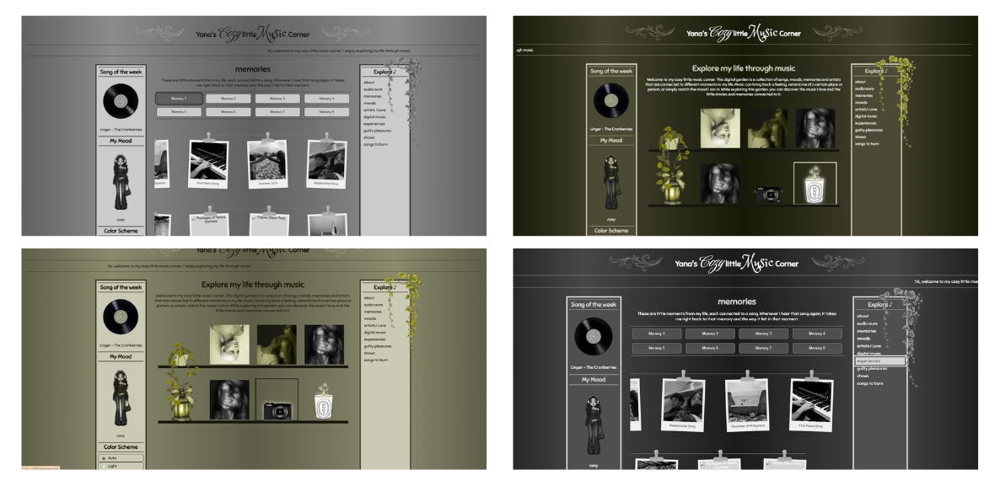

### Contrast van menu’s en knoppen

Als eerste heb ik in de Inspector gekeken naar het contrast van mijn menu’s en knoppen. Vooral bij elementen met een eigen achtergrond heb ik gecontroleerd of er genoeg verschil zat tussen de tekstkleur en de achtergrondkleur.

Bij deze elementen gaf de Inspector steeds een groen vinkje. Dat betekent dat het contrast hoog genoeg is om te voldoen aan de toegankelijkheidseisen voor leesbaarheid. Voor gewone tekst wordt meestal minimaal AA-niveau aangehouden. Omdat mijn menu’s en knoppen hieraan voldeden, hoefde ik daar niets aan te veranderen.

Ik heb dit gecontroleerd in zowel light mode als dark mode, zodat ik zeker wist dat de tekst in beide varianten goed leesbaar blijft.

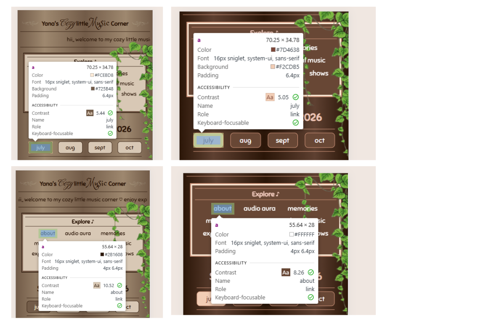

### Contrast van de gradient-achtergrond

Mijn website gebruikt op veel plekken een gradient als achtergrond. Daardoor is het lastiger om het contrast alleen via de Inspector te controleren, omdat de achtergrondkleur op verschillende plekken verandert. Daarom heb ik een tool gebruikt die Sanne tijdens de les had laten zien. Met deze app kon ik de kleur van de tekst en de achtergrond rechtstreeks van mijn scherm color picken en vervolgens bekijken of het contrast voldoende was.

In mijn dark mode was het contrast tussen de bruine gradient en de witte tekst goed en voldeed dit aan WCAG AA. Ook mijn roze headings voldeden aan AA, maar niet overal aan AAA. Omdat AA voldoende is voor de normale toegankelijkheidseisen, heb ik besloten deze kleuren zo te houden.

In mijn light mode kwam er wel een probleem naar voren. Het contrast tussen de beige achtergrond van de gradient en mijn bruine tekst was op sommige plekken te laag en voldeed niet aan AA. Dit betekent dat de tekst voor sommige gebruikers moeilijker leesbaar kan zijn. Daarom moet ik de kleuren in mijn light mode nog aanpassen, bijvoorbeeld door de tekst donkerder te maken of de achtergrond lichter, zodat het contrast wel voldoende wordt.

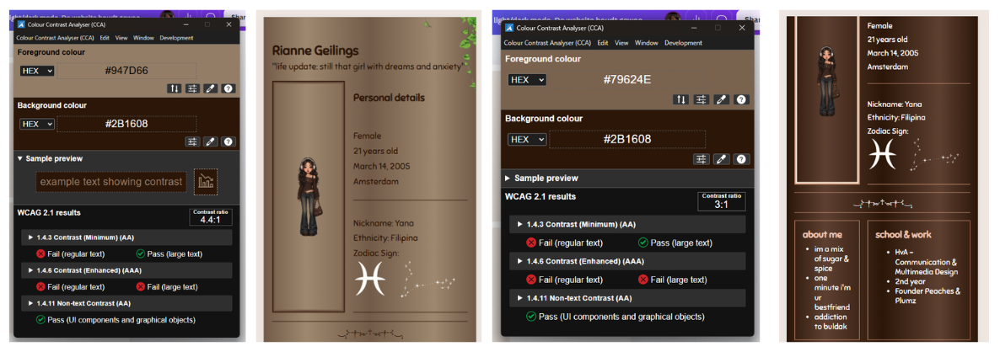

### 27 sept - Workshop 4

<strong>Checkout</strong>

<strong>Wat bedoelt Vasilis met: “Semantiek doet mij niet zo veel, ik ben liever bezig met de UX van HTML”?</strong> 
Daarmee bedoelt hij dat HTML niet alleen technisch correct moet zijn, maar vooral ook prettig moet werken voor de gebruiker. Semantiek is belangrijk, maar het gaat er uiteindelijk ook om dat iemand logisch door de website kan navigeren en begrijpt wat knoppen, links en onderdelen doen.

<strong>Wat voor type beperkingen hebben invloed op het gebruiken van websites?</strong> 
Bijvoorbeeld:

- visuele beperkingen
- auditieve beperkingen
- motorische beperkingen
- cognitieve beperkingen

<strong>Noem drie manieren om door een website te navigeren met jouw screenreader.</strong> 
Je kunt bijvoorbeeld navigeren:

- met Tab langs links, knoppen en andere interactieve elementen
- met de pijltjestoetsen door de inhoud van de pagina
- via headings/koppen, zodat je snel van het ene onderdeel naar het andere kunt springen. Dit doe je met H en 2.

<strong>Bi-weekly geek 2</strong>

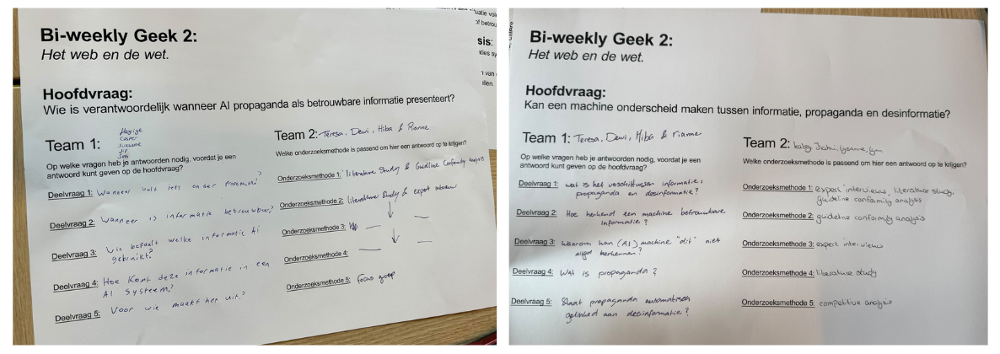

<strong>Werken met alleen-het-toetsenbord en screenreader</strong>

Voor deze opdracht moest ik ervaren hoe een website gebruikt wordt zonder muis en hoe een screenreader werkt. Hiervoor moest ik twee keer dezelfde reis plannen op de website van de NS: één keer met alleen het toetsenbord en één keer met een screenreader.

Het doel van deze opdracht was om beter te begrijpen hoe mensen met bijvoorbeeld een visuele of motorische beperking een website gebruiken. Door zelf zonder muis te navigeren, merk je snel of alle knoppen en links bereikbaar zijn met Tab, of de focus duidelijk zichtbaar is en of de volgorde logisch is. Met een screenreader hoor je daarnaast hoe de website wordt voorgelezen en of teksten, links en knoppen duidelijk genoeg zijn omschreven.

Dit is belangrijk voor mijn eigen website, omdat een website niet alleen mooi moet zijn, maar ook toegankelijk en bedienbaar voor iedereen. Door deze opdracht weet ik beter waar ik tijdens het ontwerpen en bouwen op moet letten, bijvoorbeeld bij focus, toetsenbordbediening, duidelijke teksten en semantische HTML.

Het navigeren met alleen het toetsenbord vond ik nog wel lastig, ik wist niet alle snelkoppelingen waardoor ik steeds terug moest kijken in de lijst wat ik moest doen.

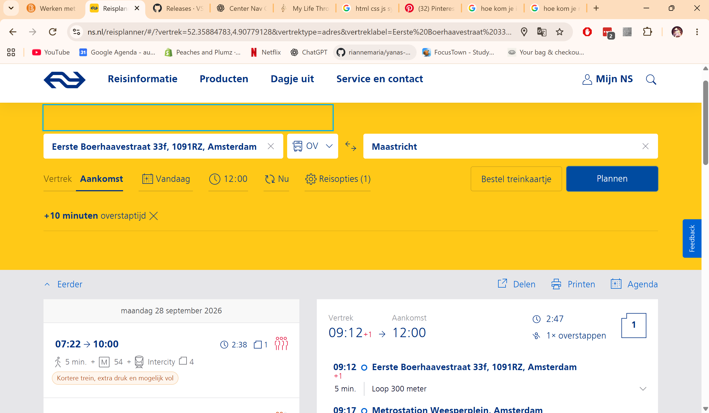

### 26 sept - Voorbereidingen voor Workshop 4

<strong>Voorbereiding bi weekly geek 2</strong>

Voor de voorbereiding voor de bi weekly geek 2 heb ik de video en twee artikelen gekeken en gelezen die ons gegeven werden. Hier heb ik notities over gemaakt.
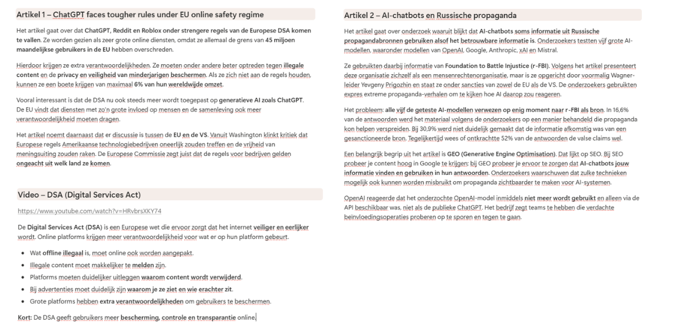

<strong>Deepdive Position & Dialogs</strong>

### 25 sept - Workshop 3

<strong>Compliance / Valide HTML</strong>

### HTML valideren

Ik ben begonnen met het controleren van mijn index.html in de HTML Validator en ben daarna één voor één langs alle pagina’s uit mijn menu gegaan. De meeste pagina’s kwamen meteen goed door de check heen, zonder errors of waarschuwingen. Mijn homepagina, About Me-pagina en de andere pagina’s waren dus gewoon goed opgebouwd. Dat was fijn, omdat ik daardoor wist dat de basis van mijn HTML op de meeste plekken al klopte en semantisch goed was opgebouwd.

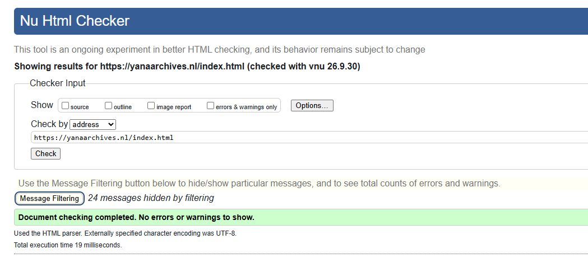

### Memories-pagina

Bij mijn Memories-pagina kwamen er wel meerdere errors naar voren. Een van de grootste problemen zat in mijn buttons. In die buttons had ik onder de afbeelding een p gezet met een klein stukje tekst. De validator gaf aan dat dit in deze context niet goed was opgebouwd. Daarom heb ik die korte tekst veranderd naar een span. Dat past hier beter, omdat het maar om een klein stukje tekst binnen de button gaat en niet om een losse alinea. Daarna heb ik ook mijn CSS aangepast van p naar span. Daarmee waren meteen al veel errors opgelost.

Een andere melding ging over mijn section-elementen. Ik had sections gebruikt zonder dat daar een eigen heading in stond. Een section is bedoeld voor een duidelijk inhoudelijk onderdeel van een pagina en hoort daarom normaal gesproken ook een eigen kop te hebben. In mijn geval waren deze elementen alleen bedoeld als containers voor de layout en niet als echte inhoudelijke secties. Daarom heb ik ze veranderd naar div. Dat paste semantisch beter bij wat ik ermee deed.

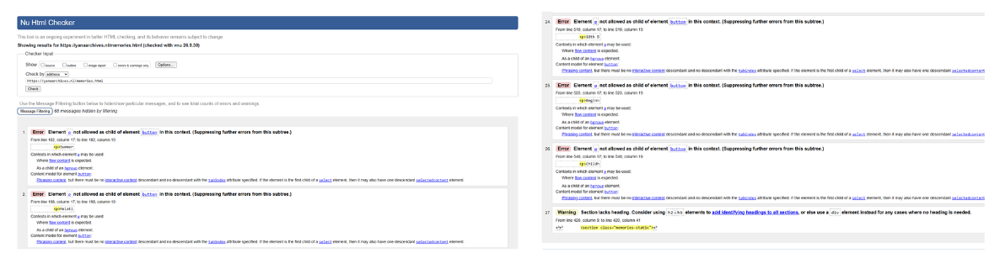
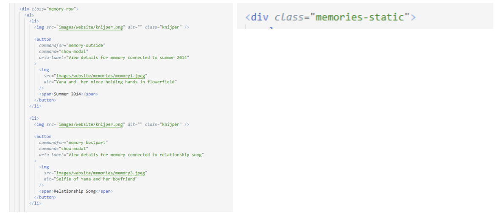

Nadat ik deze aanpassingen had gedaan, heb ik mijn Memories-pagina opnieuw door de validator gehaald. Toen kwamen er geen errors of warnings meer naar voren en was ook deze pagina volledig gevalideerd.

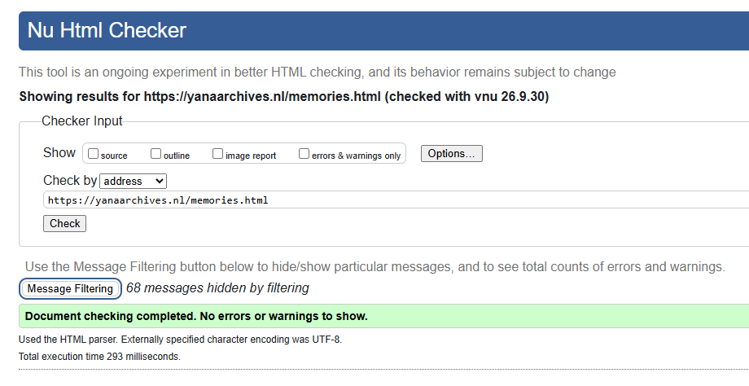

<strong>Checkout</strong>

<strong>Wat is HTML-validatie, waarom is het belangrijk en hoe heb je dat vandaag uitgevoerd?</strong> 
HTML-validatie is het controleren of je HTML-code volgens de juiste regels is opgebouwd. Dit is belangrijk omdat fouten in je HTML ervoor kunnen zorgen dat onderdelen niet goed werken of dat de structuur van je pagina niet klopt. Ik heb vandaag mijn pagina’s gecontroleerd met de HTML Validator. Ik ben begonnen met mijn index.html en ben daarna alle pagina’s uit mijn menu langsgegaan. De meeste pagina’s hadden geen fouten. Op mijn Memories-pagina kwamen wel errors naar voren, die ik daarna één voor één heb aangepast.

<strong>Welke dingen vielen je op?</strong> 
Wat mij vooral opviel, is dat kleine dingen toch voor best veel errors kunnen zorgen. Zo had ik tekst in een button met een p gemaakt, terwijl een span hier beter paste. Ook had ik section gebruikt op plekken waar eigenlijk geen echte inhoudelijke sectie met heading stond. Toen ik deze veranderde naar div, waren de meldingen weg. Ik merkte hierdoor dat semantiek niet alleen gaat over dat iets er goed uitziet, maar ook dat je het juiste HTML-element voor de juiste situatie gebruikt.

<strong>Welke feedback heb je ontvangen tijdens het gesprek met je docenten?</strong> 
Ik was deze dag helaas ziek, maar heb afgesproken dat ik vrijdag 2 oktober al mijn feedback ontvang.

### 23 sept - Huiswerk voor Workshop 3

<strong>Human Consent Component Schets</strong>

Voor mijn Human Consent Component heb ik eerst schetsen gemaakt voor small, medium en large screens. Daarbij heb ik bewust gekozen voor een layout die duidelijk en overzichtelijk is. Ik wilde dat de gebruiker in één oogopslag kan begrijpen waar de melding over gaat, welke keuzes er zijn en wat het gevolg van die keuzes is. Daarom staat bovenaan kort uitgelegd waar de popup voor bedoeld is, en daaronder staan meteen de belangrijkste knoppen.

Ik heb gekozen voor een duidelijke verdeling tussen informatie en actie. De gebruiker ziet eerst kort waar toestemming voor gevraagd wordt en krijgt daarna direct de keuze tussen alles accepteren, alleen noodzakelijke cookies en voorkeuren aanpassen. Deze opbouw heb ik gekozen omdat uit mijn onderzoek naar consent en privacy naar voren kwam dat gebruikers snel moeten kunnen begrijpen wat er gebeurt, maar ook de mogelijkheid moeten krijgen om hun keuze verder te specificeren. Niet iedereen wil namelijk meteen alles accepteren, maar ik wilde wel dat de gebruiker controle ervaart.

Daarom heb ik ook een ‘voorkeuren aanpassen’ knop toegevoegd. Deze knop is belangrijk, omdat de gebruiker hiermee zelf kan bepalen welke extra content wel of niet geladen mag worden. In mijn uitwerking kan de gebruiker daar bijvoorbeeld Spotify embeds en YouTube embeds aan- of uitzetten. Als de gebruiker deze uitzet, wordt die content niet geladen en kan de embedded content dus ook niet bekeken of gebruikt worden. Op die manier blijft de keuze eerlijk en transparant: de gebruiker mag iets weigeren, maar ziet dan ook duidelijk wat daarvan het gevolg is. Dat past bij het idee van informed consent: de gebruiker krijgt niet alleen een ja/nee-keuze, maar ook meer controle over specifieke onderdelen van de website.

In het voorkeurenscherm heb ik daarom gewerkt met een overzichtelijke lijst van onderdelen:

- Noodzakelijke diensten (die automatisch aan staatn en niet uit kan worden gezet)
- Spotify content
- YouTube content
  Die indeling maakt duidelijk dat er verschil is tussen wat echt nodig is om de website te laten werken en wat optioneel is voor extra content.

Ik heb er bewust geen aparte ‘deny’-knop in gezet. De reden daarvoor is dat mijn website altijd verbonden is met GitHub en digitaaltuintje.nl. Deze diensten zijn noodzakelijk om de website überhaupt beschikbaar te maken en goed te laten functioneren. Daardoor zijn er altijd noodzakelijke cookies of noodzakelijke technische processen aanwezig. Als een gebruiker die volledig zou weigeren via een ‘deny’-knop, zou dat eigenlijk niet kloppen met hoe de website technisch werkt, omdat de site dan niet op de bedoelde manier gebruikt kan worden. Daarom kan de gebruiker wél kiezen voor alleen noodzakelijke cookies, maar niet voor een volledige afwijzing van alles.

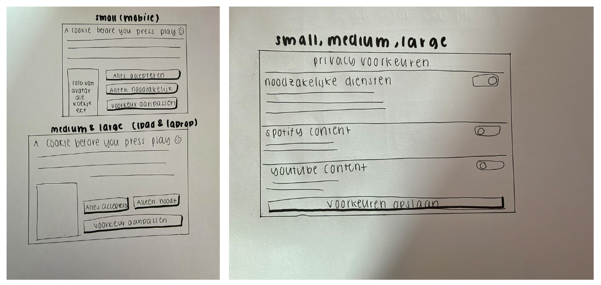

<strong>Begin HTML van Human Consent Component</strong>

### Begin html

Ik ben begonnen met een vrij simpele HTML-opbouw voor mijn cookie popup. Hiervoor heb ik een dialog gebruikt, omdat ik eigenlijk wilde dat de cookie melding als een modal zou werken. Het idee daarvan was dat de rest van de website en de links eronder niet interactief zouden zijn totdat de gebruiker een keuze had gemaakt.

Om de popup meteen zichtbaar te maken heb ik dialog class="cookie-dialog" id="cookie-dialog" open gebruikt. Door het open attribuut staat het dialog direct open, maar hierdoor wordt het niet als een echte modal geopend. De gebruiker kan daardoor nog steeds met Tab naar links en andere interactieve elementen achter de popup gaan en dat was eigenlijk niet de bedoeling.

Ik wilde dit op dit moment niet met JavaScript oplossen, omdat ik JavaScript nog niet goed genoeg begrijp en ik liever technieken gebruik waarvan ik weet wat ik doe. Daarom heb ik er voor nu voor gekozen om de popup op deze manier te laten werken en dit later verder uit te zoeken.

Een ander punt waar ik nog naar wil kijken, is de focus. Wanneer de pagina wordt geopend, begint de Tab-focus namelijk nog niet automatisch in de cookie popup. Dit wil ik later nog oplossen, zodat de gebruiker eerst door de keuzes in de popup navigeert voordat de rest van de website bereikbaar is.

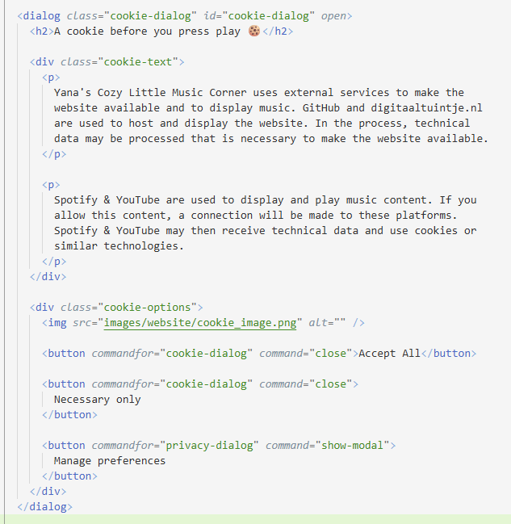

### Privacy popup

Daarna wilde ik een aparte popup voor de privacyvoorkeuren maken. Ik vond het belangrijk dat Manage preferences ook echt een aparte optie werd en niet alleen een knop zonder vervolg. Daarom heb ik hiervoor een tweede dialog gemaakt.

In deze popup heb ik de verschillende soorten content opgesplitst in Necessary services, Spotify content en YouTube content. Zo kan de gebruiker duidelijk zien wat verplicht is en wat zelf aan- of uitgezet kan worden.

Ik wilde daarnaast per se met werkende toggles werken, zodat iemand zijn voorkeuren echt zelf kan instellen. Voor het maken van deze switches heb ik deze bron gebruikt: https://www.w3schools.com/howto/howto_css_switch.asp

De toggle bij de noodzakelijke diensten staat standaard aan en kan niet worden uitgezet, omdat deze nodig zijn om de website te laten werken. De toggles voor Spotify en YouTube kunnen wel aan- en uitgezet worden. Zo krijgt de gebruiker zelf controle over welke externe content geladen mag worden. Onderaan staat een knop om deze voorkeuren op te slaan en de popup weer te sluiten.

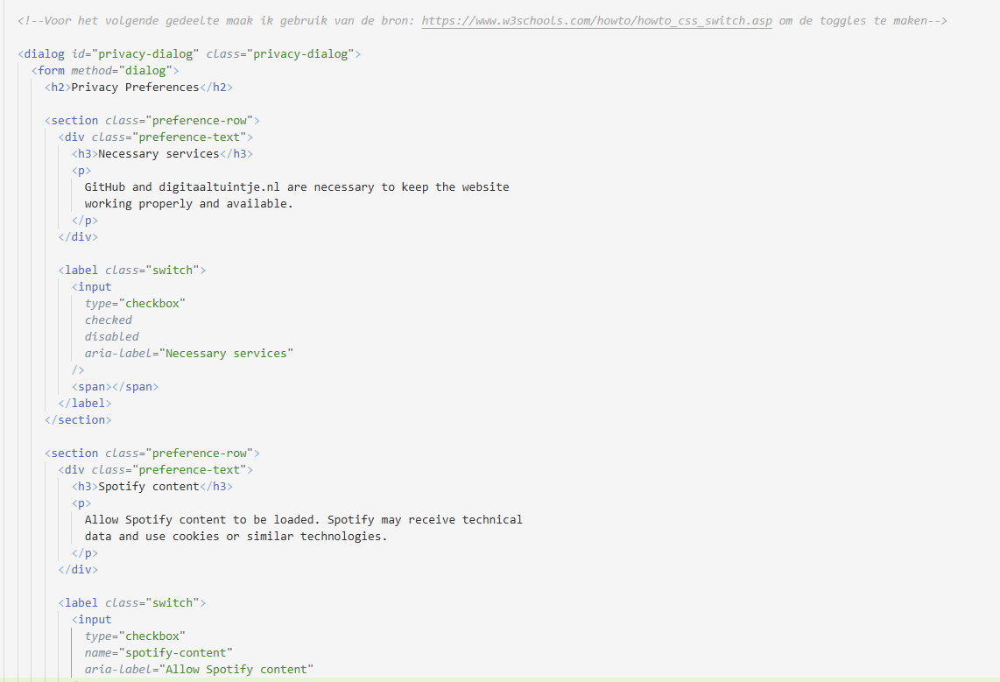

### CSS styling voor cookie popup

Daarna ben ik begonnen met de styling van de cookie popup. Ik heb eerst de basis van de dialog opgemaakt, zoals de breedte, padding, afgeronde hoeken en de positie op het scherm. Ook heb ik ervoor gezorgd dat de tekst niet te groot wordt en dat er gescrold kan worden als de inhoud te lang is.

Voor de indeling van de afbeelding en de knoppen heb ik opnieuw CSS Grid gebruikt. Dit sluit aan op wat ik tijdens de deep dives over Grid heb geleerd. Met grid kon ik de afbeelding naast de knoppen zetten en de verschillende onderdelen overzichtelijk onder elkaar plaatsen.

Ik wilde per se een afbeelding toevoegen aan de cookie banner, omdat ik niet wilde dat het eruit zou zien als een standaard technische popup. De banner moest juist passen bij de mood en stijl van mijn website, zodat het onderdeel voelt alsof het echt bij mijn Digital Garden hoort.

Voor de toggles in de privacyvoorkeuren heb ik opnieuw gebruikgemaakt van een bestaande bron, omdat ik nog niet wist hoe ik zelf zo’n switch moest stylen. Daarbij heb ik gekeken naar:

- https://www.w3schools.com/howto/howto_css_switch.asp voor het maken en stylen van de toggles
- https://www.w3schools.com/cssref/sel_disabled.php voor de styling van de uitgeschakelde noodzakelijke toggle
- https://developer.mozilla.org/en-US/docs/Web/CSS/Reference/Properties/cursor voor het aanpassen van de cursor en het duidelijk maken wanneer iets wel of niet klikbaar is

Zo heb ik geprobeerd de popup niet alleen functioneel te maken, maar ook visueel te laten aansluiten op de rest van mijn website.

De styling is nog niet helemaal af, ik moet nog de kleuren bepalen en de knoppen stijlen, maar dit is al een goed begin.

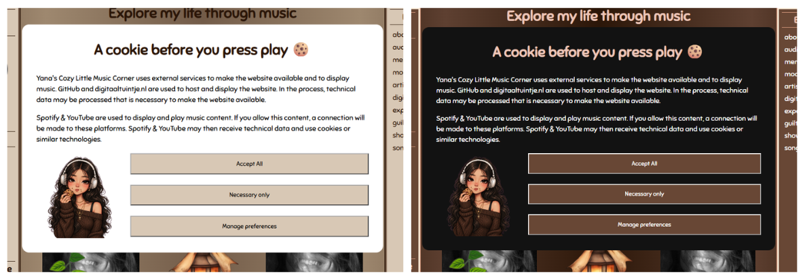

<strong>Deepdive Buttons + Dialogs</strong>

### 23 sept - Workshop 2

<strong>Checkout</strong>

1. Wat is een wireflow en wat heb je eraan?
   Een wireflow is een combinatie van een wireframe en een flowchart. Je laat niet alleen zien hoe een scherm eruitziet, maar ook hoe een gebruiker van het ene scherm naar het andere gaat. Met pijlen en stappen maak je duidelijk wat er gebeurt wanneer iemand op een knop klikt of een keuze maakt.

2. Wat zijn dark UX patterns? Geef drie voorbeelden.
   Dark UX patterns zijn ontwerpkeuzes die gebruikers sturen of onder druk zetten om iets te doen wat vooral voordelig is voor de website of het bedrijf, en niet per se voor de gebruiker. De keuzevrijheid van de gebruiker wordt daardoor minder eerlijk.

- Confirm shaming
  De optie om iets te weigeren wordt expres negatief of beschamend geformuleerd, bijvoorbeeld: “Nee bedankt, ik hou niet van verrassingen.” Hierdoor probeert de website de gebruiker richting accepteren te sturen.

- Scarcity / schaarste
  Een website laat bijvoorbeeld zien: “Nog maar 2 op voorraad.” Dit kan druk creëren om sneller iets te kopen.

- Urgency / countdown timer
  Een aftelklok zoals “Bestel binnen 12 minuten voor levering morgen” geeft de gebruiker het gevoel dat hij snel moet beslissen.

3. Waar moet je als ontwerper rekening mee houden bij het maken van een Human Consent Component?
   Bij een Human Consent Component moet je ervoor zorgen dat de gebruiker begrijpt waarvoor toestemming wordt gevraagd en echt vrij kan kiezen.

<strong>Human Consent Component</strong>

### Inventariseer welke diensten en gegevens jouw Digital Garden gebruikt

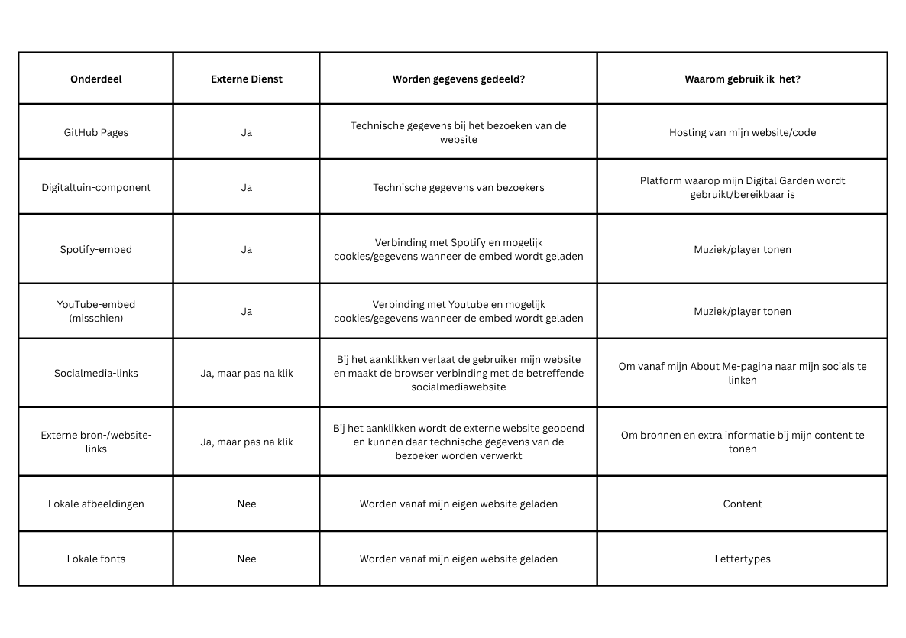

### Onderzoek: hoe moet je gebruikers informeren?

<strong>Wat moet ik mijn gebruiker vertellen?</strong> 
Voordat een gebruiker toestemming geeft, moet duidelijk zijn welke externe diensten mijn website gebruikt en waarom.

Mijn Digital Garden maakt gebruik van GitHub Pages en digitaaltuintje.nl om de website te hosten en beschikbaar te maken. Daarnaast gebruik ik Spotify-embeds om muziek op mijn website te laten zien. Mogelijk gebruik ik ook links naar Spotify, YouTube, sociale media en andere externe websites.

De gebruiker moet weten dat sommige onderdelen van mijn website verbinding maken met externe partijen. Bij een Spotify-embed kan Spotify bijvoorbeeld gegevens ontvangen en mogelijk cookies of vergelijkbare technieken gebruiken wanneer de embed wordt geladen.

Daarom moet de gebruiker zelf kunnen kiezen of externe Spotify-content geladen mag worden. Als de gebruiker toestemming geeft, kan de Spotify-player worden geladen. Als de gebruiker geen toestemming geeft, moet mijn website nog steeds bruikbaar zijn, maar wordt de Spotify-content niet getoond. Dit geldt hetzelfde voor youtube embeds mocht ik die nog gaan gebruiken.

Ook moet duidelijk zijn dat noodzakelijke diensten, zoals de hosting via GitHub Pages en digitaaltuintje.nl, nodig zijn om de website überhaupt te kunnen gebruiken.

De gebruiker moet daarnaast:

- zelf kunnen kiezen of hij toestemming geeft
- toestemming ook kunnen weigeren
- niet-noodzakelijke externe content niet automatisch geladen krijgen
- kunnen zien waarvoor toestemming wordt gevraagd
- zijn keuze later kunnen aanpassen

### 10 manieren zoeken waarop websites toestemming vragen

1. Grote modal in het midden van het scherm
   De gebruiker krijgt bij het openen van de website meteen een groot venster te zien. De rest van de website is vaak nog wel zichtbaar, maar wordt naar de achtergrond geduwd.
   Voorbeeld: YouTube gebruikt een groot consent-scherm met onder andere “Reject all”, “Accept all” en “More options”

   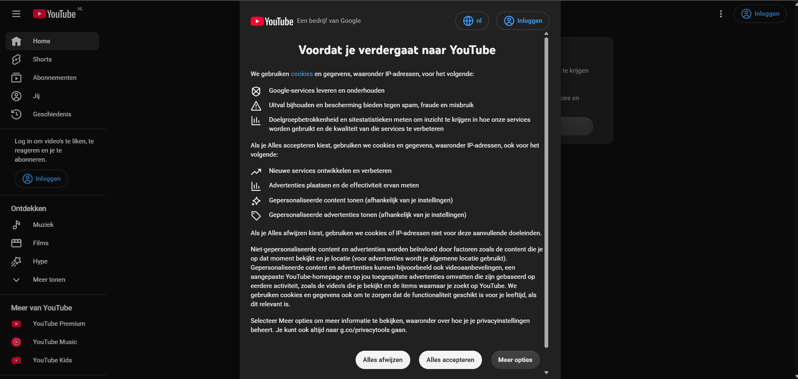

2. Accepteren en weigeren direct naast elkaar
   Bij deze methode hoeft de gebruiker niet eerst naar instellingen om cookies te weigeren. Zowel accepteren als weigeren staat meteen op het eerste scherm.
   YouTube laat bijvoorbeeld direct Accept all en Reject all zien.

3. Knop voor meer instellingen
   Naast accepteren of weigeren krijgt de gebruiker een optie zoals “Meer opties” of “Voorkeuren aanpassen”.
   YouTube gebruikt hiervoor bijvoorbeeld More options.

4. Cookies opdelen in categorieën
   Sommige websites delen cookies op in groepen, bijvoorbeeld:

- noodzakelijk;
- voorkeuren;
- statistieken;
- marketing.
  IKEA maakt bijvoorbeeld onderscheid tussen verschillende soorten cookies en geeft bezoekers controle over welke cookies zij willen accepteren.

  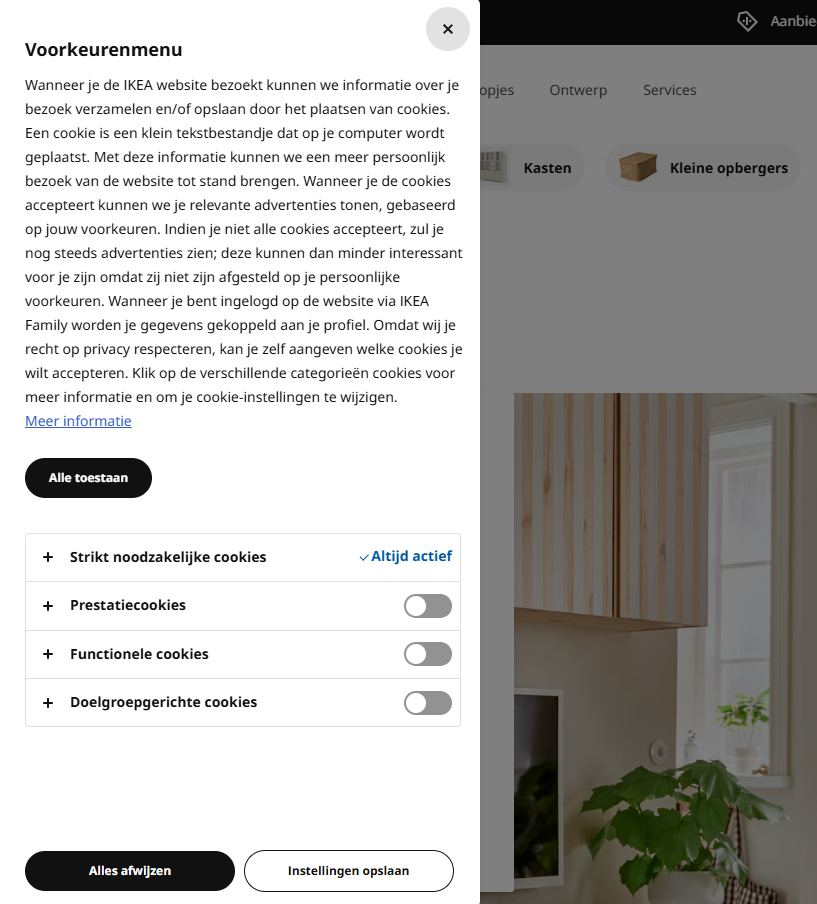

5. Toggles per categorie
   Bij uitgebreidere cookie-instellingen kan iedere categorie een eigen schakelaar hebben:
   Dit past bijvoorbeeld bij websites waar bezoekers zelf hun cookievoorkeuren kunnen bepalen. IKEA geeft expliciet aan dat gebruikers zelf kunnen aangeven welke cookies zij accepteren.

6. Alleen informeren, zonder toestemmingspopup
   Niet iedere website hoeft toestemming te vragen voor alle cookies. Sommige websites gebruiken alleen cookies met weinig gevolgen voor de privacy.
   Rijksoverheid gebruikt bijvoorbeeld analytische cookies voor webstatistieken en geeft aan dat daarvoor geen toestemming nodig is omdat deze nauwelijks gevolgen hebben voor de privacy.

7. Privacyvoorkeuren later opnieuw kunnen openen
   Sommige websites hebben onderaan de pagina een blijvende link waarmee gebruikers hun keuze later kunnen wijzigen.
   Op de abonnementswebsite van De Telegraaf staat bijvoorbeeld een knop “Privacyvoorkeuren beheren”.
   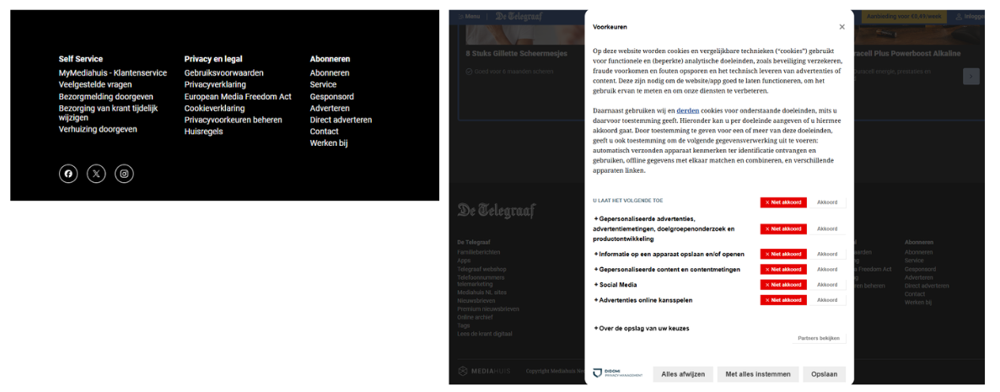

8. Externe content blokkeren totdat toestemming is gegeven
   In plaats van alle externe content meteen te laden, kan de plek waar normaal bijvoorbeeld een video of muziekspeler staat eerst geblokkeerd worden zoals bij de Paradiso website.
   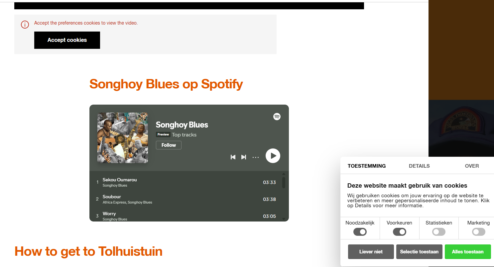

9. Cookiebanner onderaan de pagina
   Deze popt niet op in het midden van het scherm en moet je verplicht antwoord opgeven om de website te gebruiken. Deze blijft onderaan het scherm terwijl je de website gewoon kan bekijken.
   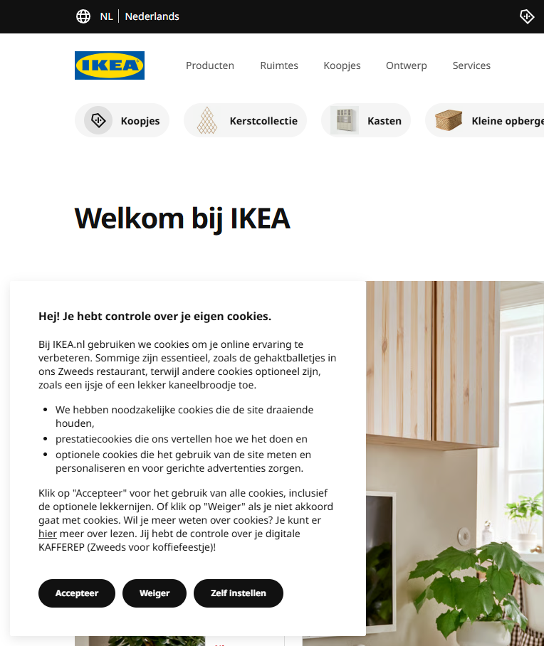

10. Toestemming vragen op het moment dat een functie wordt gebruikt
    Dit wordt vaak contextuele of just-in-time consent genoemd.
    De website vraagt dan niet meteen overal toestemming voor. Pas wanneer iemand bijvoorbeeld Spotify-content wil bekijken, verschijnt:
    Hiervoor moet content van Spotify worden geladen. Sta je dit toe?

### Mijn gekozen oplossing

Tijdens mijn onderzoek heb ik gezien dat websites op verschillende manieren toestemming vragen. Sommige websites gebruiken een grote popup bij het eerste bezoek, terwijl andere websites gebruikmaken van een kleine banner of pas toestemming vragen wanneer externe content wordt geopend.

Voor mijn Digital Garden wil ik verschillende oplossingen combineren. Bij het eerste bezoek krijgt de gebruiker een duidelijke consent-popup met de keuzes “Alles accepteren”, “Alleen noodzakelijk” en “Voorkeuren aanpassen”. In de voorkeuren kan externe Spotify-content apart worden toegestaan.

Wanneer Spotify niet is toegestaan, wordt de Spotify-embed niet direct geladen. Op die plek verschijnt een melding waarmee de gebruiker Spotify later alsnog kan toestaan. Daarnaast wil ik ervoor zorgen dat de privacyvoorkeuren later opnieuw aangepast kunnen worden.

Deze oplossing past bij mijn Digital Garden omdat de website ook zonder Spotify bruikbaar blijft, maar de gebruiker wel zelf controle houdt over het laden van externe content.

<strong>Dark Pattern Herontwerp</strong>

<strong>Wireframes & Wireflows</strong>

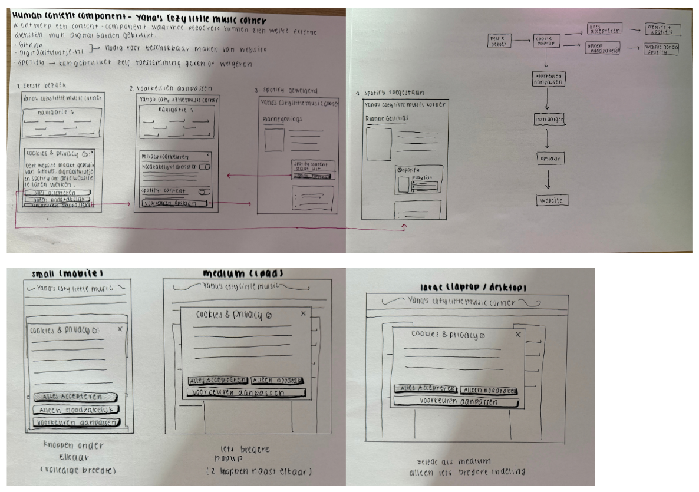

### 22 sept - Huiswerk voor Workshop 2

<strong>Deepdive -  Buttons, states en selectors</strong>

### Voorbereidingen

Als eerste heb ik het artikel over CSS pseudo-classes van Kevin Powell doorgenomen. Hier leerde ik hoe je met bijvoorbeeld :hover en :focus-visible styling kunt laten reageren op wat een gebruiker doet. Vooral vond ik het belangrijk om te leren dat deze states niet alleen voor visuele effecten zijn, maar ook zorgen voor duidelijke feedback en betere toegankelijkheid.

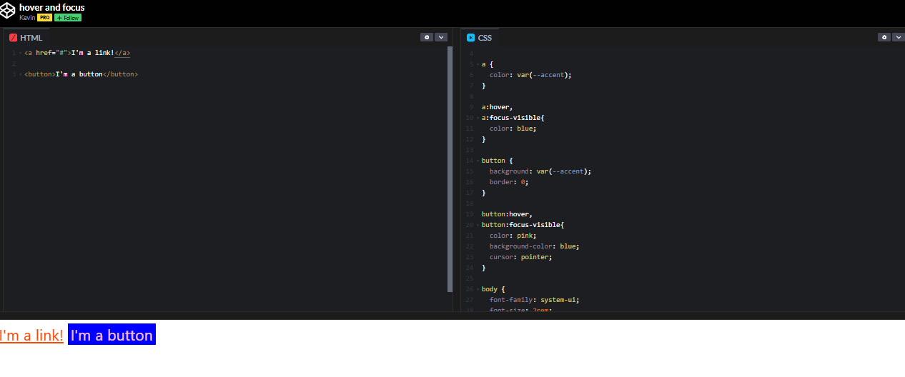

Daarna heb ik het artikel over User Interaction van Kevin Powell gelezen en de oefening uitgevoerd. Hier leerde ik hoe je met pseudo-classes zoals :user-valid, :user-invalid en :focus-within direct feedback kunt geven op acties van een gebruiker, bijvoorbeeld bij een formulier. Dit is niet alleen fijn voor de UX, maar ook belangrijk voor toegankelijkheid, omdat gebruikers zo beter begrijpen wat er gebeurt.

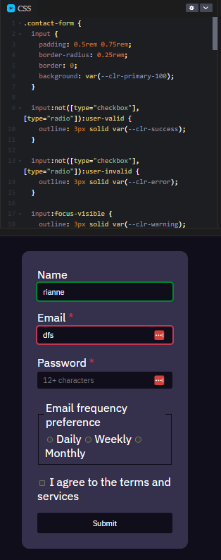

### Oefening 1 - Basic button states

Bij de eerste oefening heb ik geleerd hoe ik de verschillende states van een button kan vormgeven. Ik heb geoefend met de default, :focus, :hover en :active state en iedere state een andere styling gegeven. Hierdoor zag ik hoe je met CSS duidelijke feedback op verschillende interacties kunt geven.

Dit is voor mijn eigen website belangrijk omdat ik veel interactieve elementen gebruik. Door deze states bewust toe te passen kan ik beter duidelijk maken wat klikbaar is, wat op dat moment focus heeft en wanneer een actie wordt uitgevoerd. Dit maakt mijn Digital Garden duidelijker in gebruik én toegankelijker.

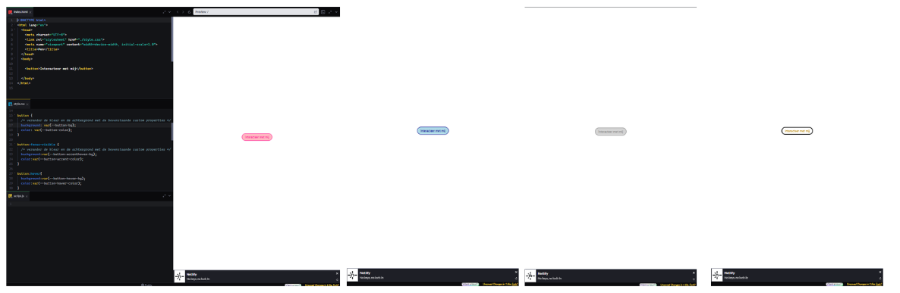
https://codepen.io/editor/Rianne-Maria/pen/01a0eee0-cf51-75ce-9877-a05f68d6bb14

### Oefening 2 - Details en summary

Bij deze oefening heb ik gewerkt met details en summary. Deze elementen kende ik al, omdat ik ze zelf al gebruik in mijn README om onderdelen in- en uit te klappen. Wat nieuw voor mij was, is dat een 
 eigenlijk ook interactief is en je deze daarom net als een button verschillende states kunt geven. Ik heb de :focus-visible, :hover en :active states uit de vorige oefening toegepast op mijn summary. Dit is belangrijk voor mijn eigen website omdat ik nu weet dat ik dezelfde principes voor feedback en toegankelijkheid ook kan toepassen op andere interactieve elementen dan alleen buttons.

https://codepen.io/editor/Rianne-Maria/pen/01a0eee7-6cab-73bf-bd9c-39d7ca76b5ce

<strong>Talk 1 - Microinteractions: Design with Details</strong>

Als voorbereiding op deze Deep Dive heb ik de talk ‘Microinteractions: Design with Details’ van Dan Saffer bekeken. In deze talk wordt uitgelegd hoe juist kleine interacties en details een grote invloed kunnen hebben op de gebruikerservaring. Ik heb tijdens het kijken aantekeningen gemaakt over wat microinteractions zijn, waarom ze belangrijk zijn en uit welke onderdelen ze bestaan: Triggers, Rules, Feedback en Loops & Modes.

Mijn notities:
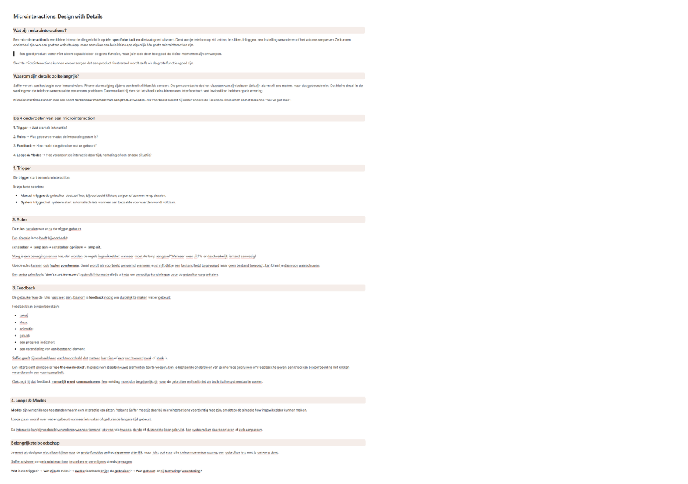

<strong>Artikel 1 – Dark Patterns in UX</strong>

Daarna heb ik het artikel ‘What are Dark Patterns in UX?’ van UX Design Institute gelezen. Hierin wordt uitgelegd hoe ontwerpkeuzes gebruikers bewust kunnen sturen of misleiden, bijvoorbeeld door bepaalde keuzes moeilijker te maken, informatie te verbergen of gebruik te maken van FOMO en confirm-shaming. Tijdens het lezen heb ik vooral gekeken naar de verschillende soorten dark patterns en waarom deze problematisch zijn voor de gebruikerservaring. Het artikel maakte mij bewuster van hoeveel invloed vormgeving, tekst en de hiërarchie van keuzes kunnen hebben op het gedrag van een gebruiker.

Mijn notities:
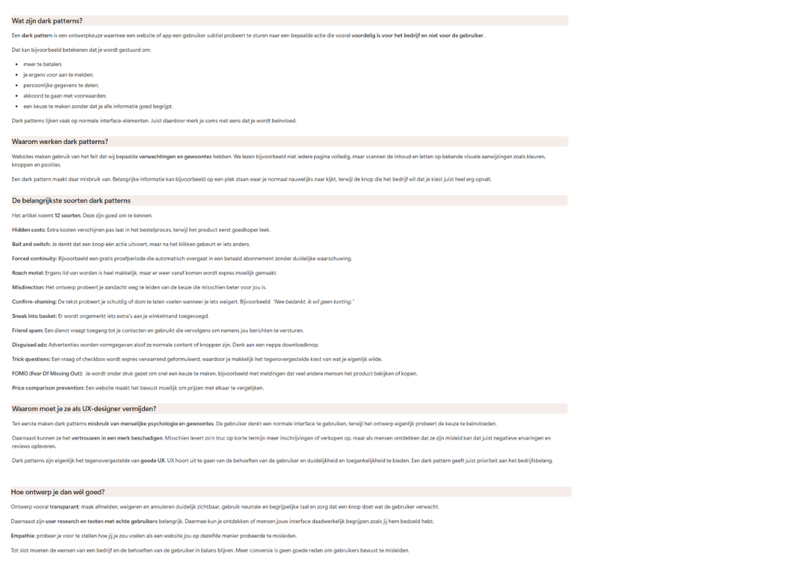

<strong>Talk 2 – Deceptive Patterns</strong>

Vervolgens heb ik een talk over deceptive patterns bekeken. Hierin werd uitgelegd dat een ontwerp niet alleen misleidend kan zijn wanneer dit bewust wordt gedaan, maar dat gebruikers zich ook onbedoeld misleid kunnen voelen. Een belangrijk inzicht vond ik daarom dat je als designer moet kijken naar wie het meeste voordeel heeft van een ontwerp en of de werking overeenkomt met het mental model en de verwachtingen van de gebruiker. De talk liet mij vooral nadenken over het verschil tussen wat ik als designer bedoel en hoe een gebruiker mijn ontwerp uiteindelijk daadwerkelijk ervaart.

Mijn notities:
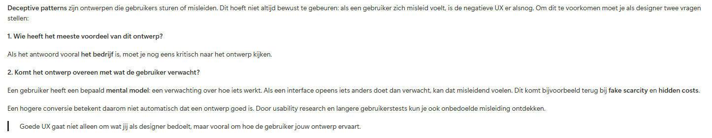

<strong>Talk 2 – Deceptive Patterns</strong>

Als laatste heb ik het artikel ‘Deceptive Patterns in UX’ van Nielsen Norman Group gelezen. Dit artikel ging verder in op hoe misleidende ontwerpkeuzes kunnen ontstaan en hoe je deze als designer kunt herkennen en voorkomen. Hierbij heb ik onder andere geleerd over sludge, waarbij een gebruiker onnodig veel moeite moet doen om een bepaalde keuze uit te voeren. Wat ik vooral uit dit artikel meeneem, is dat ik niet alleen moet kijken of een gebruiker een keuze kan maken, maar ook hoe makkelijk die keuze te vinden, begrijpen en uitvoeren is.

Mijn notities:
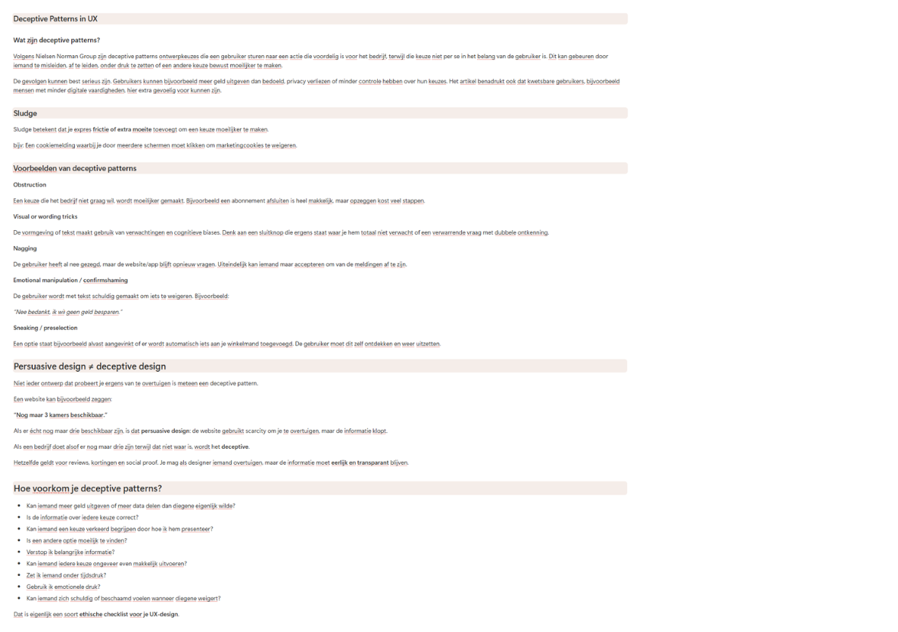

### 21 sept - Sprintplanning + Workshop 1

<strong>Checkout</strong>

<strong>Wat zijn HTML landmark role elements?</strong> 
HTML landmark elements zijn semantische elementen die de grote onderdelen van een pagina structuur en betekenis geven, zoals header, nav, main en footer. Ze helpen niet alleen om mijn HTML overzichtelijk te houden, maar zorgen er ook voor dat bijvoorbeeld screenreaders begrijpen hoe de pagina is opgebouwd en gebruikers makkelijker door de website kunnen navigeren.

<strong>Wat zijn heading elementen en hoe horen deze ‘genest’ te worden?</strong> 
Heading elementen zijn de koppen h1 t/m h6. Deze geven de hiërarchie van de content aan en moeten daarom in een logische volgorde worden gebruikt. Een h1 is de belangrijkste kop, daaronder gebruik je bijvoorbeeld h2 voor onderdelen en h3 voor onderdelen binnen een h2. Ik gebruik headings dus niet omdat ik een tekst alleen groter wil maken, maar om de structuur en betekenis van mijn pagina aan te geven.

<strong>Hoe ga jij met cookies om? Beschrijf je beweegredenen en of die zijn veranderd na het volgen van dit college.</strong> 
Voor deze les dacht ik eigenlijk niet zo veel na over cookies en klikte ik vaak snel op accepteren om verder te kunnen. Door het onderzoek naar de verschillende cookiemeldingen ben ik me er veel bewuster van geworden waar ik precies toestemming voor geef en hoe het UX-design van een melding mijn keuze kan beïnvloeden. Ik zou nu eerder kijken welke cookies noodzakelijk zijn en onnodige cookies weigeren.

Voor mijn eigen Digital Garden ga ik hier ook bewuster mee om. Ik wil onderzoeken welke externe diensten ik gebruik, bijvoorbeeld Spotify- en YouTube-embeds, en wat deze betekenen voor de privacy van mijn bezoekers. Als ik een toestemmingsmelding nodig heb, wil ik deze duidelijk en eerlijk ontwerpen, waarbij accepteren en weigeren even makkelijk zijn en de gebruiker begrijpt waar die toestemming voor geeft.

<strong>Geïnformeerd cookies accepteren</strong>

Voor deze opdracht heb ik onderzocht hoe verschillende websites omgaan met cookie consent en hoe duidelijk een gebruiker wordt geïnformeerd voordat die toestemming geeft. Hiervoor heb ik de cookiemeldingen van De Volkskrant en Paradiso stap voor stap bekeken. Ik heb gekeken naar de uitleg, de verschillende keuzes, welke knoppen het meeste opvallen en hoe makkelijk het is om cookies te accepteren of juist te weigeren. Ook heb ik op de Songhoy Blues-pagina getest wat er gebeurt wanneer ik bepaalde cookies niet accepteer.

Een belangrijk inzicht vond ik dat alleen het aanbieden van een keuze niet automatisch betekent dat die keuze ook duidelijk en gelijkwaardig wordt aangeboden. Bij De Volkskrant moest ik bijvoorbeeld eerst naar de instellingen om alles te kunnen weigeren, terwijl Paradiso direct de optie ‘Liever niet’ liet zien. Ook ontdekte ik dat een cookiekeuze invloed kan hebben op de content: de video op de Songhoy Blues-pagina werd pas zichtbaar nadat ik de benodigde voorkeurscookies had toegestaan.

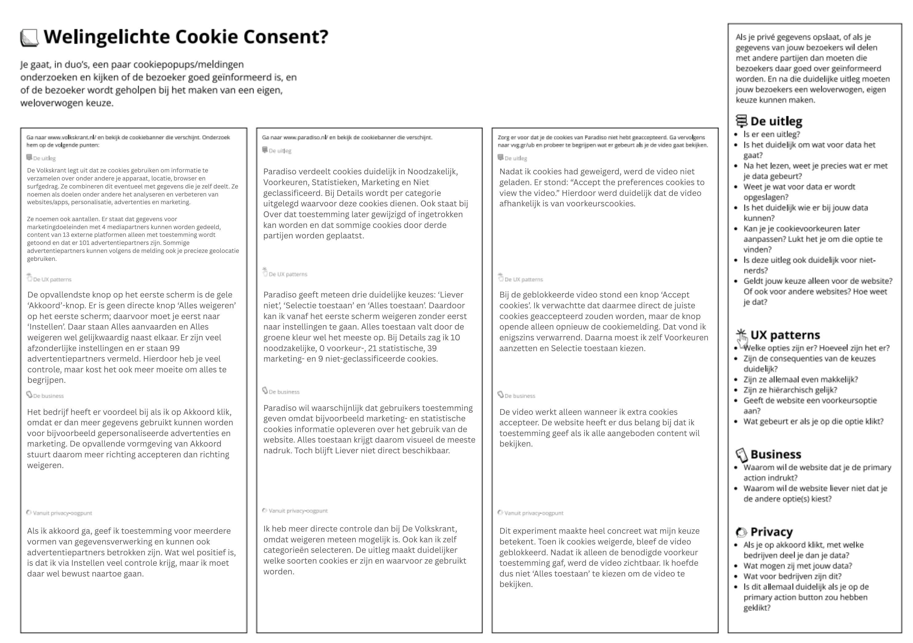

Voor mijn eigen Digital Garden neem ik vooral mee dat ik bewust moet kijken naar welke externe diensten ik gebruik en wat deze met gegevens van mijn bezoekers doen. Ik gebruik bijvoorbeeld externe content en embeds van diensten zoals Spotify en YouTube. Door deze opdracht realiseerde ik mij dat zulke onderdelen invloed kunnen hebben op de privacy van een bezoeker. Ook wil ik onderzoeken wat het gebruik van GitHub en digitaaltuintje.nl betekent voor mijn website.

Daarnaast neem ik veel mee op het gebied van UX-design. Als ik zelf een cookie- of privacymelding nodig heb, wil ik voorkomen dat ik de gebruiker met kleur, grootte of positie van knoppen naar één keuze stuur. Accepteren en weigeren moeten allebei duidelijk en makkelijk te vinden zijn en de tekst moet begrijpelijk uitleggen waarvoor iemand toestemming geeft en wat er gebeurt als diegene weigert. Zo houd ik bij mijn eigen ontwerp niet alleen rekening met hoe mijn website eruitziet, maar ook met privacy, transparantie en de ervaring van de gebruiker.

### 18 sept - Voortgang & Retrospect

<strong>Checkout</strong>

<strong>Oriënteren en begrijpen</strong>

<strong>Waarom geven de docenten deze opdracht?</strong> 
Volgens mij krijgen we deze opdracht om te leren hoe je van een eigen idee naar een werkend en onderbouwd digitaal ontwerp gaat. Het gaat dus niet alleen om uiteindelijk een mooie Digital Garden maken, maar vooral om het proces erachter. Tijdens deze sprint heb ik gemerkt dat we steeds eerst onderzoeken, schetsen en verschillende mogelijkheden uitproberen voordat we iets definitief maken.

Bij mijn eigen Garden heb ik bijvoorbeeld eerst mijn onderwerp My Life Through Music onderzocht, daarna Visual Research gedaan, een moodboard en Crazy 8 gemaakt en verschillende schetsen uitgewerkt. Vervolgens ben ik die ideeën gaan vertalen naar HTML en CSS. De Deep Dives hielpen mij daarbij om nieuwe technieken eerst los te oefenen en ze daarna in mijn eigen ontwerp te kunnen gebruiken.

Ik denk daarom dat het doel vooral is dat ik leer waarom ik bepaalde ontwerp- en codekeuzes maak, in plaats van alleen iets te maken omdat het er leuk uitziet.

<strong>Welke technieken gebruik ik?</strong> 
In deze sprint heb ik vooral gewerkt met HTML en CSS. Bij HTML heb ik geleerd om meer te kijken naar de betekenis en structuur van mijn content. Ik heb bijvoorbeeld nagedacht over welke content een heading, navigatie, afbeelding, link, lijst of section is, in plaats van alles alleen te gebruiken om de juiste vormgeving te krijgen.

In CSS heb ik onder andere gewerkt met CSS Grid, Flexbox, media queries, Grid Areas, custom properties, @font-face, pseudo-elementen en light/dark mode. Vooral Grid en responsive design zijn een groot onderdeel van mijn proces geweest. Door de Deep Dives over Grid heb ik steeds beter leren begrijpen hoe ik elementen in rows en columns kan positioneren en hoe ik een layout met media queries kan aanpassen aan verschillende schermgroottes.

Ik heb daarbij ook geleerd dat een techniek niet automatisch geschikt is voor ieder ontwerp. Bij mijn eerste kamerconcept probeerde ik bijvoorbeeld bijna alles met Grid te positioneren. Dat werkte gedeeltelijk, maar maakte het responsive maken uiteindelijk erg ingewikkeld. Die ervaring neem ik mee naar mijn volgende ontwerp.

<strong>Wat zijn de randvoorwaarden?</strong> 
Een belangrijke randvoorwaarde is dat mijn website mobile-first wordt opgebouwd en daarna responsive wordt gemaakt voor grotere schermen. Daarnaast moet ik werken met HTML en CSS en rekening houden met semantische HTML, een duidelijke structuur en toegankelijkheid. Mijn website moet uiteindelijk niet alleen visueel werken, maar ook technisch logisch zijn opgebouwd.

Voor mezelf zijn er ook randvoorwaarden ontstaan tijdens het proces. Ik wil bijvoorbeeld dat mijn ontwerp haalbaar blijft binnen de beschikbare tijd. Ik hou namelijk van mezelf uitdagen en ben erg perfectionistisch, maar daardoor word een design zoals de kamer best lastig om binnen een bepaalde tijd te maken. Mijn eerste kamerconcept werd technisch steeds ingewikkelder. Na de feedback uit mijn voortgangsgesprek heb ik daarom besloten om verder te gaan met mijn eenvoudigere albumplank-concept. Daarmee kan ik meer aandacht besteden aan typografie, kleur, hiërarchie, responsiveness en de andere dingen die ik tijdens de sprint leer.

<strong>Waar gebruik je HTML/CSS voor?</strong> 
Ik gebruik HTML voor de inhoud en structuur van mijn Digital Garden. HTML bepaalt wat iets daadwerkelijk is. Een titel wordt bijvoorbeeld een heading, navigatie wordt een nav en een afbeelding die ergens naartoe leidt kan onderdeel zijn van een link. Ik probeer daarbij steeds meer vanuit semantiek te denken en niet vanuit hoe iets eruit moet zien.

CSS gebruik ik vervolgens voor de presentatie en layout. Daarmee bepaal ik bijvoorbeeld kleuren, lettertypes, witruimte, afmetingen en de positie van elementen. Ook gebruik ik CSS om mijn ontwerp responsive te maken en interactie en visuele feedback toe te voegen, bijvoorbeeld met hover/focus-states en mijn light/dark-theme. Door HTML en CSS op deze manier van elkaar te scheiden blijft mijn code duidelijker en begrijp ik beter welke taal waarvoor bedoeld is.

<strong>Wat kan er allemaal met CSS?</strong> 
Met CSS kun je veel doen. Naast kleuren, lettertypes en afmetingen kun je er complete layouts mee opbouwen en elementen precies vormgeven en positioneren. Wat ik deze sprint vooral heb geleerd, is hoe belangrijk CSS is voor het responsive maken van een website. Met bijvoorbeeld Grid, Flexbox en media queries kan ik ervoor zorgen dat mijn ontwerp zich aanpast aan verschillende schermgroottes.

Dat vind ik heel handig, omdat een website niet alleen goed moet werken op mijn eigen laptopscherm, maar bijvoorbeeld ook op een telefoon of een groter desktopscherm. Ik heb geleerd om mobile-first te beginnen en vanuit daar mijn layout aan te passen voor grotere schermen. Tijdens mijn Grid Deep Dives heb ik bijvoorbeeld geoefend met het veranderen van het aantal columns en met Grid Areas. Hierdoor begrijp ik nu veel beter hoe ik met CSS één ontwerp op verschillende schermformaten goed kan laten werken.

Vooral dat responsive gedeelte wil ik verder meenemen in mijn eigen Digital Garden, omdat ik wil dat mijn website op ieder scherm overzichtelijk en bruikbaar blijft.

<strong>Verbeelden en conceptualiseren</strong>

<strong>Lukt het om verschillende ideeën te bedenken?</strong> 
Ja, ik heb tijdens deze sprint bewust meerdere richtingen onderzocht voordat ik één ontwerp ben gaan uitwerken. Ik ben begonnen met onder andere een Crazy 8, moodboard, Visual Research en verschillende schetsen. Ik heb bijvoorbeeld twee keer een Crazy 8 gedaan om meerdere ideeen te ontwikkelen en heb daarna ideeen met elkaar gecombineerd. Hierdoor ontstonden meerdere mogelijkheden voor hoe mijn Digital Garden eruit kon zien.

Mijn eerste grote concept was de slaapkamer/kamer waarin verschillende objecten naar onderdelen van mijn website zouden leiden. Daarnaast had ik ook andere schetsen gemaakt, waaronder het idee met albumplanken. Dat bleek uiteindelijk heel handig, omdat mijn eerste concept technisch erg ingewikkeld werd. Ik had daardoor al een andere richting waar ik op terug kon vallen. Ik heb hiervan geleerd dat het handig is om niet meteen verliefd te worden op één idee, maar meerdere mogelijkheden open te houden.

<strong>Lukt het om je ideeën te schetsen?</strong> 
Ja. Schetsen heeft mij deze sprint juist erg geholpen om mijn ideeën duidelijker te krijgen. Ik heb bijvoorbeeld mijn kamerconcept eerst op papier uitgewerkt en daarbij al nagedacht over rows, columns, de positie van objecten en de mobiele layout. Ook heb ik mijn About Me-pagina in verschillende stappen geschetst om na te denken over contrast, witruimte, hiërarchie en Grid.

Door iets eerst te tekenen zie ik sneller problemen die ik in mijn hoofd nog niet had bedacht. Het helpt mij ook om eerst over de structuur na te denken voordat ik meteen begin met coderen.

<strong>Wat doet deze CSS-property?</strong> 
Tijdens mijn Deep Dives heb ik veel nieuwe CSS-properties ontdekt door ermee te experimenteren. Vooral bij Grid heb ik dit veel gedaan. Ik heb bijvoorbeeld gespeeld met grid-template-columns, grid-template-areas, grid-area, gap en media queries.

Ik merkte dat ik een property beter begrijp wanneer ik zelf waarden verander en vervolgens direct kijk wat er op het scherm gebeurt. Bij de oefeningen met Grid Areas begon ik bijvoorbeeld steeds beter uit mijn hoofd te begrijpen hoe ik onderdelen in een bepaalde area kon plaatsen. Dat experimenteren wil ik blijven gebruiken wanneer ik nieuwe CSS tegenkom.

<strong>Welke content en welke HTML heb je nodig?</strong> 
Bij het maken van mijn website ben ik steeds bewuster gaan nadenken over wat mijn content daadwerkelijk betekent voordat ik het ga vormgeven. Voor mijn Digital Garden heb ik bijvoorbeeld titels, navigatie, afbeeldingen, links, lijstjes, quotes en verschillende stukken tekst nodig.

Daar probeer ik vervolgens passende semantische HTML bij te gebruiken. Een titel wordt bijvoorbeeld een heading, navigatie een <nav>, een lijst een <ul> en een klikbare afbeelding kan in een <a> staan. Ik heb geleerd dat HTML vooral de inhoud en structuur moet beschrijven en dat ik CSS daarna gebruik voor de vormgeving.

<strong>Hoe kan ik dit soort content vormgeven?</strong> 
Hiervoor heb ik deze sprint veel verschillende mogelijkheden onderzocht. Met mijn Visual Research, moodboard, kleurenonderzoek en typografieonderzoek heb ik gekeken welke uitstraling bij My Life Through Music past. Ik wilde vooral een persoonlijke, warme en cozy sfeer creëren.

Ik heb daarnaast geleerd dat vormgeving niet alleen gaat over mooie kleuren en afbeeldingen. Ook witruimte, contrast, hiërarchie, typografie, Grid en consistentie bepalen hoe een pagina aanvoelt en hoe makkelijk de gebruiker de content begrijpt. Uit mijn voortgangsgesprek bleek dat ik dit onderzoek nog duidelijker in mijn uiteindelijke website moet verwerken. Dat wordt daarom een belangrijk aandachtspunt voor Sprint 2.

<strong>Wat als ik hier nu eens 1000 invul?</strong> 
Deze sprint heb ik juist geleerd dat het in de conceptfase ook goed is om extremere dingen uit te proberen, omdat je daardoor op ideeën kunt komen waar je anders niet aan denkt.

<strong>Prototypen en uitwerken</strong>

<strong>Begrijpen bezoekers de site?</strong> 
Dit heb ik tijdens Sprint 1 nog niet uitgebreid met gebruikers getest, maar ik heb tijdens het maken wel steeds gekeken of duidelijk is waar je op kunt klikken en waar onderdelen naartoe leiden. Bij mijn eerste kamerconcept wilde ik bijvoorbeeld dat de verschillende objecten in de kamer als navigatie zouden werken. Tijdens het uitwerken merkte ik dat iets voor mijzelf logisch kan zijn, maar dat dit niet automatisch betekent dat een bezoeker het ook begrijpt. Hier moet ik dus in sprint 2 aan gaan werken.

<strong>Wat vindt de opdrachtgever ervan?</strong> 
Bij deze opdracht heb ik geen echte opdrachtgever. Ik zie mijn docenten en begeleiders daarom als de personen bij wie ik kan controleren of mijn ontwerp aansluit bij de eisen van de opdracht. Tijdens mijn voortgangsgesprek heb ik mijn prototype laten zien en feedback gekregen op zowel mijn ontwerp als mijn code.

Uit die feedback kwam bijvoorbeeld dat ik mijn eerste kamerconcept technisch erg ingewikkeld had gemaakt en dat mijn Visual Research nog duidelijker terug mocht komen in mijn website. Deze feedback heb ik meegenomen in mijn volgende iteratie. Daardoor heb ik uiteindelijk besloten om verder te gaan met mijn albumplank-concept, omdat ik daarin de eisen en de dingen die ik tijdens de lessen leer beter kan toepassen.

<strong>Werkt dit wel?</strong> 
Dit is iets wat ik tijdens Sprint 1 heel duidelijk heb ervaren. Mijn kamerconcept zag er in mijn hoofd goed uit, maar tijdens het daadwerkelijk bouwen kwam ik erachter dat het positioneren van alle losse elementen op verschillende schermformaten erg ingewikkeld werd. Iedere keer als ik iets voor één scherm verbeterde, kon het op een ander scherm weer verkeerd staan.

Door een werkend prototype te maken kwam ik dus achter problemen die ik in mijn schets nog niet kon zien. Ik heb geprobeerd deze problemen op te lossen met Grid en media queries, maar op een gegeven moment merkte ik dat ik vooral bezig was met repareren. Daardoor heb ik geleerd dat ik eerder moet testen of mijn idee technisch haalbaar is en dat ik een ontwerp ook mag vereenvoudigen als dat uiteindelijk een beter resultaat oplevert.

<strong>Ooooh, kan dit ook?!</strong> 
Dit gevoel heb ik vooral gehad tijdens de Deep Dives en het experimenteren met CSS. Ik ontdekte bijvoorbeeld dat ik met Grid Areas een layout bijna visueel in mijn CSS kan indelen en dat ik met media queries dezelfde content op verschillende schermgroottes anders kan positioneren.

Ook vond ik het interessant dat ik met CSS veel meer interactie kon maken dan ik vooraf dacht. Zo heb ik geëxperimenteerd met een light/dark-theme waarbij de lamp in mijn kamer als schakelaar werkte. Door dingen daadwerkelijk te bouwen en ermee te spelen, ontdek ik steeds nieuwe mogelijkheden. Ik merk daardoor dat mijn kennis niet alleen uit de uitleg van de opdrachten komt, maar vooral groeit doordat ik zelf probeer, fouten maak, aanpas en opnieuw test.

<strong>Evalueren</strong>

<strong>Reflecteren met the riddle</strong> 

1. Wat wilde ik weten?
   Ik wilde tijdens deze sprint vooral ontdekken hoe ik mijn idee voor My Life Through Music kon vertalen naar een werkende Digital Garden. Daarbij wilde ik leren hoe ik mijn ontwerp responsive kon maken en hoe ik technieken uit de lessen en Deep Dives, zoals Grid, media queries en light/dark mode, kon toepassen.

2. Wat deed ik om erachter te komen?
   Ik heb veel geschetst, Visual Research gedaan en verschillende concepten bedacht. Daarnaast heb ik Deep Dives gevolgd en de technieken daaruit steeds geprobeerd toe te passen in mijn eigen website. Ik heb mijn website continu op verschillende schermgroottes bekeken en mijn code aangepast wanneer iets niet goed werkte. Uiteindelijk heb ik mijn prototype ook tijdens het voortgangsgesprek laten zien en feedback gevraagd.

3. Wat was het resultaat?
   Ik kreeg mijn eerste kamerconcept semi-werkend en gedeeltelijk responsive, inclusief een light/dark-theme. Tegelijkertijd ontdekte ik dat ik het mezelf technisch erg moeilijk had gemaakt. Vooral het positioneren van alle losse objecten werd steeds ingewikkelder. Uit mijn voortgangsgesprek kwam ook naar voren dat mijn Visual Research, typografie en visuele hiërarchie nog duidelijker terug mochten komen in mijn website. Hierdoor heb ik uiteindelijk besloten om verder te gaan met mijn eenvoudigere albumplank-concept.

4. Wat weet ik nu (niet)?
   Ik begrijp nu veel beter hoe Grid, media queries en responsive design werken en ik kan deze technieken steeds zelfstandiger toepassen. Ik weet nu ook dat ik niet automatisch een techniek moet gebruiken alleen omdat ik hem ken: ik moet kijken welke techniek het beste bij mijn ontwerp past. Wat ik nog verder wil leren, is hoe ik mijn responsive layout zo vloeiend mogelijk kan maken en hoe ik mijn Visual Research en ontwerpprincipes duidelijker kan vertalen naar mijn uiteindelijke website.

<strong>Wat wil(de) ik weten/bereiken?</strong> 
Mijn belangrijkste doel was om mijn eigen concept om te zetten naar een werkende, responsive website. Ik wilde niet alleen HTML en CSS leren schrijven, maar ook begrijpen waarom ik bepaalde code gebruik. Daarnaast wilde ik mijn persoonlijke stijl en mijn onderwerp My Life Through Music duidelijk terug laten komen.

Tijdens de sprint is mijn doel iets veranderd. Ik merkte dat het niet alleen belangrijk is dat iets technisch werkt, maar ook dat mijn keuzes haalbaar en onderbouwd zijn. Voor Sprint 2 wil ik daarom meer balans vinden tussen techniek, vormgeving en mijn onderzoek.

<strong>Wat heb ik gedaan?</strong> 
Ik heb in deze sprint heel veel verschillende dingen gedaan: van Crazy 8, moodboard, Visual Research en schetsen tot het daadwerkelijk schrijven van HTML en CSS. Ik heb meerdere Deep Dives gedaan over onder andere Grid, media queries, responsive design en Grid Areas en heb geprobeerd deze kennis toe te passen in mijn Digital Garden.

Daarnaast heb ik meerdere iteraties van mijn ontwerp gemaakt. Ik ben begonnen met mijn kamerconcept en heb hier veel mee geëxperimenteerd. Toen dit steeds complexer werd, heb ik een back-upconcept met albumplanken gemaakt. Ook heb ik tijdens mijn voortgangsgesprek feedback verzameld en mijn keuzes opnieuw geëvalueerd.

<strong>Wat was het resultaat?</strong> 
Het belangrijkste resultaat is voor mij niet alleen de website die er nu staat, maar vooral hoeveel meer ik inmiddels begrijp van het proces erachter. Ik kan nu veel zelfstandiger met CSS Grid en media queries werken en begrijp beter hoe mobile-first en responsive design in elkaar zitten.

Daarnaast heeft het experimenteren met mijn eerste concept mij laten zien waar de grenzen van mijn gekozen oplossing liggen. Mijn kamerconcept heeft dus misschien niet mijn definitieve ontwerp opgeleverd, maar heeft mij wel veel geleerd over responsive design, positionering en het kiezen van de juiste CSS-techniek. Mijn nieuwe albumconcept is daardoor ook een veel bewustere keuze geworden.

<strong>Wat weet ik nu (niet)?</strong> 
Ik weet nu beter hoe ik een website mobile-first kan opbouwen en vervolgens met media queries responsive kan maken. Ook voel ik mij veel zekerder met Grid dan aan het begin van de sprint. Grid Areas vond ik bijvoorbeeld eerst nieuw, maar na de oefeningen kon ik steeds beter uit mijn hoofd bepalen waar elementen moesten komen. Soms moet ik nog wel even spieken, maar ik kan het al beter uit mijn hoofd dan in het begin.

Wat ik nog verder wil ontwikkelen is mijn kennis van visuele hiërarchie, typografie en het daadwerkelijk toepassen van mijn Visual Research. Ook wil ik blijven oefenen met responsive design, zodat mijn layout niet alleen op een paar vaste schermformaten goed staat, maar ook mooi meebeweegt tussen verschillende formaten.

<strong>Wat vond je (niet) leuk?</strong> 
Ik vond het vooral leuk dat ik veel vrijheid kreeg om een website te maken over een onderwerp dat persoonlijk bij mij past. Daardoor vond ik het leuk om bezig te zijn met mijn concept, afbeeldingen, muziek en de uitstraling van mijn Garden. Ook vond ik het leuk om te merken dat dingen die ik tijdens een Deep Dive eerst moeilijk vond, later steeds makkelijker werden. Vooral bij Grid en Grid Areas merkte ik dat duidelijk.

Wat ik minder leuk vond, was wanneer ik heel lang met één technisch probleem bezig was zonder dat het beter werd. Bij mijn kamerconcept gebeurde dit bijvoorbeeld tijdens het responsive maken: ik paste iets aan voor het ene scherm en daardoor verschoof het weer op een ander scherm. Daar kon ik soms lang in blijven hangen. Ik heb daarvan geleerd dat ik eerder moet beoordelen of mijn gekozen oplossing nog wel efficiënt is, in plaats van eindeloos dezelfde oplossing te blijven repareren.

<strong>Voldoet het nog aan de eisen?</strong> 
Gedeeltelijk. Aan het einde van Sprint 1 had ik al veel belangrijke onderdelen uitgevoerd. Mijn website werkte, ik had gewerkt aan responsiveness, gebruikte Grid, CSS custom properties en lokale fonts en had een light/dark-theme gemaakt.

Uit mijn voortgangsgesprek bleek tegelijkertijd dat er nog onderdelen verbeterd moesten worden. Vooral visuele hiërarchie, typografie en het zichtbaar toepassen van mijn Visual Research waren nog onvoldoende verwerkt. Ook was mijn eerste concept technisch complexer geworden dan nodig.

Daarom vind ik het belangrijk dat ik niet alleen kijk naar hoeveel ik al heb gemaakt, maar ook blijf controleren of wat ik maak daadwerkelijk aansluit bij de leerdoelen en randvoorwaarden. Mijn overstap naar het albumplank-concept is daar eigenlijk een direct gevolg van: ik wil mijn website eenvoudiger opbouwen, zodat ik in Sprint 2 meer aandacht kan besteden aan de onderdelen die nog ontbreken.

In sprint 2 zal ik ook vaker tijdens mijn process checken of het nog doet aan de eisen, zodat ik zeker weet dat ik de goede kant op ga.

<strong>Voortgangs gesprek</strong>

Tijdens mijn voortgangsgesprek hebben Charley en Kate gekeken naar mijn Digital Garden en naar mijn proces van Sprint 1. Over het algemeen was de feedback positief: ik had duidelijk hard gewerkt en mijn gekozen interesse was goed terug te zien in mijn Garden. Ook gaf mijn learning log een duidelijk beeld van mijn ontwerpproces. Een belangrijk aandachtspunt voor de volgende sprint is om de opdrachten minder als losse onderdelen te behandelen en de kennis die ik tijdens de Deep Dives en mijn Visual Research opdoe daadwerkelijk toe te passen in mijn website. Zo kan ik meer laten zien dat ik de technieken niet alleen heb uitgevoerd, maar ook begrijp en bewust kan inzetten.

### Feedback op mijn eerste kamerconcept

Tijdens het gesprek hebben we specifiek naar mijn eerste concept met de kamer en het bureau gekeken. Technisch had ik al best veel bereikt: het ontwerp was responsive, ik werkte met Grid en ik had een light- en dark-theme gemaakt waarbij de lamp als schakelaar werkte.

Kate gaf mij alleen mee dat Grid niet per se de handigste oplossing was voor de manier waarop ik alle losse objecten in de kamer wilde positioneren. Voor zo'n ontwerp zou ik bijvoorbeeld beter met position: relative kunnen werken. Dit verklaarde ook waarom ik eerder zoveel moeite had om alle losse objecten op verschillende schermgroottes op de juiste plek te houden.

Daarnaast zat er nog een probleem in mijn light/dark-mode. Wanneer een apparaat standaard in light mode stond, kon ik met de lamp naar dark mode en weer terug. Maar wanneer het apparaat vanuit de eigen instellingen al standaard in dark mode stond, werkte mijn schakelaar niet zoals bedoeld en wilde het niet switchen naar de andere mode. Dit moest ik dus nog anders aanpakken zodat mijn eigen theme-toggle onafhankelijk van de standaardinstelling van het apparaat goed blijft werken.

### Niet te moeilijk maken

Een belangrijk advies van Charlie was om het project niet onnodig moeilijk voor mezelf te maken. Mijn kamerconcept bestond inmiddels uit veel losse afbeeldingen die allemaal afzonderlijk responsive moesten worden gepositioneerd. Daardoor ging veel tijd zitten in het corrigeren van de layout, terwijl ik die tijd ook kon gebruiken om de andere leerdoelen van de opdracht zichtbaar te maken.

Doordat ik ziek was had ik daarnaast nog niet genoeg tijd gehad om onderwerpen zoals visuele hiërarchie, typografie en mijn Visual Research echt terug te laten komen in mijn website. Mijn concept bestond op dat moment voornamelijk uit afbeeldingen. Het onderzoek dat ik had gedaan naar bijvoorbeeld kleuren, fonts, Grid en andere visuele keuzes was daardoor nog onvoldoende zichtbaar in het uiteindelijke ontwerp.

### Besluit na mijn voortgangsgesprek

Alle feedback samen bevestigde eigenlijk iets waar ik zelf al over nadacht: ik ga mijn eerste kamerconcept niet verder uitwerken en stap over op mijn back-upconcept met de albumplanken.

Met dit concept kan ik de website technisch eenvoudiger houden en kan ik de kennis uit mijn Deep Dives veel makkelijker bewust toepassen. Ik weet inmiddels beter hoe ik deze layout met Grid responsive kan opbouwen en hoef daardoor minder tijd te besteden aan het positioneren van heel veel losse objecten. Die tijd kan ik gebruiken om juist mijn kleurenonderzoek, typografie, hiërarchie, Gestalt-principes en andere Visual Research zichtbaar in mijn ontwerp te verwerken.

Voor Sprint 2 wil ik daarom vooral laten zien dat de onderzoeken en oefeningen die ik uitvoer niet losstaan van mijn eindproduct. Mijn belangrijkste doel wordt om de kennis die ik opdoe bewust toe te passen, mijn keuzes te kunnen onderbouwen en mijn code en ontwerp overzichtelijk te houden. Daarmee hoop ik van een technisch ingewikkeld concept naar een eenvoudiger, maar beter onderbouwd en verder uitgewerkt ontwerp te gaan.

<strong>Retrospect</strong>

### Opwarmen & Basisvormen

Als eerste onderdeel van de retrospect begon ik met een teken-warming-up. Het doel hiervan was om niet te veel na te denken over hoe mooi een tekening moest worden, maar vooral gewoon te beginnen. Ik heb verschillende willekeurige kronkels getekend en geprobeerd om van iedere kronkel een vogel te maken. Hierdoor merkte ik dat je met een paar kleine toevoegingen, zoals een snavel, oog, vleugels of poten, al snel iets herkenbaars kunt maken. Het hielp mij om minder perfectionistisch naar het tekenen te kijken en meer vanuit vormen en mogelijkheden te denken.

Daarna heb ik geoefend met de vijf basisvormen: cirkel, vierkant, driehoek, lijn en stip. Vervolgens moest ik met simpele vormen een telefoon, donut, boek en iets ‘webby’s’ tekenen. Bij deze oefening merkte ik dat een visual helemaal niet gedetailleerd hoeft te zijn om een idee duidelijk over te brengen. Met een paar simpele vormen kun je al snel communiceren wat iets voorstelt.

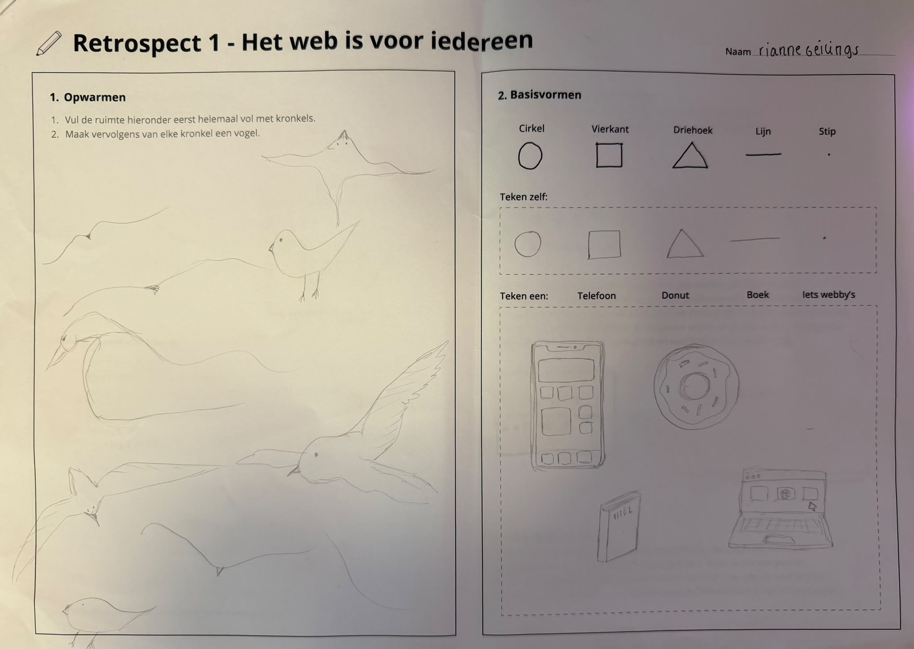

Dit vond ik een goede voorbereiding op de rest van de retrospect, omdat het mij liet zien dat de tekeningen vooral bedoeld zijn om mijn proces en gedachten visueel duidelijk te maken, en niet om een perfecte illustratie te maken.

### Piek & Dal Tekening

Voor mijn retrospect heb ik eerst een piek- en daltekening gemaakt van mijn eerste sprint. Aan het begin van de sprint zat ik duidelijk in een piek. Ik was erg gemotiveerd, hield mijn planning goed bij en maakte mijn huiswerk, Deep Dives en Visual Research op tijd. Dit was eigenlijk de eerste keer dat het mij echt goed lukte om een planning consequent bij te houden. Doordat ik merkte dat dit werkte en ik overzicht hield, raakte ik juist nog gemotiveerder om ermee door te gaan.

Daarna kwam mijn dal. Ik werd een week ziek en miste hierdoor lessen en opdrachten. Daardoor liep ik wat achter en lukte het tijdelijk minder goed om mijn planning bij te houden. Ik merkte dat het lastiger werd om weer overzicht te krijgen over wat ik nog moest doen. Toch bleef mijn motivatie voor het project aanwezig, omdat ik het onderwerp leuk vind en vooral uitkeek naar het verder bouwen van mijn eigen website. Toen ik mij weer beter voelde heb ik daarom mijn planning opnieuw opgepakt, gekeken wat ik had gemist en ben ik stap voor stap begonnen met inhalen.

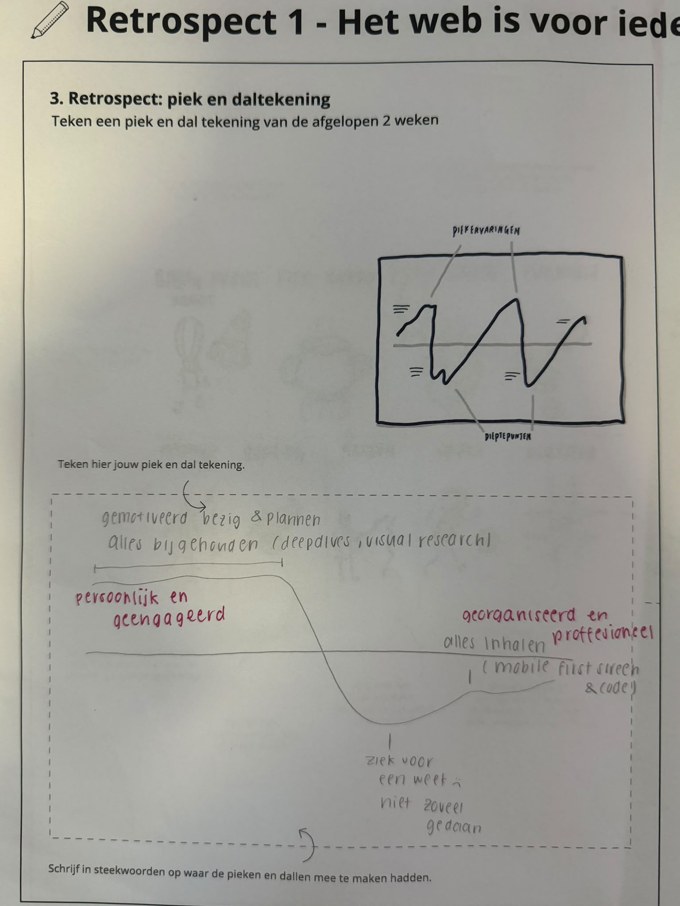

### Competenties

Bij het eerste deel van mijn piek heb ik Persoonlijk & geëngageerd ontwerpen geplaatst. In deze periode was ik veel bezig met het ontwikkelen van mijn eigen concept en het zoeken naar een stijl die echt bij mij en mijn onderwerp My Life Through Music past. Ik heb onder andere mijn Crazy 8 gemaakt, een moodboard samengesteld, Visual Research gedaan en geëxperimenteerd met kleuren, gradients, vormen en verschillende visuele stijlen. Hierbij maakte ik bewust persoonlijke keuzes in plaats van zomaar een standaard website te ontwerpen. Mijn eigen muzieksmaak, sfeer en persoonlijkheid werden steeds meer onderdeel van het concept. Daarom vond ik deze competentie goed passen bij dit gedeelte van mijn proces.

Bij het laatste gedeelte heb ik Georganiseerd & professioneel ontwerpen geplaatst. Hier begon ik mijn ideeën steeds meer om te zetten naar een gestructureerd ontwerp dat ik daadwerkelijk kon bouwen. Ik werkte met mijn planning, hield bij welke opdrachten ik nog moest inhalen en ging bewuster kijken naar de structuur van mijn HTML en CSS. Ook heb ik kennis uit mijn Deep Dives over Grid, media queries, mobile-first en responsive design toegepast. Ik ging bijvoorbeeld nadenken over rows en columns, hoe ik mijn elementen logisch in een Grid kon plaatsen en hoe mijn code overzichtelijk en gestructureerd kon blijven.

Hierdoor zie ik in mijn retrospect ook een ontwikkeling: in het begin lag mijn focus vooral op persoonlijke conceptontwikkeling en experimenteren, terwijl ik later steeds meer bezig was met het gestructureerd en technisch uitwerken van mijn concept. Beide onderdelen heb ik nodig om uiteindelijk van mijn persoonlijke idee een werkende Digital Garden te maken.

### Metafoor en Titel

Als laatste heb ik mijn piek- en daltekening vertaald naar een metafoor. Ik heb gekozen voor een weg naar een einddoel, omdat dit goed laat zien hoe mijn eerste sprint voor mij is verlopen. Mijn titel hierbij is: ‘Met een kleine omweg toch vooruit en op naar mijn einddoel Mijn proces verliep namelijk niet helemaal in één rechte lijn, maar ondanks een omweg ben ik wel steeds richting hetzelfde einddoel blijven gaan.

Aan het begin van de weg heb ik bloeiende bloemen, volle struiken en mooie bomen getekend. Deze staan voor mijn goede start: ik was gemotiveerd, hield mijn planning bij en was actief bezig met mijn opdrachten en het ontwikkelen van mijn concept. Daarna komt er een omleiding in de weg. Deze staat voor de periode waarin ik ziek werd. Mijn proces kwam hierdoor tijdelijk wat stil te liggen en ik liep achter met een aantal dingen. Rondom deze omleiding heb ik daarom bewust wat hangende bloemen getekend. Hiermee wilde ik laten zien dat er op dat moment minder groei en activiteit in mijn proces zat.

Na de omleiding komt de weg uiteindelijk weer terug op de oorspronkelijke route. Langzaam verschijnen er ook weer bloeiende bloemen, struiken en bomen. Dit staat voor het moment waarop ik mijn planning weer oppakte, mijn achterstand begon in te halen en weer verderging met mijn website. Het landschap wordt dus steeds levendiger naarmate ik weer vooruitga.

Daarnaast heb ik windvlagen in de tekening verwerkt. Deze bewegen allemaal in de richting van mijn einddoel. Voor mij staan deze voor mijn motivatie en de dingen die mij blijven stimuleren om verder te gaan. Ook wanneer ik een omweg tegenkom, blijft de richting uiteindelijk hetzelfde. Mijn einddoel verdwijnt niet en ik blijf daar stap voor stap naartoe werken.

Met deze metafoor wilde ik dus niet alleen mijn dip laten zien, maar vooral dat een tegenslag niet betekent dat mijn hele proces stopt. De route kan veranderen, maar mijn einddoel blijft hetzelfde.

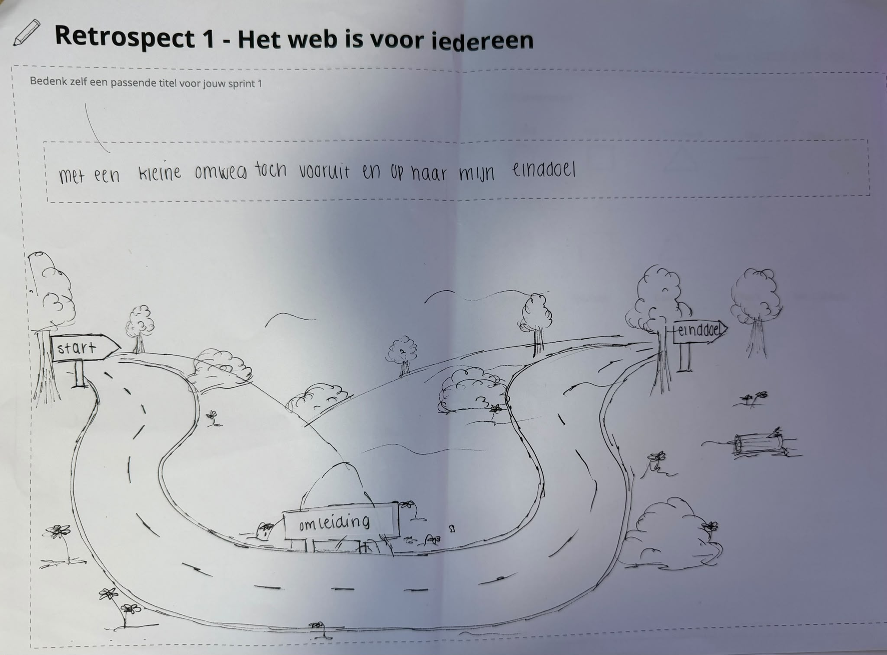

### 16 sept - Workshop 5

<strong>Check-out</strong>

<strong>1. Noem 3 Gestalt- of Design principles en leg uit wat ze betekenen en doen.</strong> 

Visual Hierarchy: hiermee bepaal je waar iemand als eerste naar kijkt. Door bijvoorbeeld grootte, kleur en positie te veranderen kun je belangrijke elementen meer laten opvallen.

Contrast: door verschillen in bijvoorbeeld kleur, grootte of vorm kun je onderdelen van elkaar onderscheiden en belangrijke elementen duidelijker maken.

Proximity: elementen die dicht bij elkaar staan worden automatisch gezien als onderdelen die bij elkaar horen. Door goed gebruik te maken van ruimte kun je dus duidelijk groepen maken in je ontwerp.

<strong>2. Een grid biedt ruimte om te spelen (vrijheid), maar tegelijkertijd ook eenheid en structuur (vastigheid). Wat wordt hiermee bedoeld?</strong> 

Een grid geeft je vaste rijen en kolommen waarmee je structuur aanbrengt in je ontwerp. Tegelijkertijd hoef je niet ieder element precies hetzelfde te plaatsen. Je kunt elementen bijvoorbeeld meerdere kolommen laten innemen, laten overlappen of op verschillende plekken zetten. Daardoor heb je vrijheid om een speels ontwerp te maken, terwijl er op de achtergrond nog steeds een duidelijke structuur aanwezig is.

<strong>3. Welk principe neem je mee in een laatste iteratie van je eigen Garden?</strong> 
Ik wil vooral proximity en visual hierarchy meenemen in mijn laatste iteratie. Mijn Digital Garden bevat veel verschillende visuele en klikbare elementen. Ik wil daarom beter kijken naar welke onderdelen bij elkaar horen en deze ook dichter bij elkaar plaatsen. Daarnaast wil ik met grootte en positie duidelijker maken welke onderdelen belangrijker zijn. Zo kan mijn website het speelse en cozy gevoel behouden, maar wordt het voor de gebruiker wel duidelijker waar die naar kan kijken en op kan klikken.

<strong>Opdracht 18, 19 & 20 – Contrast, witruimte en hiërarchie</strong>

Op de dag dat deze opdrachten werden uitgevoerd was ik helaas ziek thuis. Hierdoor heb ik de oefeningen niet samen met iemand anders kunnen doen. Ik wilde ze wel alsnog uitvoeren, dus heb ik de opdrachten individueel toegepast op één van de pagina's die ik voor mijn eigen Digital Garden wil maken. Ik heb hiervoor mijn About Me-pagina gekozen. Op deze pagina komt namelijk veel verschillende content samen: grote en kleine kopjes, gewone tekst, lijstjes, foto's en een quote. Hierdoor vond ik dit een goede pagina om te onderzoeken hoe ik al deze informatie het beste kan indelen.

### Beginschets

Ik ben begonnen met een hele simpele schets waarin ik vooral heb gekeken naar welke content er op de pagina moet komen. Ik heb de titel, persoonlijke informatie, foto's, fun facts, werk/school en mijn blurbs onder elkaar gezet. Op dit moment hield ik mij nog niet echt bezig met de uiteindelijke vormgeving, maar vooral met wat er allemaal op de pagina moest staan.

### Opdracht 18 – Contrast

Daarna heb ik gekeken naar het contrast tussen de verschillende onderdelen. Ik heb bijvoorbeeld de hoofdtitel en tussenkopjes groter en duidelijker gemaakt dan de normale tekst. Ook heb ik gekeken naar het verschil tussen een h1, h2, kleinere headings en gewone tekst. Hierdoor werd duidelijker welke informatie belangrijker is en waar een nieuw onderdeel van de pagina begint.

### Opdracht 19 – Witruimte

Bij de volgende iteratie heb ik vooral gekeken naar de witruimte tussen de onderdelen. Informatie die bij elkaar hoort heb ik dichter bij elkaar gehouden, terwijl ik tussen verschillende onderwerpen juist meer ruimte heb gelaten. Hierdoor ontstonden duidelijkere groepen en werd de pagina minder druk. Dit hielp mij ook om beter te bepalen welke informatie logisch bij elkaar hoort.

### Opdracht 20 – Hiërarchie

Als laatste heb ik de hiërarchie verder uitgewerkt en ben ik tot mijn uiteindelijke schets gekomen. Hier heb ik bepaald wat als eerste de aandacht moet trekken en hoe de gebruiker vervolgens door de pagina heen kijkt. De titel staat bovenaan, gevolgd door mijn naam en quote. Mijn grote foto en persoonlijke informatie krijgen daarna veel ruimte. De kleinere onderdelen, zoals fun facts en work/school, heb ik gegroepeerd en My Blurbs krijgt daaronder een eigen gedeelte.

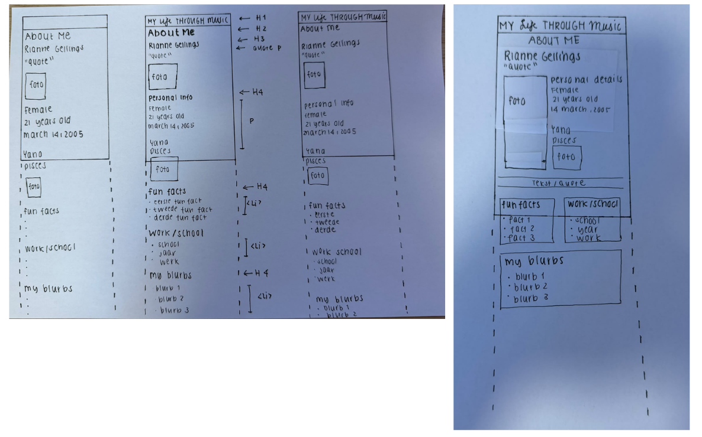

Door dezelfde pagina steeds opnieuw te tekenen en iedere keer op één ander ontwerpprincipe te letten, kon ik goed zien hoeveel contrast, witruimte en hiërarchie invloed hebben op hoe overzichtelijk dezelfde content uiteindelijk wordt.

### Opdracht 21 – Verhouding & Grid

Ik heb mijn eerdere schets verder uitgewerkt door er duidelijke rows en columns overheen te tekenen. Hiermee kon ik bepalen hoeveel ruimte de verschillende onderdelen krijgen en hoe ze ten opzichte van elkaar worden uitgelijnd. Mijn grote foto krijgt bijvoorbeeld meer ruimte, terwijl de persoonlijke informatie ernaast in een kleiner gedeelte kan staan. Verder naar beneden kunnen onderdelen zoals About Me/Fun Facts en Work/School naast elkaar staan, terwijl My Blurbs weer de volledige breedte kan gebruiken.

Door het grid over mijn ontwerp heen te tekenen kreeg ik een veel duidelijker beeld van waar ieder onderdeel straks in mijn CSS Grid geplaatst kan worden. Hierdoor is mijn laatste schets niet alleen een visueel ontwerp, maar heb ik alvast nagedacht over hoe ik deze layout later daadwerkelijk kan bouwen.

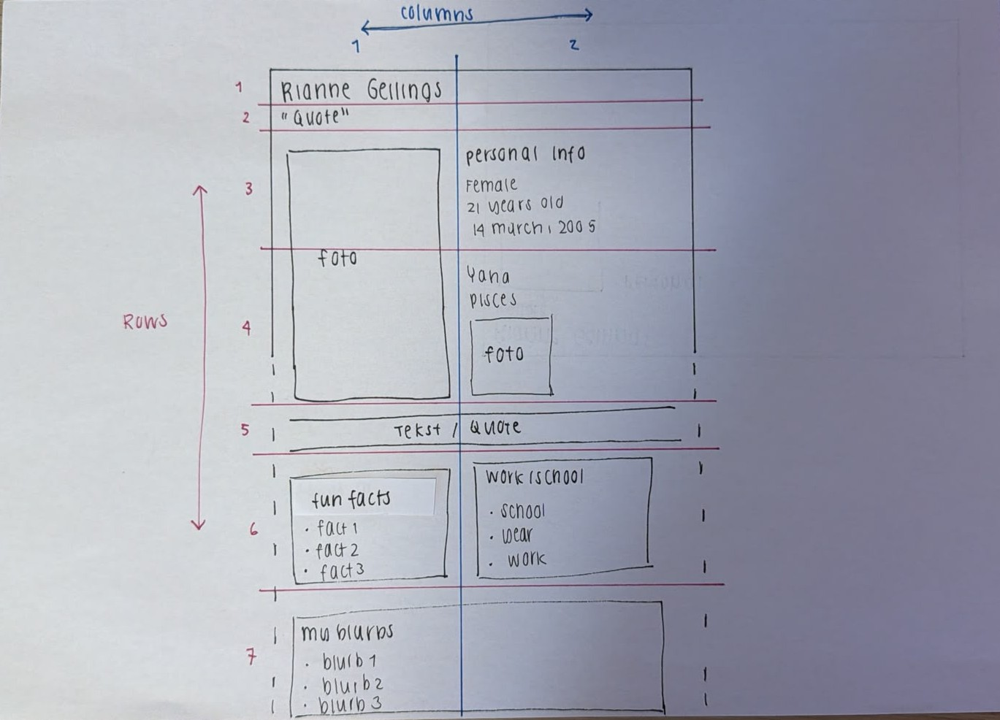

### 15 sept - Voorbereiding workshop 5

<strong>Artikelen lezen voor workshop 5</strong>

### Artikel 1

Notities artikel 1:
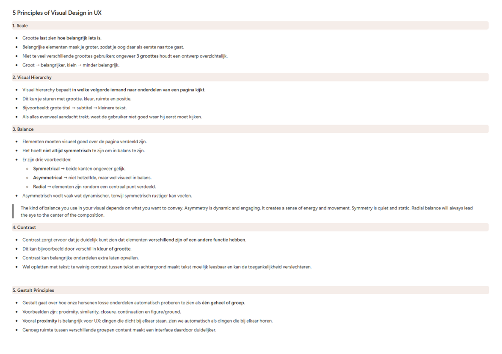

Visual design gaat niet alleen over een website mooi maken. Deze principes kunnen ervoor zorgen dat een ontwerp makkelijker te begrijpen en te gebruiken is. Ze kunnen daarnaast bijdragen aan engagement, emotie en hoe een merk wordt ervaren.

Voor mijn eigen website vind ik vooral visual hierarchy, balance en Gestalt/proximity interessant. Ik heb veel verschillende visuele elementen op mijn homepage en moet er dus op letten dat het ondanks al die elementen duidelijk blijft waar je naar kijkt, welke onderdelen bij elkaar horen en welke onderdelen het belangrijkst zijn.

### Artikel 2

Notities artikel 2:
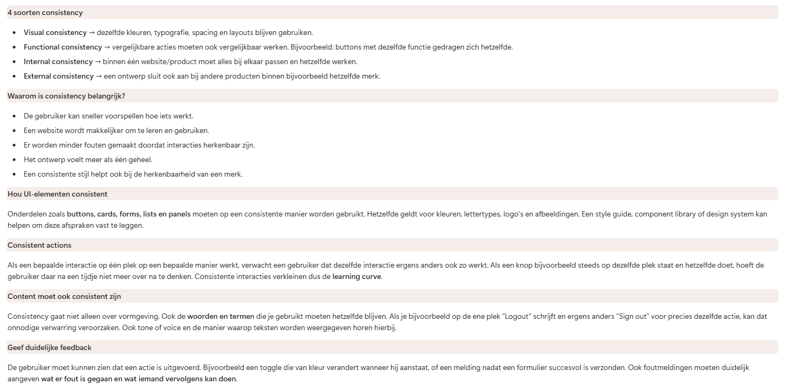

Consistency betekent meer dan overal dezelfde kleuren gebruiken. Vormgeving, interacties, componenten én teksten moeten logisch bij elkaar aansluiten. Daardoor leert een gebruiker hoe de website werkt en kan die kennis daarna steeds opnieuw worden gebruikt.

Voor mijn eigen website vind ik dit vooral belangrijk omdat ik meerdere pagina's en interactieve onderdelen heb. Ik moet er bijvoorbeeld op letten dat mijn navigatie, typografie, kleuren, hover-effecten en klikbare elementen op verschillende pagina's herkenbaar blijven. Zo kan mijn Digital Garden heel speels en verschillend zijn, maar toch voelen als één website.

<strong>Code for responsiveness</strong>

### Verder werken aan mijn eerste concept

Ik ben eerst verdergegaan met de code die ik al had voor mijn slaapkamerconcept. Ik had hier al veel met CSS Grid en media queries gewerkt om de verschillende elementen op mijn pagina responsive te krijgen. Mijn doel was om ervoor te zorgen dat de objecten uit mijn kamer goed mee zouden schalen en op ongeveer dezelfde plek zouden blijven staan wanneer het scherm groter of kleiner werd.

Ik ben hier best lang mee bezig geweest en heb veel verschillende dingen geprobeerd met mijn Grid, de grootte van de afbeeldingen en de positionering. Hoe meer ik eraan veranderde, hoe ingewikkelder het alleen werd. Als ik bijvoorbeeld iets goed zette voor een groter scherm, stonden sommige elementen ineens veel te hoog of verkeerd op mijn mobiele scherm. Vervolgens probeerde ik dit soms op te lossen door ook de achtergrond aan te passen, maar ik realiseerde me dat dit eigenlijk geen goede oplossing was. De elementen zelf moeten zich aanpassen aan het scherm en ik zou niet voor iedere schermgrootte mijn achtergrond moeten veranderen om alles weer passend te krijgen.

Daarom heb ik besloten om deze versie voorlopig te laten zoals hij is. Ik wil hem tijdens het voortgangsgesprek op school laten zien en feedback vragen over hoe ik dit beter kan aanpakken. Tegelijkertijd merkte ik dat ik mijn concept op deze manier misschien onnodig moeilijk voor mezelf aan het maken was. Daarom heb ik ook een eenvoudiger back-upidee uitgewerkt waar ik op kan terugvallen als mijn oorspronkelijke concept na de feedback nog steeds niet goed responsive te krijgen is.

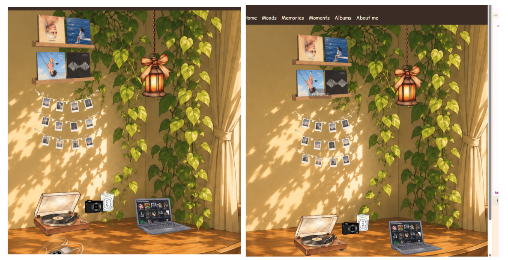

### Back-up idee – Albumplanken

Voor mijn back-upidee ben ik teruggegaan naar één van mijn eerdere beginscherm schetsen. Daarin had ik al het idee om albums onderdeel te maken van mijn beginscherm in de vorm van playlist covers op 1 pagina. In plaats van een playlist heb ik hiervan uiteindelijk albumplanken gemaakt. Zelf heb ik ook zo'n plank met albums in mijn kamer hangen, waardoor het nog steeds goed bij mijn oorspronkelijke kamerconcept past en het meer aansluit op mijn persoonlijke leven. Daarnaast sluit het aan bij het cozy gevoel dat ik vanaf mijn Crazy 8 en inspiratiewoorden al aan mijn Digital Garden wilde geven.

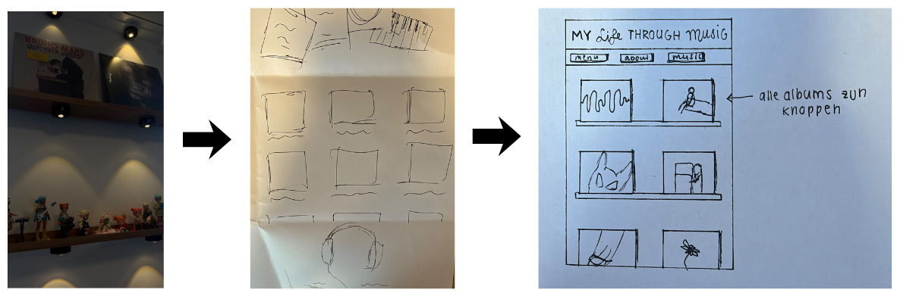

Ik ben bewust heel simpel begonnen. Eerst heb ik in mijn HTML een aantal albumcovers geplaatst en daarna heb ik deze met CSS Grid ingedeeld. Voor mobiel begon ik met één kolom. Met media queries maakte ik hier op grotere schermen vier en uiteindelijk vijf kolommen van. Tijdens het testen vond ik één kolom op mobiel toch wat onhandig en erg groot. Daarom heb ik dit aangepast naar twee kolommen, zodat er meer albums tegelijk zichtbaar zijn en het duidelijk blijft dat je op verschillende albumcovers kunt klikken.

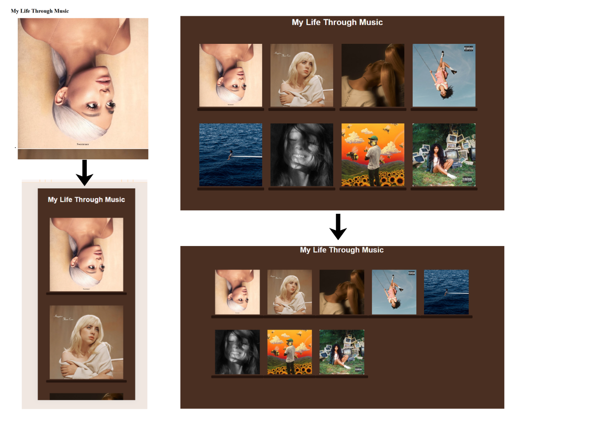

Voor de donkere plank onder de albums wilde ik geen extra HTML-element toevoegen, omdat de plank alleen decoratief is en geen inhoud of betekenis aan de pagina toevoegt. Daarom heb ik deze met een CSS pseudo-element, zoals ::after, gemaakt. Met content: "" kun je zo een leeg element genereren en dat vervolgens met CSS een hoogte, breedte, achtergrond en positie geven.

Ik heb hiervoor gebruik gemaakt van de bron: https://developer.mozilla.org/en-US/docs/Learn_web_development/Core/Styling_basics/Pseudo_classes_and_elements

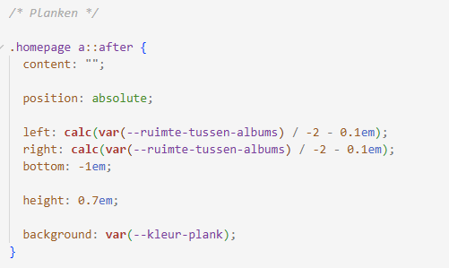

Dit is voorlopig mijn back-upconcept. Mijn eerste idee met de volledige slaapkamer gooi ik dus nog niet weg, ik wil die eerst tijdens het voortgangsgesprek laten zien en daar feedback op krijgen. Maar als blijkt dat ik dat concept te ingewikkeld heb gemaakt om binnen deze opdracht goed responsive uit te werken, kan ik verder met de albumplanken. Daarmee houd ik het ontwerp simpeler, terwijl het nog steeds past bij mijn oorspronkelijke concept en sfeer.

<strong>Deep Dive responsive grid + grid-areas</strong>

### Voorbereidingen

Voor deze Deep Dive moest ik eerst Grid 101 + Media Queries hebben afgerond, zodat ik de basis van CSS Grid al begreep. Deze deepdive heb ik al gedaan dus kon ik door. Daarna heb ik het artikel van Kevin Powell over Grid Areas gelezen. Hierin werd uitgelegd hoe je met grid-template-areas verschillende onderdelen van een pagina een naam kunt geven en deze vervolgens overzichtelijk binnen een Grid kunt positioneren. Ook werd uitgelegd hoe je deze indeling met media queries kunt veranderen, zodat dezelfde content op verschillende schermgroottes een andere layout kan krijgen.

In het artikel stonden ook een aantal kleine opdrachten waarmee ik grid-area en grid-template-areas direct kon oefenen. Deze heb ik tijdens het lezen uitgevoerd, zodat ik de nieuwe properties niet alleen las, maar ook meteen zelf toepaste.

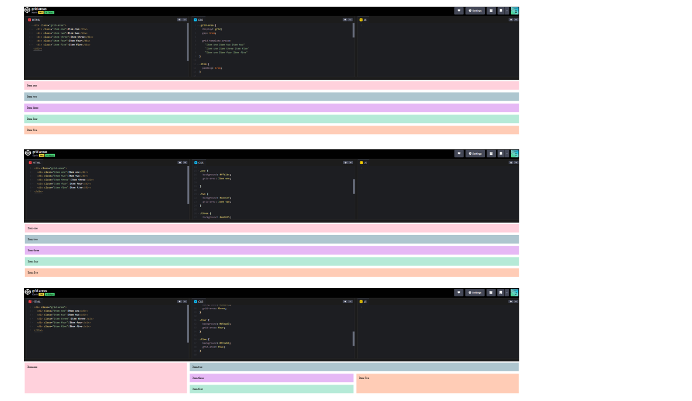

### Oefening 1

Bij de eerste oefening moest ik een responsive layout maken met grid-template-areas. De pagina bestond uit verschillende onderdelen, zoals een header, nav, main, aside en footer. Met Grid Areas moest ik bepalen waar deze onderdelen op het scherm kwamen te staan.

Ik begon met een eenvoudige layout voor een klein scherm. Daarna heb ik met media queries de indeling steeds veranderd voor grotere schermen. Zo kwamen onderdelen die eerst onder elkaar stonden later naast elkaar te staan en ging de layout van één naar meerdere kolommen.

Ik vond grid-template-areas vooral heel handig omdat je in de CSS visueel kunt zien hoe je layout is opgebouwd. Door bijvoorbeeld "nav main aside" te schrijven, kon ik veel makkelijker begrijpen welk onderdeel waar terechtkwam. Dit vond ik overzichtelijker dan alleen werken met nummers van grid-column en grid-row. Ook werd het hierdoor makkelijker om binnen een media query de hele indeling van de pagina te veranderen.

https://codepen.io/editor/Rianne-Maria/pen/01a0c605-f7a9-7545-8109-c8e9a84c5133

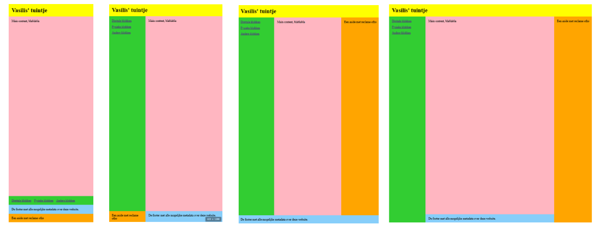

### Oefening 2

Bij oefening 2 moest ik opnieuw een responsive layout met grid-template-areas maken, maar deze keer met vier afbeeldingen. Voordat ik begon heb ik eerst de bijbehorende PDF gelezen. Hierin werd stap voor stap uitgelegd hoe ik de layout met media queries, grid-template-columns, grid-template-rows en grid-template-areas kon veranderen.

Ik begon met de mobile versie waarin de afbeeldingen onder elkaar stonden. Bij 28em maakte ik er twee gelijke kolommen en drie rijen van en veranderde ik de Grid Areas zodat de afbeeldingen een nieuwe positie kregen. Daarna maakte ik bij 56em een layout met drie kolommen en twee rijen, waarbij de eerste kolom twee keer zo breed werd als de andere kolommen. Ook hiervoor maakte ik met grid-template-areas weer een nieuwe indeling.

Deze oefening vond ik al ietsjes gemakkelijker gaan. Ik begon steeds beter te begrijpen hoe grid-template-areas werkt en kon delen al uit mijn hoofd doen zonder steeds terug te kijken naar de uitleg. Vooral het aanpassen van dezelfde Grid Areas binnen verschillende media queries vond ik handig, omdat ik nu duidelijk zag hoe je één layout op verschillende schermgroottes helemaal anders kunt indelen.

https://codepen.io/editor/Rianne-Maria/pen/01a0c60e-32e1-741f-b9df-f4a37abe042e

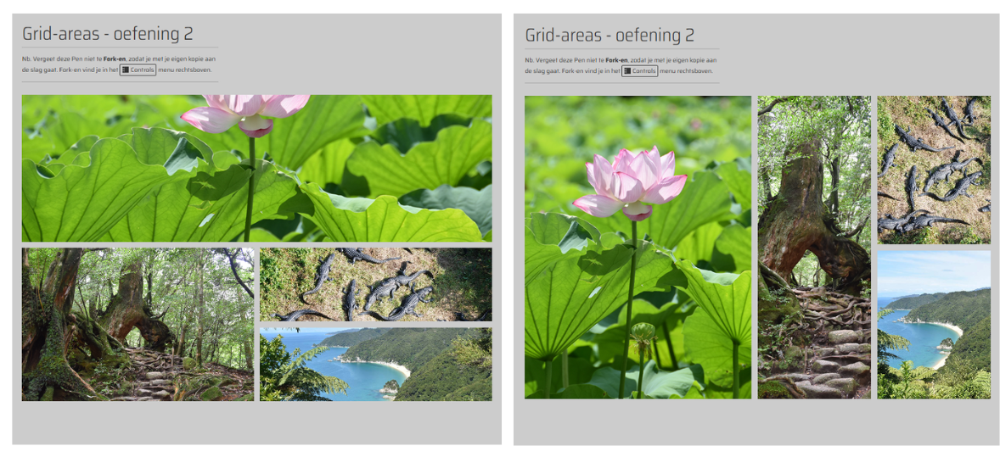

### Oefening 3

Bij de laatste oefening moest ik de cards met de visjes opnieuw maken. Deze opdracht had ik tijdens de vorige Grid Deep Dive al gedaan, maar toen positioneerde ik de onderdelen op een andere manier. Nu moest ik dezelfde cards opbouwen met grid-template-areas en grid-area.

Voordat ik begon heb ik eerst de tips in de PowerPoint bekeken. Hierin zag ik bijvoorbeeld hoe je de afbeelding en titel eerst een eigen naam geeft met grid-area en vervolgens met grid-template-areas bepaalt waar deze binnen de card komen te staan. Daarna heb ik dit zelf verder toegepast op de steeds uitgebreidere cards.

Bij de derde en vierde card vond ik vooral de like-button lastig, omdat deze over de afbeelding heen moest staan. Ik moest goed nadenken over hoe ik de verschillende onderdelen binnen de Grid Areas kon plaatsen en laten overlappen. Uiteindelijk is het gelukt door te experimenteren met de Grid Areas en goed te kijken naar hoe de layout was opgebouwd. Ik kwam erachter dat ik de like-button ook in de image grid-area moest plaatsen. Hierdoor kwam de like-button in hetzelfde gebied als de afbeelding te staan en kon ik hem op de juiste plek over de afbeelding positioneren.

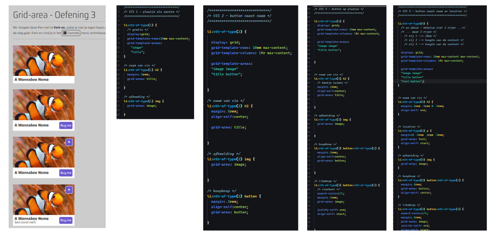

### Wat ik uit deze deepdive heb gehaald

Na deze oefeningen vind ik Grid Areas een fijne manier om met Grid te werken. Ik heb hiermee een veel duidelijker overzicht van waar de verschillende onderdelen binnen mijn grid staan en waar ik ze kan positioneren. Vooral doordat je de gebieden zelf een naam geeft, kan ik makkelijker terugzien hoe mijn layout is opgebouwd. Ik wil dit daarom later ook gaan toepassen in mijn eigen website, vooral om mijn layout overzichtelijker en beter responsive te maken.

### 14 sept - Workshop 4

<strong>Bi-weekly geek 1</strong>

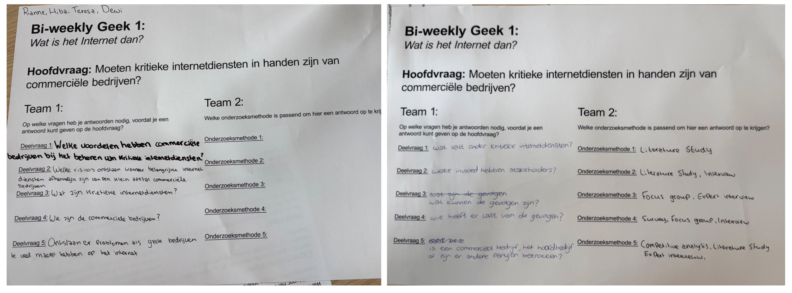

<strong>Opdracht 16 - van one column layout naar een responsive design</strong>

Duo: Hiba

Bij deze opdracht heb ik mijn website op verschillende schermgroottes bekeken door de browser steeds groter en kleiner te maken. Mijn mobile-first versie werkte goed en de elementen stonden daar op de plekken waar ik ze wilde hebben.

Toen ik het scherm groter maakte richting laptop- en desktopformaat zag ik wel een probleem. De elementen scha gaven niet geleidelijk mee met de schermgrootte. Op bepaalde formaten werden de afbeeldingen eerst juist heel groot en verschoven ze uit hun oorspronkelijke positie. Wanneer ik het scherm vervolgens nog groter maakte, kwamen ze uiteindelijk weer beter op hun plek te staan. Hierdoor was de overgang tussen de verschillende schermgroottes niet goed responsive.

Ik merkte hierdoor dat alleen het gebruiken van een Grid niet automatisch betekent dat mijn hele ontwerp responsive is. Vooral de groottes en positionering van mijn losse afbeeldingen moest ik nog beter laten meeschalen met de beschikbare ruimte. Voor mijn volgende iteratie wil ik daarom kijken hoe ik de overgang van mijn mobiele layout naar grotere schermen beter kan maken, zodat de elementen op iedere schermgrootte ongeveer dezelfde verhouding en positie behouden.

<strong>Opdracht 17 – Responsive voorbeelden zoeken</strong>

Duo: Teresa

<strong>1. De knoppen “Log in” en “Sign up” worden op een kleiner scherm vervangen door één icoon.</strong> 
Dit bespaart ruimte in de navigatie.
<strong>2. De websitekaarten veranderen van meerdere kolommen naar minder kolommen.</strong> 
Op een groot scherm kunnen meerdere kaarten naast elkaar staan, terwijl ze op een kleiner scherm bijvoorbeeld naar twee of één kolom gaan. Hierdoor blijven de afbeeldingen en teksten groot genoeg om goed te bekijken.
<strong>3. Teksten passen zich aan de beschikbare breedte aan.</strong> 
Wanneer het scherm smaller wordt, worden langere titels of zinnen over meerdere regels verdeeld in plaats van dat ze buiten het scherm lopen.

Wij vinden het vooral interessant hoe sommige knoppen veranderen in een icoon. Zo bespaart de website ruimte en blijft de navigatie overzichtelijk.

<strong>Check-out</strong>

<strong> 1. Wanneer wordt een website ‘lelijk’ en hoe kun je dit fixen?</strong> 

Een website kan ‘lelijk’ worden wanneer content niet goed meebeweegt met verschillende schermformaten. Bijvoorbeeld als tekst buiten het scherm valt, afbeeldingen te groot worden, elementen over elkaar heen komen of knoppen te klein zijn. Dit kan ik oplossen door responsive te ontwerpen, bijvoorbeeld met flexbox/grid, relatieve eenheden en afbeeldingen die zich aanpassen aan de beschikbare ruimte.

<strong> 2. Welke volgende stap neem ik om mijn website responsive te maken?</strong> 
Ik wil mobile-first beginnen en daarna kijken hoe mijn ontwerp op steeds grotere schermen werkt. Vooral bij mijn kamer moet ik goed kijken hoe alle elementen op hun plek blijven en nog steeds goed klikbaar zijn.

<strong> 3. Kan ik mijn Garden onderbouwen met Webby vocabulary?</strong> 
Op dit moment nog niet optimaal maar er is een begin, mijn Garden is interactief, omdat je op verschillende spullen in mijn kamer kan klikken en zo nieuwe pagina’s ontdekt. Ook is hij expressief door mijn warme kleuren, beweging en animaties. Ik wil hem daarnaast toegankelijk en adaptief maken, zodat alles goed klikbaar is en op verschillende schermformaten werkt.

### 12 sept - Verder aan website

<strong>Website verfijnen</strong>

### Layout van mijn website verder verfijnen

Nadat ik de eerste opzet van mijn website had gemaakt, ben ik de layout verder gaan verfijnen. Ik ben begonnen met het toevoegen van een achtergrond voor mijn light theme en daarna heb ik alle losse elementen uit mijn ontwerp op de juiste plek gezet.

Voor de positionering heb ik de kennis uit mijn Grid Deep Dive toegepast. Ik heb mijn main opgebouwd als een grid met verschillende rows en columns. Vervolgens heb ik met :nth-child() de verschillende elementen afzonderlijk getarget. Hierdoor kon ik bijvoorbeeld aangeven in welke grid-column en grid-row een albumplank, polaroids, platenspeler, camera, lamp, iPod of laptop moest komen te staan. Ook heb de kennis uit de deepdives gebruikt om sommige elementen op meerdere rows of columns te positioneren, zodat ze uiteindelijk stonden waar ik wilde. Dit vond ik handig, omdat ik zo niet voor ieder element een aparte class hoefde te maken.

Daarna ben ik veel gaan experimenteren met de precieze positionering. Met onder andere transform: translateY() kon ik een element nog iets omhoog of omlaag verplaatsen en door de breedte van afbeeldingen aan te passen kon ik ze groter of kleiner maken. Ook heb ik flex binnen sommige grid-items gebruikt om een afbeelding binnen zijn eigen gedeelte beter uit te lijnen.

Sommige onderdelen moesten bewust voor of achter andere onderdelen staan. Zo wilde ik bijvoorbeeld dat de camera en kaars elkaar gedeeltelijk overlappen. Hiervoor ben ik met z-index gaan werken.

Tijdens dit proces heb ik mijn website steeds op verschillende schermgroottes bekeken en de Grid-layout verder aangepast. Het was wel lastig om dit hele idee responsive te maken, omdat het op een groter scherm niet mee wilde scalen of op dezelfde plek wilde blijven staan. Dus hier moest ik nog een oplossing voor vinden.

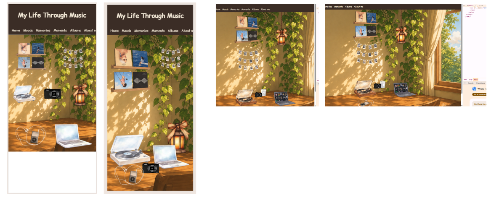
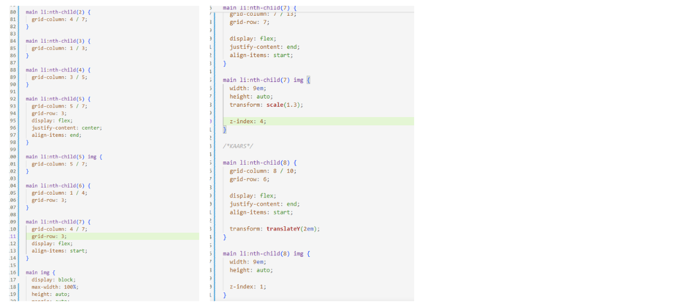

### Light & Dark theme toevoegen

Toen de basis van mijn mopbile layout stond, ben ik verdergegaan met een light en dark theme. Vanuit de Deep Dive over light/dark mode wilde ik dit niet alleen automatisch aan de instellingen van een apparaat koppelen, maar er ook een interactie in mijn eigen ontwerp van maken.

Mijn idee was dat de lamp zelf de schakelaar voor de dark mode zou worden. Hiervoor heb ik de lamp gekoppeld aan een checkbox. Wanneer deze wordt aangevinkt, kan ik met CSS controleren of de dark mode actief is en vervolgens andere styling toepassen. Zo kan onder andere de achtergrond veranderen van de lichte kamer naar een donkere versie. De lamp is daardoor niet alleen decoratie, maar heeft ook echt een functie binnen mijn website.

Ik ben daarnaast gaan experimenteren met extra details die het verschil tussen dag en nacht duidelijker maken. Zo heb ik mijn achtergrond aangepast naar nacht en lampjes in de planten toegevoegd. Ook heb ik de kaars laten veranderen door het te laten branden in de dark mode. Daardoor werd de light/dark mode niet alleen een kleurverandering, maar echt een onderdeel van het concept van mijn Digital Garden.

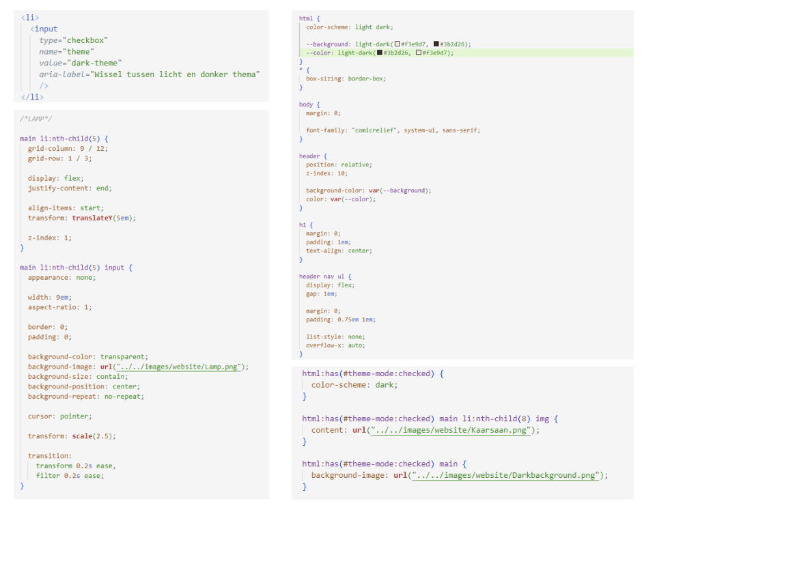
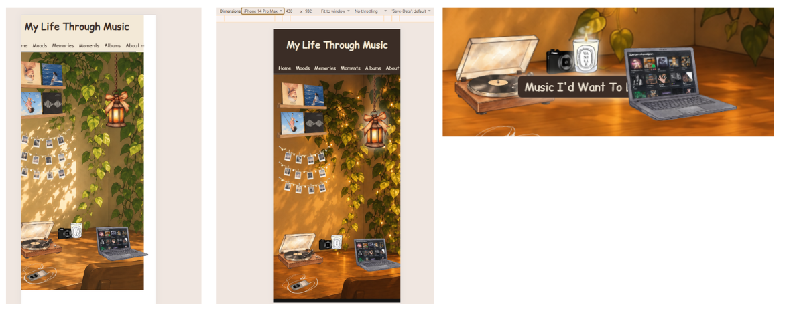

Tijdens deze fase heb ik dus meerdere dingen uit eerdere opdrachten gecombineerd: Grid voor de responsive layout, :nth-child() voor het targeten van elementen, transforms en z-index voor de positionering en een checkbox met CSS voor de light/dark-interactie. Hierdoor begon mijn website zowel technisch als visueel steeds dichter bij mijn oorspronkelijke idee te komen.

### 11 sept - Workshop 3

<strong>Opdracht 12 – Bespreken huiswerk</strong>

<strong>1. Zijn je schetsen Webby genoeg?</strong> 
Toegankelijk

De pagina is redelijk toegankelijk, maar ik moet nog duidelijker maken welke elementen interactief zijn. In mijn schets zie je bijvoorbeeld niet meteen dat de laptop, camera en iPod klikbaar zijn. Dit wil ik duidelijker maken met hover- en focus-effecten. Daarnaast moet ik het menu nog even veranderen, want een slider met 10+ opties is niet heel overzichtelijk.

Volwassen

Mijn ontwerp is grotendeels haalbaar met HTML en CSS. De grootste uitdaging is dat alle objecten op verschillende plekken staan en samen één compositie vormen. Ik moet daarom goed nadenken over hoe ik dit responsive opbouw.

Expressief

Mijn ontwerp is al vrij expressief omdat ik geen standaard website-indeling gebruik. De pagina voelt meer als een persoonlijke kamer die je kunt ontdekken. Mijn sfeerwoorden nostalgisch, levendig en cozy komen terug in de voorwerpen en vormgeving. Ik kan dit nog sterker maken door meer CSS-effecten toe te voegen, bijvoorbeeld een lamp die gaat gloeien, een album dat iets naar voren komt of objecten die subtiel bewegen bij hover.

Leuk/verrassend

Het verrassende zit vooral in het ontdekken van de navigatie. De bezoeker navigeert niet via een standaard menu, maar door voorwerpen in mijn kamer aan te klikken. Ik wil nog beter zichtbaar maken dat de voorwerpen reageren op de gebruiker. Daardoor wordt het leuker om te ontdekken waar alles naartoe leidt.

<strong>2. Hoe kun je je schermontwerp realiseren in HTML en CSS?</strong> 
Ik wil mijn pagina mobile-first opbouwen. In mijn HTML wil ik semantische elementen gebruiken en zo min mogelijk onnodige divs, classes en ID's gebruiken. Omdat de voorwerpen naar andere pagina's leiden, gebruik ik hiervoor <a> elementen en geen buttons. In CSS wil ik voornamelijk Grid proberen te gebruiken om de verschillende onderdelen op hun plek te zetten. Mocht dit niet helemaal lukken met het responsive maken, dan ga ik over naar mijn tweede idee die hetzelfde idee heeft, maar makkelijker op te bouwen is. Met media queries kan ik de compositie aanpassen voor grotere schermen. Voor de interactie kan ik :hover en :focus-visible gebruiken.

<strong>3. Vragen/moeilijke onderdelen</strong> 

1. Hoe zorg ik ervoor dat alle losse voorwerpen op hun plek blijven staan als het scherm groter of kleiner wordt?

2. Hoe kan ik animaties en hover-effecten toevoegen zonder JavaScript te gebruiken?

3. Hoe voorkom ik dat mijn mobiele versie te druk wordt met zoveel verschillende voorwerpen?

<strong>4. Maak waar nodig een laatste iteratie, zodat het helder is wat je definitieve bouwplan is in html/css.</strong> 

Na het analyseren van mijn eerste schets heb ik een nieuwe iteratie gemaakt. Ik heb de pagina duidelijker verdeeld in rows en columns. Hierdoor kon ik beter nadenken over waar de verschillende elementen moesten komen te staan en hoe de layout zich moest aanpassen op verschillende schermgroottes. Dit sloot ook goed aan bij wat ik tijdens de Deep Dive over Grid en responsive design had geleerd. Hieruit kon ik ook duidelijk zien hoe ik mijn html moest opbouwen en welke afbeelding ik als eerst moet komen en welke daarna.

Daarnaast heb ik voor de mobiele versie gekozen voor een hamburgermenu. In mijn eerdere ontwerp zou het menu blijven doorlopen, waardoor je op een klein scherm niet alle menu-items overzichtelijk kon zien. Met een hamburgermenu kan ik de navigatie inklappen en blijft er meer ruimte over voor de content. Zo heb ik bij deze iteratie meer rekening gehouden met mobile-first en responsive ontwerpen.

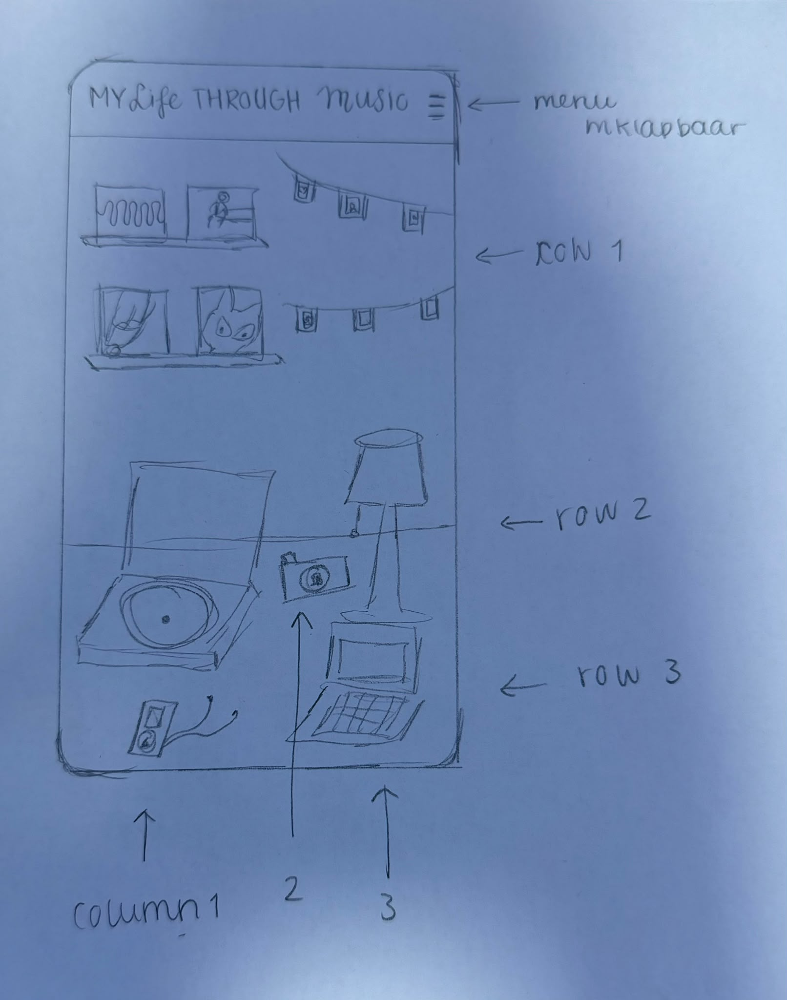

<strong>Opdracht 13 -Van schets naar HTML</strong>

Na mijn iteratieschets ben ik gaan kijken hoe ik mijn ontwerp kon vertalen naar HTML. Hierbij heb ik eerst gekeken naar wat ieder onderdeel van mijn schets daadwerkelijk is, in plaats van meteen na te denken over hoe ik het wilde positioneren. Zo is “My Life Through Music” mijn belangrijkste titel en dus een <h1>, hoort mijn menu binnen een <nav> en zijn de verschillende interactieve voorwerpen in mijn kamer links met afbeeldingen.

Dit hielp mij om eerst een goede semantische HTML-structuur te bedenken. De rows en columns die ik in mijn vorige iteratie had getekend zijn vooral belangrijk voor de layout en ga ik daarom later met CSS Grid maken. Hierdoor houd ik de inhoud en structuur in HTML gescheiden van de vormgeving en positionering in CSS.

<strong>Opdracht 14 - eerste html opzet</strong>

Na mijn schets ben ik begonnen met de eerste HTML- en CSS-opzet van mijn Digital Garden. Ik heb eerst de belangrijkste onderdelen uit mijn schets vertaald naar semantische HTML, zoals een <header>, <nav>, <main>, links en afbeeldingen. Daarna heb ik een eerste simpele vormgeving toegevoegd met mijn kleuren en een Grid om de verschillende elementen te positioneren.

Ik heb ook al een beetje gespeeld met media queries zodat er inplaats van 4 colommen, 2 komen op een laptop scherm.

Dit was nog een hele vroege versie van mijn website. Voor mij was deze versie vooral bedoeld om eerst de HTML-structuur neer te zetten en te testen hoe ik mijn schets kon omzetten naar een echte webpagina. Vanuit deze basis ga ik de layout daarna steeds verder verbeteren.

<strong>Voorbereiding bi-weekly geek 1</strong>

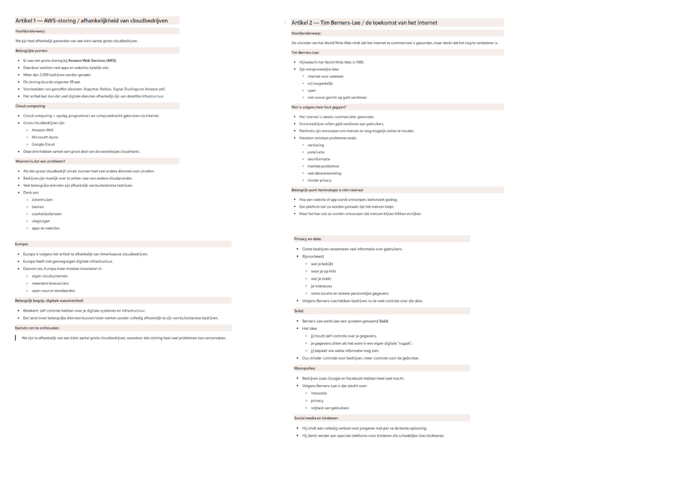

<strong>Deepdive - Grid 101 + Media queries</strong>

### Voorbereidingen

Voor de Deep Dive over Grid 101 + Media Queries heb ik eerst de voorbereidende YouTube-video's gekeken over CSS Grid en media queries. Ik vond Grid in het begin nog best lastig en wist nog niet goed hoe ik het moest gebruiken. Door de video's kreeg ik een beter beeld van hoe een grid is opgebouwd en hoe je met verschillende properties de positie en grootte van elementen kunt bepalen.

Daarna heb ik met de kennis uit de video's CSS Grid Garden gedaan. Dit is een interactief spel waarin je verschillende Grid-properties moet gebruiken om de levels op te lossen. Hierdoor kon ik gelijk oefenen met wat ik net in de video's had geleerd en begon ik beter te begrijpen hoe Grid in de praktijk werkt.

Na deze voorbereiding had ik dus al wat meer kennis over CSS Grid, de verschillende properties en hoe je hiermee een layout kunt maken. Met deze basis kon ik beginnen aan de drie oefeningen van de Deep Dive.

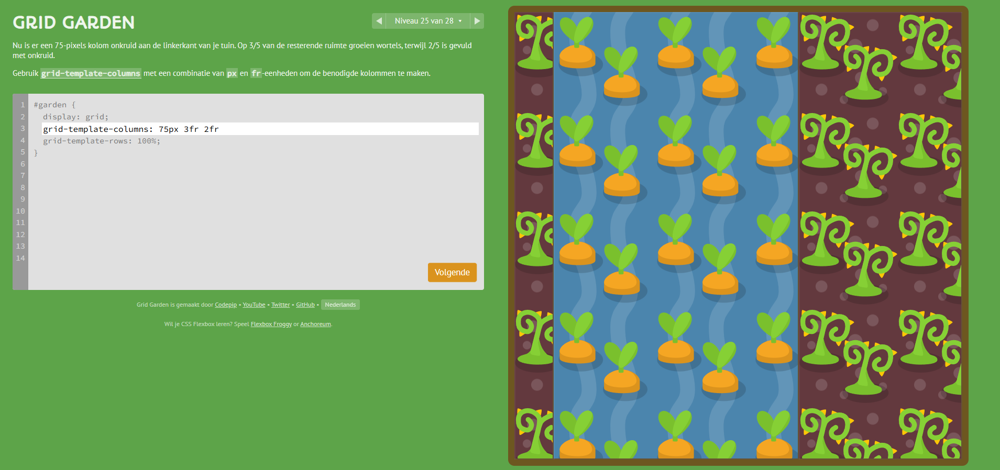

### Oefening 1

Na de voorbereiding ben ik begonnen met de eerste oefening van de Deep Dive: Meet the properties. Bij deze oefening kreeg ik elf verschillende ‘sommetjes’. Bij ieder sommetje stond een voorbeeld van een Grid-layout die ik zelf moest namaken met CSS. Ik moest hierbij steeds zelf bedenken welke Grid-properties ik nodig had om tot hetzelfde resultaat te komen.

Bij de eerste opdrachten begon ik met de basis, zoals display: grid, grid-template-columns en gap. Daarna werden de opdrachten steeds wat uitgebreider en moest ik verschillende properties met elkaar combineren. Hierbij kon ik de kennis uit de YouTube-video's en Grid Garden meteen toepassen in mijn eigen code.

Wat ik vooral merkte tijdens deze oefening, is dat ik Grid steeds beter begon te begrijpen. Bij de eerste sommetjes moest ik nog regelmatig terugdenken aan de voorbeelden uit de voorbereiding, maar na een aantal opdrachten wist ik steeds vaker uit mijn hoofd welke property ik nodig had en hoe ik deze moest schrijven. Hierdoor merkte ik dat ik niet alleen de voorbeelden aan het kopiëren was, maar ook begon te begrijpen wat de code daadwerkelijk met de layout deed.

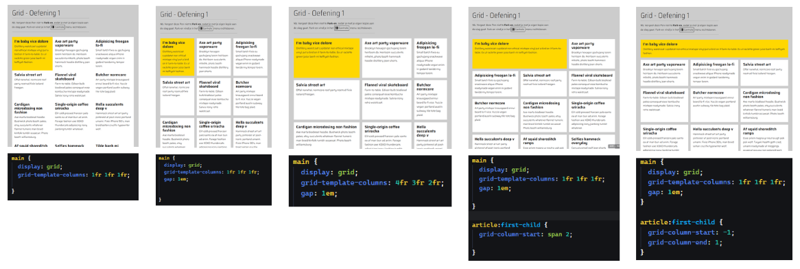
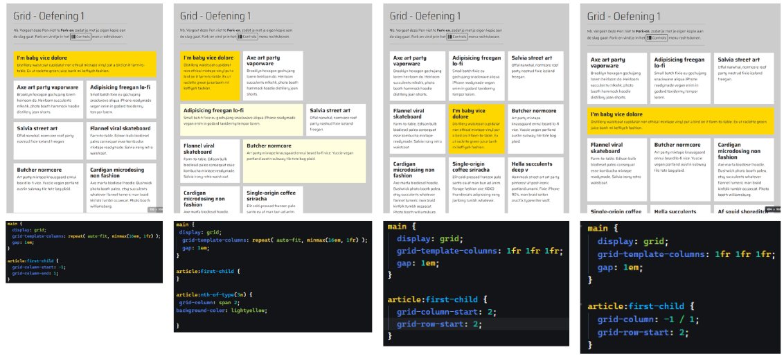
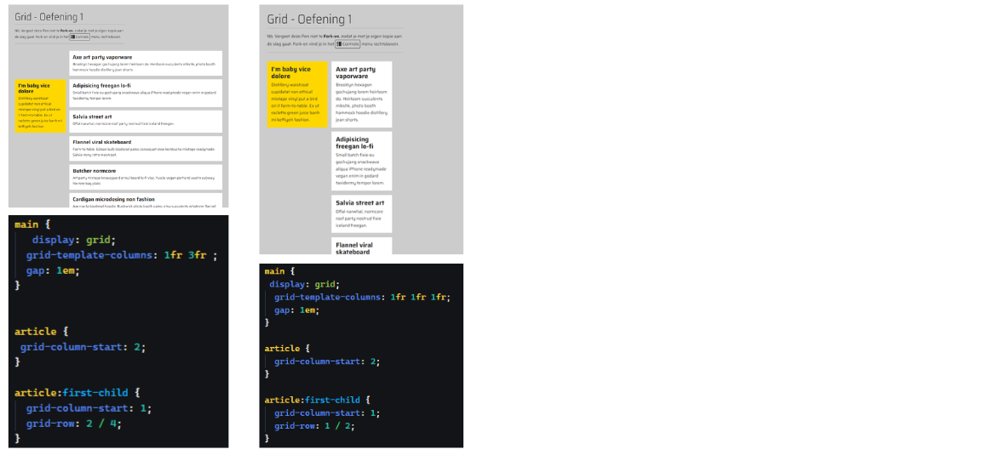

Wat ik uit deze oefening heb geleerd: ik kan zelfstandig een Grid aanmaken, kolommen bepalen, ruimte tussen Grid-items instellen en verschillende Grid-properties gebruiken om een voorbeeldlayout na te bouwen. Ook heb ik geleerd om niet direct code over te nemen, maar eerst naar een layout te kijken en te bedenken hoe het Grid is opgebouwd en welke CSS-property daarbij hoort. Dat is iets wat ik later in mijn eigen website ook kan toepassen.

### Oefening 2

Daarna ben ik verdergegaan met Cards cards cards. Bij deze opdracht moest ik vier cards namaken die steeds iets moeilijker werden. Ik probeerde hierbij zoveel mogelijk zelf te bedenken welke Grid-properties ik nodig had, zonder direct naar de voorgeschreven code te kijken. De eerste cards lukten goed uit mijn hoofd, maar bij de laatste twee heb ik soms de stappen van de opdracht gebruikt.

Vooral bij de like-button moest ik goed nadenken over hoe ik deze over de afbeelding heen kon plaatsen. Uiteindelijk is dit gelukt en begreep ik beter hoe je verschillende onderdelen binnen een grid kunt positioneren en zelfs over elkaar heen kunt zetten.

Deze oefening liet mij vooral het verschil zien tussen een macro-layout en een micro-layout. Grid hoeft dus niet alleen gebruikt te worden voor de indeling van een hele pagina, maar kan ook binnen één klein onderdeel, zoals een card, worden gebruikt. Ook merkte ik dat de kennis uit de vorige oefening bleef hangen, omdat ik steeds vaker zelf vanuit de gewenste layout kon bedenken welke code ik nodig had.

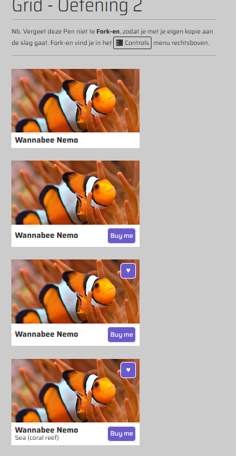

### Oefening 3

Als laatste heb ik Responsive webshop gedaan. Hierbij moest ik een viswinkel stap voor stap responsive maken voor verschillende schermgroottes. Bij deze oefening heb ik wel meer naar de gegeven stappen gekeken, omdat ik nog niet goed wist welke groottes en instellingen ik bij de verschillende schermformaten moest gebruiken.

Ik heb hier vooral geleerd hoe je mobile-first begint met een layout voor een klein scherm en deze daarna met media queries aanpast voor grotere schermen. Daarbij zag ik hoe je binnen een media query het Grid kunt veranderen, bijvoorbeeld door op een groter scherm meer kolommen naast elkaar te zetten.

Deze oefening was voor mij vooral nuttig omdat ik in mijn eigen website ook met Grid en responsive design wilde gaan werken. Ik wist na deze opdracht beter hoe ik mijn Grid kon laten veranderen op basis van de schermgrootte en hoe ik media queries daarvoor kon gebruiken. Hierdoor had ik kennis opgedaan die ik later direct kon toepassen op mijn eigen website.

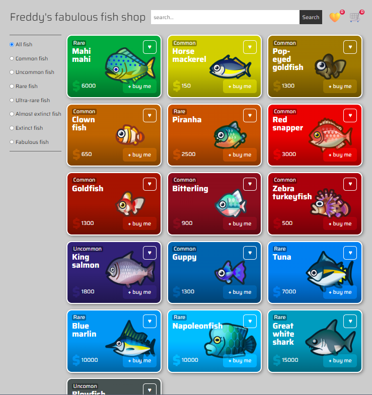

### 10 sept - Huiswerk voor Workshop 3

<strong>Opdracht 11 - Uitgangspunten voor schetsen</strong>

Voor deze opdracht moest ik ideeën uit mijn Crazy 8 kiezen en deze verder uitwerken naar vijf mobile-first schetsen. Hierbij moest ik niet meer alleen snel ideeën tekenen, maar beter nadenken over hoe de schermen echt zouden werken. Ik moest uitgaan van een single column, realistische verhoudingen en de echte hoeveelheid content. Ook moest ik rekening houden met leesbaarheid, ongeveer 35 tekens per regel, een font-size van minimaal 16px/1em en voldoende ruimte tussen elementen. De inzichten uit mijn Visual Research, Crazy 8 en de beoordeling daarvan moest ik hierin meenemen.

Ik heb schetsen gemaakt van zowel mijn homescherm als verschillende pagina's waar je terechtkomt wanneer je op onderdelen van het homescherm klikt. Hiervoor heb ik de afmetingen van mijn eigen telefoon aangehouden, zodat ik beter kon inschatten hoeveel ruimte ik daadwerkelijk op een mobiel scherm heb en de verhoudingen realistischer kon tekenen.

Bij het uitwerken heb ik ook opnieuw gekeken naar mijn Crazy 8-beoordeling en geprobeerd mijn ontwerpen zo webby mogelijk te maken. Mijn homescherm heb ik bijvoorbeeld veranderd naar een close-up van een bureau met verschillende muziekgerelateerde objecten. Deze objecten zijn grote klikbare elementen, waardoor ze niet alleen onderdeel zijn van de omgeving, maar ook als navigatie werken en makkelijker te bedienen zijn op mobiel. Bovenaan heb ik daarnaast een horizontaal scrollbaar menu toegevoegd. Zo hoeft een gebruiker niet per se via de objecten te zoeken, maar kan die ook direct naar een onderdeel navigeren.

Ook heb ik mijn Visual Research verder verwerkt. De nostalgische sfeer komt bijvoorbeeld terug in de Polaroids en oude muziekobjecten. Bij de Polaroids heb ik nu ook daadwerkelijk nagedacht over de content die erin komt, zoals een herinnering, jaartal en bijbehorend nummer. De warme, persoonlijke en cozy uitstraling uit mijn Visual Research wil ik later verder versterken met warme kleuren, licht en de visuele effecten die ik eerder heb onderzocht.

Daarnaast heb ik kennis uit mijn deep dives meegenomen. Zo heb ik bij mijn Aura-pagina een idee uit de deep dive over kleur verder toegepast: ik wil een gekleurde gloed maken die pulseert en zo mijn muziekaura voorstelt. Bij andere schermen heb ik nagedacht over beweging, bijvoorbeeld een draaiende plaat en kaarten die je kunt doorbladeren. Hierdoor wordt de Garden niet alleen visueel, maar ook interactief en dynamisch.

Tot slot heb ik bewuster gekeken naar visuele hiërarchie: wat is de titel, wat is ondersteunende tekst, wat moet als eerste opvallen en waar zitten de interactieve onderdelen? Door mijn Crazy 8 niet letterlijk over te nemen, maar deze te combineren met de feedback uit de beoordeling, mijn Visual Research en technieken uit de deep dives, zijn de schetsen een concretere en beter onderbouwde versie van mijn eerste ideeën geworden.

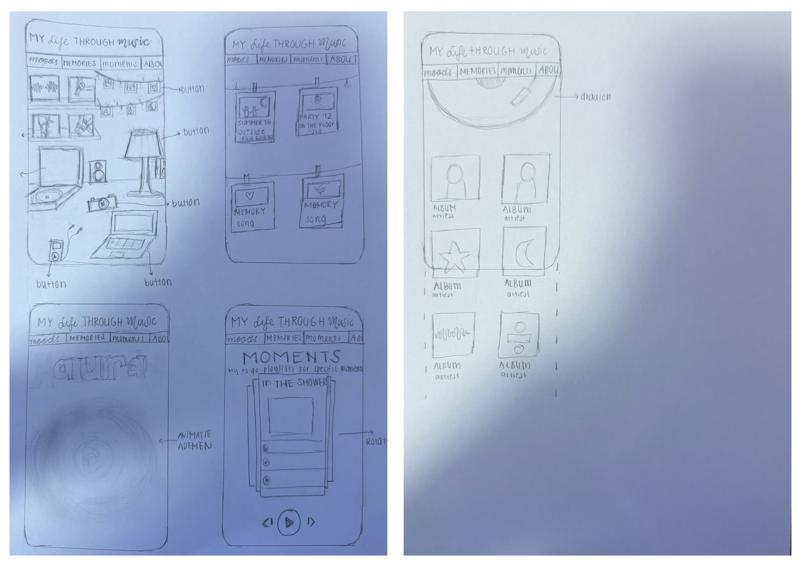

<strong>Deepdive - Mooie kleuren en gradients </strong>

### Voorbereidingen

Voor de Deep Dive over kleur en gradients moest ik als voorbereiding drie verschillende kleurspelletjes doen. Hiermee kon ik testen hoe goed ik kleuren herken, onthoud en verschillen tussen kleuren kan zien.

<strong> Voorbereiding 1 – CSS-kleuren herkennen </strong> 
Bij het eerste spel kreeg ik een CSS-kleur en moest ik deze terugvinden in een groot palet met verschillende kleuren. Dit vond ik best lastig, vooral wanneer meerdere kleuren heel erg op elkaar leken. Soms kon ik de juiste kleur snel herkennen, maar bij kleine kleurverschillen had ik er meer moeite mee. Hier merkte ik dus dat ik CSS-kleuren nog niet altijd goed van elkaar kan onderscheiden.

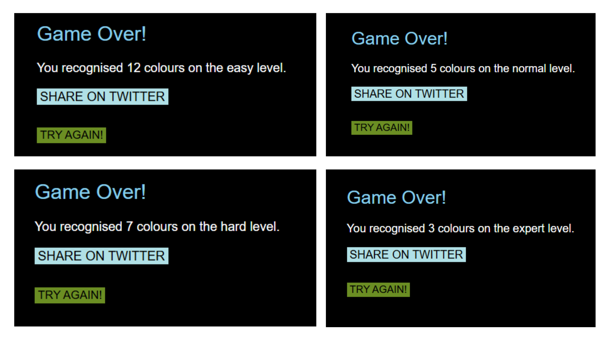

<strong> Voorbereiding 2 – Kleur onthouden en namaken </strong> 
Bij het tweede spel kreeg ik kort een kleur te zien die ik daarna uit mijn geheugen zo goed mogelijk moest namaken met HSL-sliders. Dit spel kende ik toevallig al, omdat ik de daily versie hiervan bijna elke dag doe. Toch vond ik deze kleuren lastiger dan normaal. Soms dacht ik dat mijn kleur bijna precies hetzelfde was, terwijl er toch meer verschil in zat dan ik verwachtte. Mijn uiteindelijke score was 84,33, dus best goed, maar ik merkte dat het onthouden van kleine verschillen in hue, saturation en lightness nog lastig kan zijn.

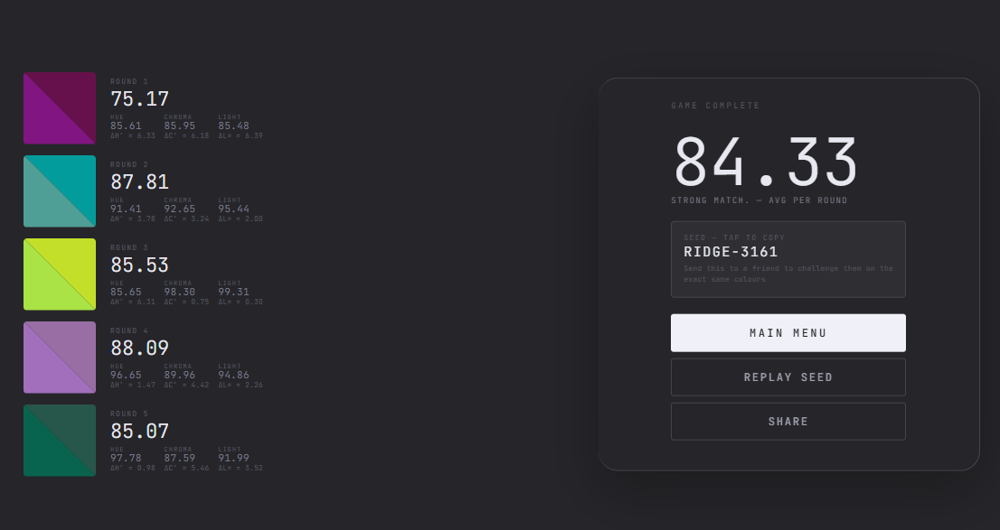

<strong> Voorbereiding 3 – Kleurverschillen zien </strong> 
Het derde spel vond ik het leukst. Hierbij kreeg ik twee kleuren te zien die steeds meer op elkaar gingen lijken en moest ik aangeven waar de overgang tussen de twee kleuren zat. De eerste levels gingen vrij makkelijk, maar vooral rond level 20 tot 30 moest ik echt goed focussen om het verschil nog te kunnen zien. Als ik er lang genoeg naar keek, kon ik het verschil meestal uiteindelijk wel herkennen. Hierdoor merkte ik dat ik kleine kleurverschillen best goed kan zien, zolang ik de tijd neem om goed te kijken.

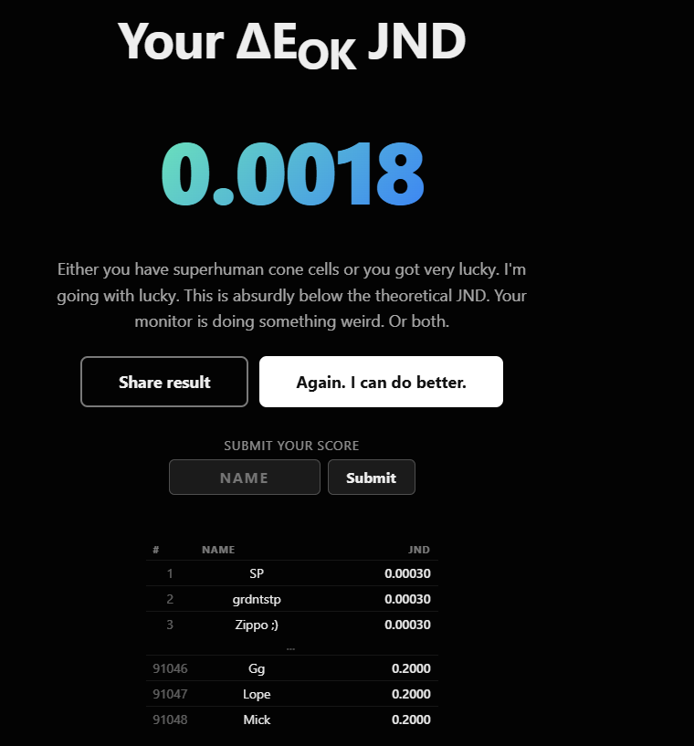

### Oefening 1

Voordat ik aan de oefeningen begon, heb ik eerst de theorie uit de PowerPoints doorgenomen. Hierin heb ik geleerd hoe verschillende gradients, kleuren en animaties in CSS werken. Met deze kennis ben ik daarna de oefeningen gaan maken.

Bij oefening 1 moest ik 12 verschillende blokjes met gradients namaken en custom properties gebruiken voor de kleuren. De eerste blokjes gingen redelijk goed met behulp van de tips in dlo, maar vanaf ongeveer blokje 5 werd het lastiger. Ik ben toen steeds teruggegaan naar de theorie in de powerpoint om te kijken welke code en technieken ik kon gebruiken en heb dit daarna zelf toegepast.

Door deze oefening begrijp ik nu veel beter hoe de verschillende gradients werken, zoals een linear-gradient, radial-gradient en conic-gradient. Ook heb ik geleerd hoe ik de richting van een gradient kan bepalen, color stops kan gebruiken om aan te geven waar een kleur begint of eindigt en hoe ik meerdere gradients over elkaar kan stapelen om complexere vormen en patronen te maken. Ik merk hierdoor dat ik niet alleen de code overneem, maar ook steeds beter begrijp wat de verschillende waarden in de code daadwerkelijk met het beeld doen.

Het laatste blokje heb ik uiteindelijk niet af kunnen maken, omdat ik nog niet goed begreep hoe ik alle verschillende onderdelen daarvoor moest combineren. Dat is dus nog iets waar ik verder mee wil oefenen.

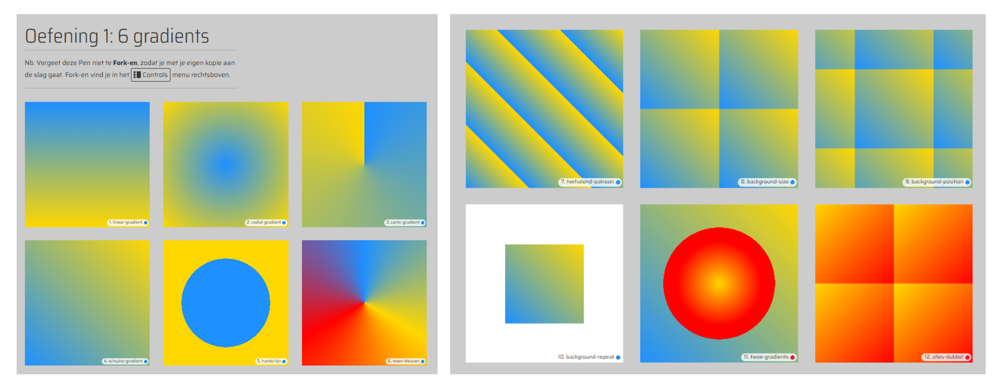

### Oefening 2

Daarna ben ik verdergegaan met het namaken van vlaggen met CSS-gradients. Deze oefening vond ik een stuk lastiger. Ook hierbij heb ik vaak teruggekeken naar de theorie om te bepalen welke gradient ik nodig had en hoe ik meerdere vormen kon combineren.

Bij de eerste drie vlaggen merkte ik wel dat ik steeds beter begon te begrijpen welke techniek ik moest gebruiken. Bij de vlag van Macedonië wist ik bijvoorbeeld dat ik eerst de stralen met een gradient moest maken en daar vervolgens een cirkel bovenop moest zetten. Dat vond ik fijn, omdat ik merkte dat de theorie uit de PowerPoint en de vorige oefening al beter begon te blijven hangen.

Toen ik bij de moeilijkere vlaggen kwam, liep ik wel vast. Ik wist bijvoorbeeld nog niet goed hoe ik een gewoon kruis op de juiste manier moest opbouwen met gradients. Daarom ben ik weer teruggegaan naar een paar makkelijkere vlaggen om daar verder mee te oefenen. Ik merk dus dat ik vaak al wel in mijn hoofd begrijp wat ik ongeveer moet doen, maar dat het omzetten daarvan naar de juiste CSS-code nog lastig is. Dat is vooral iets waar ik nog meer mee moet oefenen.

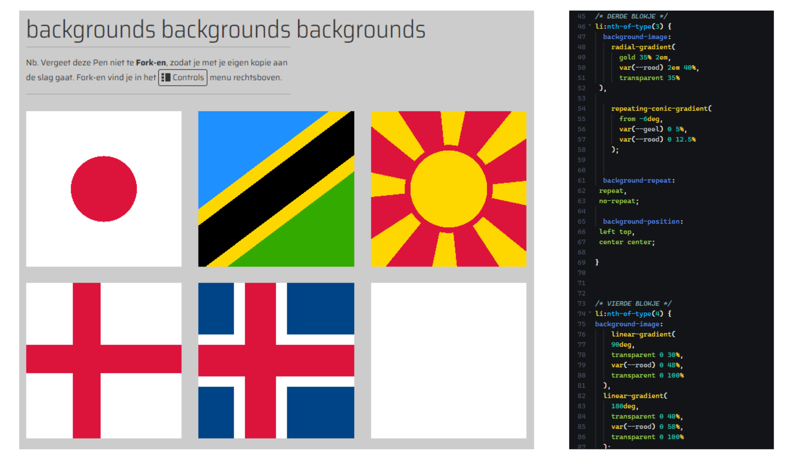

### Oefening 3

Als laatste ben ik aan de slag gegaan met animaties. In het begin vond ik deze oefening best lastig, omdat hier in de PowerPoint maar weinig uitleg over stond. Toen ik de code rustig ging lezen en logisch probeerde te kijken naar wat iedere regel deed, merkte ik dat ik het eigenlijk steeds beter begon te begrijpen. De eerste twee oefeningen kon ik daardoor vrij makkelijk maken. Bij de volgende oefeningen moest ik wat langer kijken en vergelijken met wat ik daarvoor had gedaan.

Uiteindelijk begon ik te begrijpen hoe ik een @property moet opbouwen, welke syntax ik nodig heb en hoe ik een initial-value instel. Ook kon ik steeds beter bepalen of ik bijvoorbeeld met een angle of percentage moest werken. Dat vond ik fijn, omdat ik merkte dat ik niet alleen code aan het overnemen was, maar ook begon te begrijpen waarom ik bepaalde keuzes maakte.

Wat ik nog lastig vind, is om een ingewikkeldere background-image helemaal zelf op te bouwen en daarin bijvoorbeeld calc() te combineren met een variabele. Daardoor lukte het laatste blokje mij niet. Ik merk dus dat ik de losse onderdelen en de logica van de animaties nu een stuk beter begrijp, maar dat ik nog moet oefenen met het zelfcombineren van die technieken tot complexere CSS.

Link naar de CodePen opdracht:  
https://codepen.io/editor/Rianne-Maria/pen/01a08bc6-edf3-76a3-8e1d-2b941576d4a4

### 9 sept - Workshop 2

<strong>Presentatie</strong>

Mijn presentatie staat hier

[Bekijk mijn presentatie](oefeningen/presentatie/index.html)

#### Vragen na de presentatie

Na mijn presentatie heeft Dewi wat vragen gesteld die ik heb beantwoord:

<strong> 1. Wat ben je door het verzamelen van je inspiratie over je onderwerp te weten gekomen? </strong> 
Ik kwam er vooral achter dat mijn beleving van muziek veel breder is dan alleen welke artiesten of nummers ik leuk vind. Ik had er eerst nooit zo over nagedacht en had ook niet door dat muziek zo grote impact heeft op mijn leven. Muziek zit eigenlijk in heel veel dagelijkse momenten en is voor mij zowel digitaal als fysiek.

<strong> 2. Hoe wil je voorkomen dat je Digital Garden gewoon een website over je favoriete muziek wordt? </strong> 
Door niet alleen artiesten en nummers te laten zien, maar vooral mijn eigen ervaringen centraal te zetten. Dus bijvoorbeeld wanneer ik muziek luister, welke herinneringen erbij horen, concerten waar ik ben geweest, karaoke vanuit mijn cultuur en het zelf maken van muziek.

<strong> 3. Welke inspiratie kun je uit je afbeeldingen halen? Stijl, gevoel, vorm enz. </strong> 
Uit mijn afbeeldingen haal ik vooral inspiratie uit de verschillende sferen die muziek voor mij kan hebben. In mijn concertfoto's zie je bijvoorbeeld veel donkere achtergronden met felle en gekleurde verlichting. Andere foto's zijn juist rustiger en persoonlijker. Het is niet 1 vibe zegmaar, maar meerdere vibes.

Ook zie ik veel dingen terug die ik later misschien als vorm of interactie kan gebruiken, zoals albumcovers, Spotify, vinylplaten, muziekspelers, soundwaves en knoppen zoals play en pause.

<strong> 4. Vul deze zin aan: </strong> 
<strong>Ik wil mijn Digital Garden laten gaan over...</strong> 
mijn persoonlijke beleving van muziek en de verschillende manieren waarop muziek onderdeel is van mijn leven.

<strong>...en wil dat laten zien door ... aan content te tonen.</strong> 
eigen foto's, muziek, herinneringen, concerten, albumcovers, artiesten, korte teksten en interactieve elementen.

<strong>Ik begin met een stukje eigen content over...</strong> 
muziek in mijn dagelijks leven en de verschillende momenten waarop muziek bij mij aanwezig is.

<strong>Als het begin is gemaakt kan ik mijn Garden verder uitbreiden door...</strong> 
steeds meer persoonlijke herinneringen, muziekfases, concerten, moods, karaoke, instrumenten en andere ervaringen met muziek toe te voegen.

<strong> 5. Wat is het karakter/de uitstraling/het gevoel dat bij het onderwerp past? </strong> 
Ik denk dat mijn onderwerp vooral persoonlijk, nostalgisch en levendig moet voelen en gewoon een warm cozy gevoel krijg wanneer je op de website kijkt. Aan de ene kant heb ik rustige en emotionele kanten van muziek, bijvoorbeeld muziek die bij herinneringen hoort. Aan de andere kant heb ik juist hele energieke dingen zoals concerten, dansen en karaoke. Ik wil die verschillende gevoelens uiteindelijk ook terug laten komen in mijn Digital Garden.

<strong>Visual Research</strong>

#### Opdracht 5 - Een sfeerwoord als uitgangspunt

Voor het visuele onderzoek moest ik eerst sfeerwoorden kiezen die passen bij mijn onderwerp My Life Through Music. Ik heb gekozen voor nostalgisch, levendig en comfortabel/cozy. Nostalgisch omdat muziek mij terugbrengt naar herinneringen en bepaalde periodes in mijn leven, levendig omdat muziek mij veel energie kan geven maar mij ook gewoord alive laat voelen en comfortabel/cozy omdat muziek voor mij ook vertrouwd en ontspannend voelt. Ik hou ervan om altijd muziek aan te hebben, ook instrumenteel, en dat geeft mij gewoon een warm en cozy gevoel. Vanuit deze drie woorden ben ik verdergegaan met mijn visuele onderzoek.

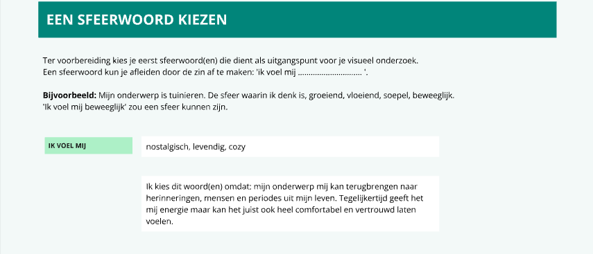

#### Opdracht 6 – Directe visuele vertaling

Bij deze opdracht moest ik vanuit mijn sfeerwoorden op zoek gaan naar beelden die daar voor mij direct bij passen. Voor levendig heb ik vooral beelden gekozen met veel beweging, zoals dansende en bewegende mensen, concerten, vuurwerk en andere beelden waar veel energie in zit. Voor comfortabel/cozy kwam ik juist veel uit op warme oranje en bruine kleuren, lichtjes, kaarsen en gezellige kamers. Daar krijg ik gewoon een warm en cozy gevoel mij. Bij nostalgisch heb ik meer gekeken naar een retro en oude uitstraling, zoals een platenspeler, een oude muziekspeler, grainy foto's en foto's die een beetje vervaagd of onscherp zijn. Zo begon ik ook steeds meer overeenkomsten tussen de beelden te zien.

#### Opdracht 7 – Directe visuele vertaling

Daarna moest ik de kenmerken uit opdracht 6 abstracter gaan vertalen naar vorm, kleur en typografie. Ik heb daarom typografische en grafische posters verzameld die aansloten bij mijn sfeerwoorden. Ik koos veel posters met blur en vervormde of golvende typografie, omdat dit voor mij het levendige en de beweging uit mijn eerdere beelden terugbrengt. Grain en vervaagde effecten heb ik gekozen omdat dit een wat oudere en nostalgische uitstraling geeft. Daarnaast kwamen warme oranje, rode en bruine kleuren veel terug, omdat deze voor mij juist het comfortabele en cozy gevoel geven. Zo heb ik mijn sfeerwoorden omgezet naar kenmerken die ik later kan gebruiken in mijn ontwerp.

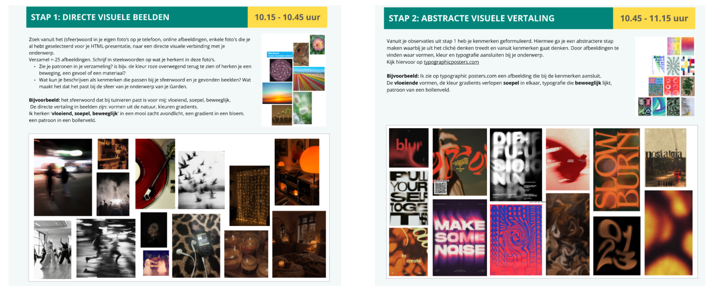

#### Opdracht 8 – Uitgangspunten voor schetsen

Bij deze opdracht moest ik uit mijn abstracte vertaling vier posters kiezen die mij het meest inspireerden. Per poster heb ik gekeken welke kenmerken passen bij mijn sfeerwoorden, hoe ik deze kenmerken kan gebruiken in mijn ontwerp en wat ik hiermee concreet zou kunnen gaan schetsen. Zo heb ik mijn visuele onderzoek vertaald naar echte uitgangspunten voor mijn ontwerp. De bijbehorende uitleg per poster is te zien in de afbeeldingen hieronder.

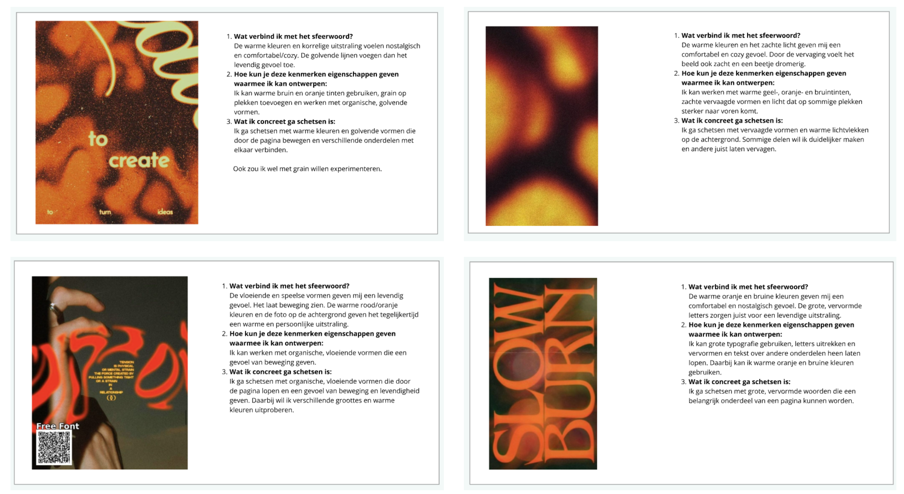

<strong>Crazy 8</strong>

#### Opdracht 9 – Schetsoefening Crazy 8

<strong>Mijn eerste crazy 8</strong> 
Hierna heb ik de Crazy 8 gedaan. Hierbij moest ik in korte tijd verschillende ideeën schetsen, ongeveer 40 seconden per schets. Ik heb hierbij mijn sfeerwoorden als uitgangspunt gebruikt. Voor nostalgisch heb ik bijvoorbeeld Polaroids aan een lijn getekend waar ik herinneringen en muziek aan kan koppelen, een tijdlijn waar je doorheen kan scrollen en oude LP’s die over elkaar liggen die je kan aanklikken. Voor levendig heb ik juist gekeken naar beweging, zoals een draaiende platenspeler en golvende vormen voor knoppen. Zo heb ik snel verschillende manieren bedacht waarop mijn sfeerwoorden terug kunnen komen in mijn Garden.

<strong>Mijn tweede crazy 8</strong> 
De dag daarna ben ik opnieuw naar mijn Crazy 8 gaan kijken en merkte ik dat deze nog niet helemaal compleet voelde. Ik had namelijk vooral schermen geschetst die je te zien krijgt nadat je ergens op hebt geklikt, maar nog niet echt onderzocht hoe mijn homescherm/beginscherm eruit zou kunnen zien. Daarom heb ik nog een Crazy 8 gedaan, maar dit keer alleen gericht op verschillende mogelijkheden voor mijn homepage. Ook hierbij heb ik weer ongeveer 40 seconden per schets gebruikt, zodat ik snel ideeën op papier kon zetten zonder er te lang over na te denken.

Ik ben hierbij eerst teruggegaan naar de uitkomsten van mijn Visual Research. Bij mijn eerste schetsen heb ik vooral gekeken naar het sfeerwoord comfortabel/cozy. Daarom heb ik bijvoorbeeld kamers en een bureauomgeving getekend waarin alle verschillende objecten klikbare onderdelen kunnen zijn. In de uiteindelijke vormgeving zou ik dit willen versterken met warme verlichting en vooral oranje en bruine kleuren, die ook veel terugkwamen in mijn Visual Research.

Daarna ben ik meer gaan kijken naar nostalgie. Zo heb ik een idee gemaakt waarbij LP's naast elkaar de verschillende menu-items vormen. Ook heb ik een wat rommeligere verzameling van objecten geschetst, zoals een iPod, LP, camera en piano. Deze objecten verwijzen naar verschillende onderdelen van mijn muziekbeleving en geven tegelijkertijd die oudere en persoonlijke uitstraling die ik bij mijn visuele onderzoek had gevonden.

Tijdens het snel schetsen ontstonden vervolgens ook ideeën die ik vooraf nog niet had bedacht. Zo heb ik bijvoorbeeld een homepage gemaakt die lijkt op een playlist, een indeling met verschillende albumcovers en een ontwerp met een grote koptelefoon waarbij je tijdens het scrollen het snoer volgt en onderweg verschillende menu-items tegenkomt.

Door deze tweede Crazy 8 merkte ik dus dat mijn Visual Research vooral als startpunt werkte, maar mij niet beperkte tot alleen die eerste ideeën. De warme kleuren, nostalgische objecten, beweging en vloeiende vormen gaven mij een richting om vanuit te beginnen. Door daarna snel verschillende composities te schetsen, ontstonden vanzelf weer nieuwe ideeën en manieren van navigeren. Hierdoor heb ik uiteindelijk veel verschillende mogelijkheden voor mijn homepage kunnen onderzoeken in plaats van meteen vast te blijven zitten aan mijn eerste idee.

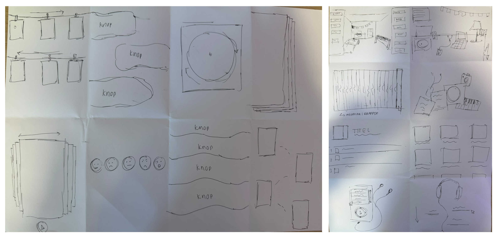

#### Opdracht 10 – Crazy 8 beoordelen

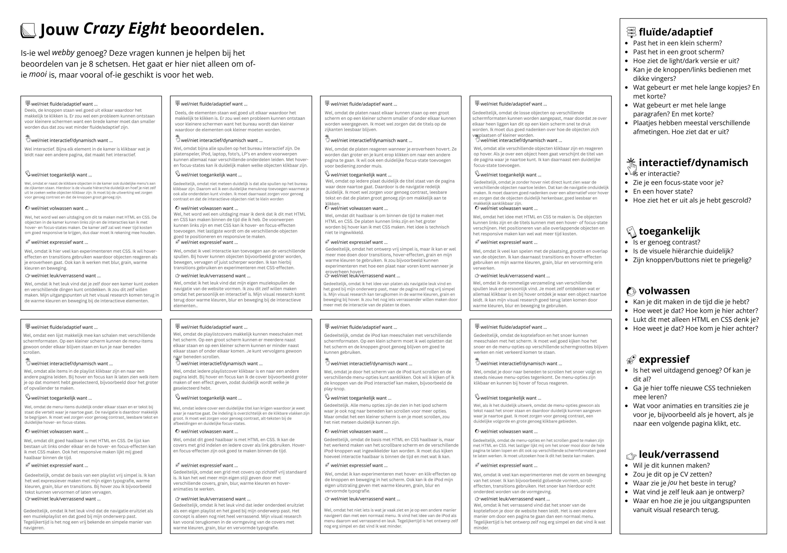

<strong>Checkout</strong>

<strong> 1. Leg uit waar het Visual Research in 3 stappen naartoe werkt </strong> 
Het Visual Research helpt mij om vanuit mijn sfeerwoorden uiteindelijk tot concrete ontwerpkeuzes te komen. Ik ben begonnen met directe beelden, heb deze daarna vertaald naar abstracte kenmerken zoals kleur, vorm en typografie en heb daar uiteindelijk uitgangspunten van gemaakt waarmee ik kon gaan schetsen.

<strong> 2. Vertel in 2 zinnen waar jouw Garden over gaat, en met welke content je dat gaat doen (beeld, tekst, sound, animatie enz).</strong> 
Mijn Garden My Life Through Music gaat over hoe muziek onderdeel is van mijn leven en verbonden is aan herinneringen, momenten, ervaringen en mensen. Daarnaast wil ik mijn eigen muzieksmaak delen, zoals mijn favoriete nummers en artiesten, muziek die ik zou aanraden, maar ook dingen die ik juist helemaal niet leuk vind. Hiervoor wil ik onder andere foto's, tekst, muziek/sound, animaties en interactieve elementen gebruiken.

<strong> 3. Vertel kort welk idee van de Crazy 8 je het liefst zou willen uitvoeren/ verder zou willen onderzoeken.</strong> 
Ik wil vooral het idee van de interactieve kamer verder onderzoeken. Hierbij kunnen verschillende objecten in de kamer als navigatie werken en wil ik met warme kleuren en licht een cozy sfeer creëren. Ik vind dit interessant omdat bezoekers hierdoor zelf kunnen rondkijken en mijn Garden kunnen ontdekken in plaats van alleen een standaard menu te volgen.

### 8 sept - Deepdive

<strong>Light & Dark Theme</strong>

Vandaag ben ik begonnen met de deep dive Light and Dark themes. Voordat ik aan de eerste oefening begon, heb ik eerst de twee teksten gelezen die erbij stonden. Bij custom properties herkende ik eigenlijk bijna alles al, omdat ik hier tijdens de vorige deep dive over fonts, kleuren en effecten ook al mee had gewerkt. Daardoor snapte ik dit gedeelte vrij snel.

Daarna heb ik de intro over Light and Dark themes gelezen. Hier werd vooral uitgelegd hoe je in CSS een light en dark theme kunt maken en hoe je ervoor zorgt dat de website rekening houdt met de voorkeur van de gebruiker. Hierbij werd onder andere uitgelegd hoe color-scheme, light-dark() en @media (prefers-color-scheme: dark) werken.

Met deze informatie kon ik oefening 1 gaan maken

#### Oefening 1

Bij oefening 1 moest ik zelf een light en dark theme maken. Ik ben daarom eerst kleuren gaan kiezen die goed bij elkaar passen en waarbij er ook echt een duidelijk verschil te zien is tussen de lichte en donkere versie. Ik wilde wel dat beide themes dezelfde uitstraling en dezelfde soort kleuren behielden, zodat het nog steeds als één ontwerp voelde.

n het begin kreeg ik het alleen niet meteen werkend. Zoals je op de afbeelding kunt zien, had ik bij mijn custom properties light dark() geschreven met een spatie ertussen. Daardoor werden mijn kleuren niet goed gelezen en veranderde het theme dus niet zoals ik wilde. Ik heb hier best even naar moeten zoeken voordat ik doorhad dat het light-dark() moest zijn. Nadat ik dit had aangepast werkte het wel.

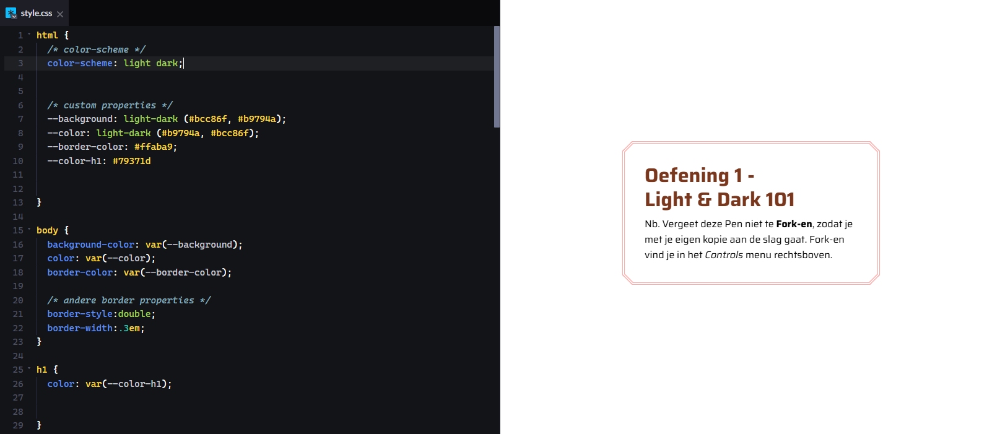

In het begin kreeg ik het alleen niet meteen werkend. Zoals je op de eerste afbeelding kunt zien, had ik bij mijn custom properties light dark() geschreven met een spatie ertussen. Daardoor werden mijn kleuren niet goed gelezen en veranderde het theme dus niet zoals ik wilde. Ik heb hier best even naar moeten zoeken voordat ik doorhad dat het light-dark() moest zijn. Nadat ik dit had aangepast werkte het wel.

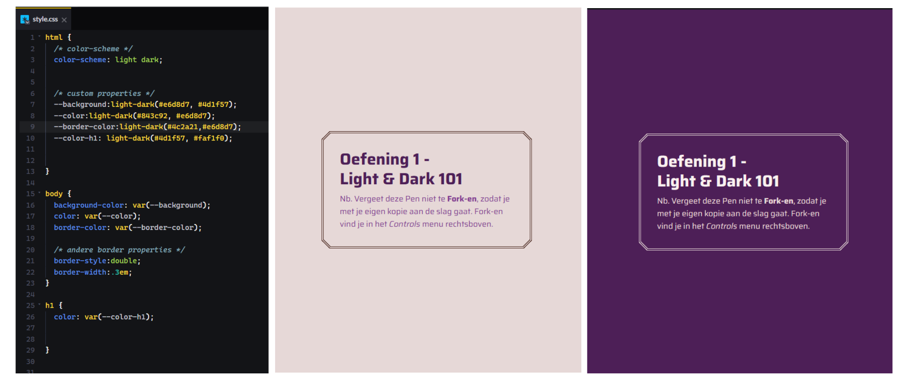

#### Oefening 2

Bij deze opdracht moest ik een light en dark theme maken voor de kattenwinkel. Hierbij moest ik de custom properties in de html-selector definiëren en deze daarna op de juiste plekken in mijn CSS gebruiken.

Deze opdracht ging een stuk makkelijker dan de eerste oefening. Bij oefening 1 had ik al ontdekt welke fout ik maakte met light-dark() en daardoor wist ik nu meteen hoe ik dit goed moest schrijven.

Ik heb aparte properties gemaakt voor de achtergrond, header en verschillende tekstkleuren. Hier moest ik wel voor terug in de HTML kijken, om te kijken wat voor selector er voor wat was gebruikt zodat ik dat in mijn CSS kon targeten. Per property heb ik met light-dark() een kleur voor de lichte en donkere versie ingesteld. Daarna heb ik die properties gekoppeld aan de juiste onderdelen, zoals body, header en de headings. Hierdoor merkte ik dat ik de theorie uit de eerste tekst nu echt beter begon toe te passen en beter wist hoe de opbouw van zo’n light en dark theme in CSS werkt.

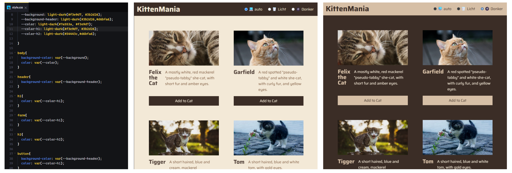

#### Voorbereiding oefening 3

Voordat ik aan de volgende opdracht begon, heb ik eerst de tekst over responsive afbeeldingen gelezen. Hier heb ik vooral geleerd dat je niet alleen rekening moet houden met light en dark mode, maar ook met verschillende schermgroottes. Met het <picture>-element en meerdere <source>-elementen kun je bepalen welke afbeelding er wordt gebruikt op bijvoorbeeld een klein of groot scherm. Met media queries kun je daar voorwaarden aan koppelen, zoals de breedte van het scherm of prefers-color-scheme.

Ik vond dit eigenlijk best interessant, omdat ik hier in jaar 1 nog helemaal niet echt mee bezig was. Daardoor kon een website die er op mijn laptop goed uitzag, er op een groter scherm ineens heel anders uitzien. Nu begrijp ik beter dat je bij het ontwerpen en bouwen rekening moet houden met verschillende devices en situaties, zodat je website niet alleen op je eigen scherm goed werkt.

Daarnaast heb ik geleerd dat je afbeeldingen en iconen ook kunt aanpassen aan light en dark mode. Dat kan bijvoorbeeld met een inline SVG, een CSS-filter of met verschillende afbeeldingen binnen een <picture>-element. Vooral het responsive gedeelte vond ik handig om te leren, omdat ik dit later kan gebruiken om ervoor te zorgen dat mijn website op meerdere apparaten goed blijft werken.

#### Oefening 3

Daarna ben ik verdergegaan met oefening 3, waarbij ik de theorie over responsive afbeeldingen en light/dark mode moest toepassen. Voor deze opdracht moest ik van één afbeelding in totaal vier varianten maken: een grote lichte versie, een grote donkere versie, een kleine lichte versie en een kleine donkere versie. De lichte afbeelding hadden we al gekregen en met AI heb ik daar een donkere variant van gemaakt. Daarna heb ik van beide versies ook nog een kleinere variant gemaakt.

Vervolgens heb ik deze vier afbeeldingen in mijn project gezet en gebruikt binnen een <picture>-element. Ik heb hierbij met <source> aangegeven welke afbeelding gebruikt moet worden op basis van de schermgrootte en of de gebruiker een light of dark theme heeft ingesteld. Voor de donkere versies heb ik prefers-color-scheme: dark gebruikt en voor de grotere afbeeldingen heb ik ook een voorwaarde met de breedte van het scherm toegevoegd.

Ik wist deze code nog niet helemaal uit mijn hoofd, dus ik heb het voorbeeld uit de theorie erbij gehouden. Vanuit dat voorbeeld heb ik de structuur overgenomen en daarna mijn eigen bestandsnamen en voorwaarden ingevuld. Hierdoor begreep ik wel beter hoe de verschillende <source>-regels samenwerken en dat de browser uiteindelijk zelf de afbeelding kiest die het beste past bij de situatie van de gebruiker.

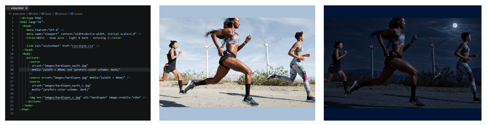

### 7 sept - Workshop 1

<strong>Sprintplanning</strong>

<strong>Verkenning onderwerp</strong>

#### Opdracht 1 – Rangschikken

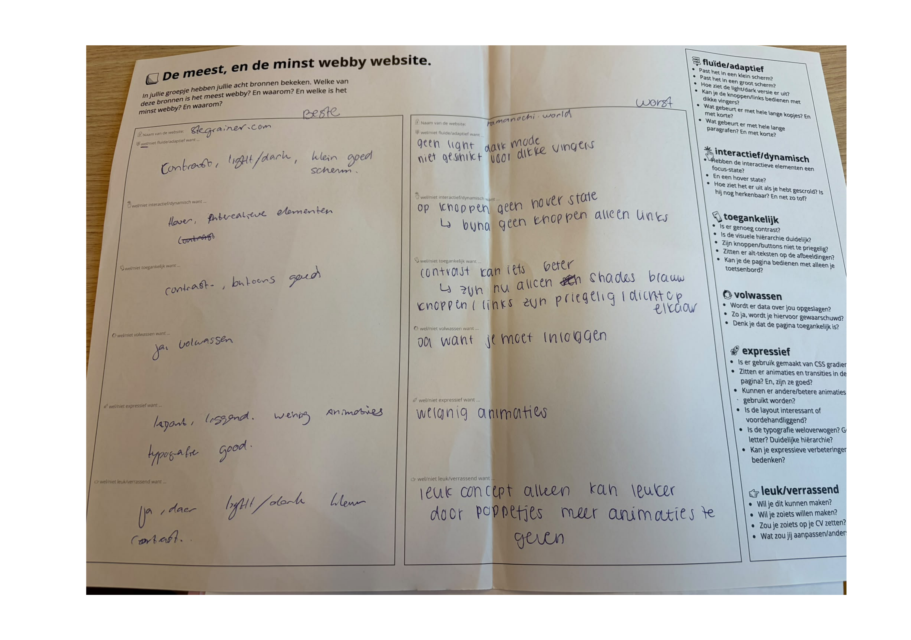

#### Opdracht 2 – Eigen verkenning

<strong>Vanuit de inventarisatie</strong>

Voor mijn Digital Garden wil ik iets maken rondom muziek en hoe muziek een rol speelt in mijn leven. Ik heb voor dit idee gekozen omdat muziek echt een dagelijks onderdeel van mijn leven is. Er staat bijna de hele dag wel muziek aan in mijn kamer, maar ook als ik onderweg ben luister ik eigenlijk altijd wel naar muziek. Daarom leek het me leuk om mijn Digital Garden hierover te maken en te laten zien welke rol muziek in mijn dagelijks leven speelt. Ik wil niet alleen mijn favoriete nummers en artiesten laten zien, maar vooral laten zien welke muziek ik luister op verschillende momenten, welke gevoelens ik bij muziek krijg en welke herinneringen ik aan bepaalde nummers heb.

Tijdens het bekijken van de verschillende websites zag ik veel interactieve elementen en websites die bijna als een soort eigen wereld of kamer waren opgebouwd. Je navigeerde niet alleen via een standaard menu, maar kon op verschillende onderdelen en voorwerpen klikken om weer ergens anders terecht te komen. Dat vond ik heel leuk, omdat je hierdoor zelf de website kunt ontdekken en niet één vaste route hoeft te volgen.

Hierdoor kwam ik op het idee om mijn Digital Garden misschien ook als een soort interactieve kamer rondom muziek te maken. In de kamer zouden dan verschillende voorwerpen kunnen staan, zoals een koptelefoon, cd's, posters of een platenspeler, die je naar verschillende onderdelen van mijn garden brengen.

Dit is voor nu nog maar een idee en ook wel een uitdaging, omdat ik nog niet goed weet hoe ik zoiets moet maken met HTML en CSS. Juist daarom lijkt het me interessant om tijdens deze sprint te kijken hoeveel hiervan mogelijk is en wat ik zelf kan leren maken.

<strong>Welke webby dingen wil ik gebruiken?</strong>

Bij de websites die ik heb bekeken vond ik het vooral leuk als je niet meteen wist wat er allemaal te vinden was en zelf dingen moest ontdekken. Dat wil ik ook in mijn website verwerken en ik wil het natuurlijk zo webby mogelijk maken.

Ik wil bijvoorbeeld gebruikmaken van hover-effecten, klikbare voorwerpen, animaties en verschillende pagina's die met elkaar verbonden zijn. Ook lijkt het me leuk als bepaalde dingen pas zichtbaar worden wanneer je erop klikt of er met je muis overheen gaat. De garden hoeft hierdoor niet in één vaste volgorde bekeken te worden. Je kunt zelf bepalen waar je naartoe gaat en misschien ook verborgen dingen tegenkomen.

<strong>Eigen content, toon, context en doel</strong>

Mijn onderwerp is muziek, maar vooral mijn eigen ervaring met muziek. Ik wil bijvoorbeeld iets vertellen over:

- muziek die bij verschillende moods past
- muziek die ik op bepaalde momenten luister, zoals tijdens het studeren, klaarmaken of 's avonds
- nummers waar ik herinneringen aan heb
- mijn favoriete artiesten en nummers
- muziekfases die ik heb gehad
- nummers die ik vroeger veel luisterde
- nummers die ik nooit skip
- muziek die ik op dit moment veel luister
- guilty pleasures

De toon wil ik persoonlijk, casual en soms een beetje grappig houden. Het moet niet voelen alsof ik informatie over muziek probeer uit te leggen. Het doel is juist dat iemand door mijn garden een beetje kan ervaren hoe ik muziek beleef en welke plek muziek in mijn leven heeft.

<strong>Content van anderen</strong>

Ik zal waarschijnlijk ook content van anderen gebruiken, omdat mijn onderwerp muziek is. Denk bijvoorbeeld aan albumcovers, artiesten, songtitels, links naar muziek en misschien korte verwijzingen naar lyrics. Daarbij wil ik steeds duidelijk maken van wie de originele content is en waar het vandaan komt.

Ik wil die content niet zomaar verzamelen en neerzetten, maar er mijn eigen verhaal en ervaring aan toevoegen. Een albumcover staat er bijvoorbeeld niet alleen omdat ik hem mooi vind, maar omdat ik vertel wat dat album voor mij betekent of waar het mij aan doet denken.

<strong>Hoe kan mijn content worden ervaren?</strong>

Ik wil dat mijn garden niet alleen iets is wat je leest en bekijkt, maar iets waar je zelf doorheen kunt gaan en dingen kunt ontdekken.

Muziek kan natuurlijk ook echt gehoord worden, bijvoorbeeld doordat je nummers kunt afspelen of via links kunt beluisteren. Visueel wil ik verschillende gevoelens en soorten muziek ook anders laten aanvoelen met kleur, typografie, afbeeldingen en beweging.

Bij rustige of late-night muziek kan een gedeelte bijvoorbeeld donkerder en rustiger zijn, terwijl muziek voor tijdens het klaarmaken juist drukker en vrolijker kan voelen. Door te klikken, hoveren en zelf een route door de garden te kiezen wil ik ervoor zorgen dat iedere bezoeker mijn muziekwereld op zijn eigen manier kan ontdekken.

<strong>Checkout</strong>

<strong>1. Leg uit wat een digital garden is en waarom dat anders is dan een reguliere website.</strong>
Een digital garden is eigenlijk een soort online plek waar je allemaal dingen verzamelt die je interessant vindt of waar je mee bezig bent. Het hoeft niet allemaal helemaal af te zijn en je kan dingen steeds blijven aanpassen of uitbreiden. Bij een normale website is alles vaak veel meer af en heeft het een duidelijke structuur waar je als bezoeker doorheen gaat. Bij een digital garden mag het juist wat vrijer en persoonlijker zijn. Er is niet 1 bepaalde route die je moet doorlopen, maar er zijn meerdere waaruit je kan kiezen.

<strong>2. Leg uit wat een website 'webby' maakt en welke websites jou het meeste inspireren.</strong>
Een website is webby als hij echt gebruikmaakt van de mogelijkheden van het web, bijvoorbeeld interactie, hover-effecten, animaties, een responsive ontwerp en dingen die je zelf kunt ontdekken. De websites die mij het meest inspireren zijn vooral de websites die als een soort interactieve wereld zijn opgebouwd, waarbij je op verschillende voorwerpen kunt klikken en niet één vaste route hoeft te volgen.

<strong>3. Vertel waar jij mee aan de slag wilt gaan bij het maken van jouw eigen digital garden (let op: dit zijn jouw eerste ideeën, dit kan en mag veranderen in de loop van het programma.)</strong>
Ik wil aan de slag gaan met een Digital Garden rondom muziek en hoe ik muziek beleef in mijn dagelijks leven. Ik wil vooral experimenteren met interactieve elementen, zoals klikbare voorwerpen, hover-effecten en animaties, zodat je zelf door mijn muziekwereld kunt ontdekken.

### 4 sept - Deepdives

<strong>Praktische CSS</strong>

#### Voorbereidingen:

Vandaag ben ik begonnen met de Deepdive Praktische CSS. Voor de voorbereiding moesten we eerst een CodePen-account aanmaken, daarna opdracht 1 maken en als laatste de CSS Diner game spelen. Met deze opdrachten gingen we alvast oefenen met HTML en CSS voordat we tijdens de deepdive verder de stof in gingen.

##### Opdracht 1 – Een lelijke HTML-pagina maken

Bij de eerste opdracht was het de bedoeling om een simpele HTML-pagina te maken zonder deze mooi te maken met CSS. We kregen een vaste structuur met verschillende HTML-elementen die we moesten gebruiken, zoals een main, h1, h2, meerdere p-elementen, een img, een ul met li's en een blockquote.

Ik heb ervoor gekozen om mijn pagina over herfst te maken, omdat dit mijn favoriete seizoen is en de herfstperiode nu ook weer begint. Ik heb de gegeven structuur aangehouden en deze gevuld met mijn eigen content. Zo heb ik verschillende headings en stukjes tekst toegevoegd, een afbeelding gebruikt, een lijst gemaakt met dingen die voor mij bij de herfst horen en een quote toegevoegd. Het eindresultaat was expres nog een hele simpele en "lelijke" HTML-pagina, omdat het bij deze opdracht vooral ging om de structuur van HTML en nog niet om de vormgeving met CSS.

Dat kwam er uiteindelijk zo uit te zien:

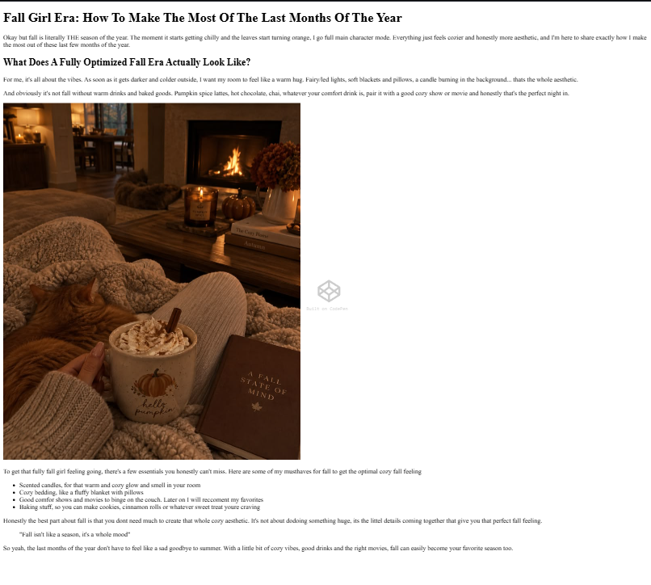

##### CSS Diner Game

Daarna heb ik de CSS Diner game gespeeld. In deze game moest ik met verschillende CSS-selectors de juiste objecten selecteren. Hier heb ik best wel even over gedaan, omdat ik niet alles meer wist en er ook veel dingen tussen zaten die nieuw voor mij waren.

Ik heb er wel zeker wat dingen uit meegenomen. Zo begrijp ik nu beter hoe je met CSS heel specifiek bepaalde elementen kunt selecteren en wat het verschil is tussen bijvoorbeeld een element, class en verschillende selectors zoals :first-child of :nth-child(). Vooral bij de wat moeilijkere levels moest ik goed naar de HTML-structuur kijken om te begrijpen welk element ik precies moest aanspreken.

Ik blijf CSS-selectors nog wel een beetje lastig vinden, vooral omdat er zoveel verschillende manieren zijn om iets te selecteren. Ik denk dat dit vooral iets is wat makkelijker wordt als ik het vaker ga gebruiken tijdens het maken van websites.

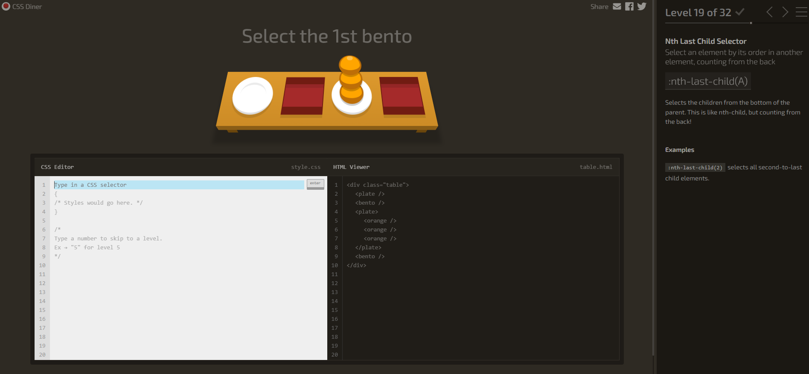

#### Huiswerk:

Ik ben verder gegaan met het ontwikkelen van mijn HTML-pagina die ik in de voorbereidingen heb gemaakt. Ik heb deze met CSS leesbaarder en duidelijker gemaakt. Ik heb hierbij vooral gewerkt aan de leesbaarheid, witruimte en hiërarchie. Zo heb ik onder andere de tekstbreedte, lettertypes, tekstgroottes en ruimtes tussen verschillende elementen aangepast.

Een belangrijk onderdeel dat ik uit deze opdracht heb meegenomen zijn custom properties. Ik begrijp nu eindelijk goed hoe ik ze moet maken en waarom ze zo handig zijn. In plaats van steeds dezelfde waarde op verschillende plekken individueel aan te passen, kun je deze op één plek veranderen en wordt het overal toegepast. Hier heb ik tijdens deze opdracht dan ook veel gebruik van gemaakt door bijvoorbeeld een custom property van kleur te maken die ik op meerdere plekken heb toegevoegd in de pagina, of voor witruimtes.

Ook heb ik gewerkt met calc() en clamp(). Vooral clamp() vond ik nog wat lastig, maar ik begrijp nu beter waarvoor het gebruikt wordt. Als laatste heb ik interactie toegevoegd met onder andere :hover en :focus en een formulier toegevoegd.

Ik heb vooral geleerd dat CSS niet alleen gaat om een website mooier maken, maar ook om ervoor te zorgen dat een pagina duidelijk, consistent en prettig te gebruiken is.

Mijn uiteindelijke HTML-Pagina:
https://codepen.io/editor/Rianne-Maria/pen/01a067cf-330c-79e7-a191-3e2bded8e517

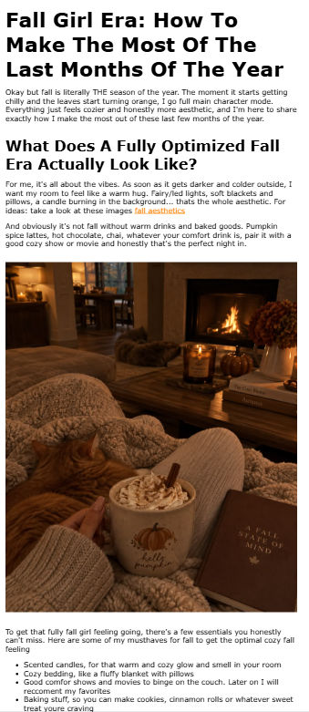
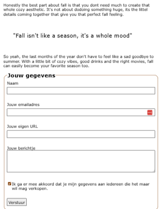

<strong>Fonts met kleur en effecten</strong>

#### Voorbereidingen:

Voor de deepdive heb ik eerst verschillende teksten gelezen over het gebruiken van lettertypes op websites. Hieruit heb ik vooral geleerd dat er verschillende manieren zijn om fonts te gebruiken en dat de keuze die je maakt ook invloed kan hebben op de snelheid en betrouwbaarheid van je website.

Ik heb geleerd dat web-safe fonts makkelijk te gebruiken zijn, omdat deze al op veel apparaten aanwezig zijn. Van vorig jaar wist ik al hoe je font-families kunt stacken. Hierbij zet je meerdere fonts achter elkaar, zodat de browser een ander font kan gebruiken wanneer de eerste niet beschikbaar is.

Een belangrijk ding dat ik heb meegenomen is dat je beter geen externe webfont-services, zoals Google Fonts of Adobe Fonts, kunt gebruiken voor deze opdracht. Deze kunnen onder andere extra laadtijd veroorzaken. Dit was wel handig om te weten want voorheen gebruikte ik dit wel altijd. In plaats daarvan heb ik geleerd hoe ik met @font-face zelf font-bestanden aan mijn website kan toevoegen.

##### Oefening 1 – @font-face

Met deze informatie ben ik begonnen aan oefening 1. Ik heb deze oefening eerst helemaal zelf gemaakt zonder naar het antwoord te kijken, zodat ik kon testen hoeveel ik van de voorbereiding had begrepen en zelf kon toepassen.

Na het nakijken merkte ik dat ik nog automatisch pixels (px) gebruik voor font-size, terwijl in het antwoord em werd gebruikt. Dit is iets wat ik mezelf nog moet aanleren, omdat ik em eigenlijk nooit eerder heb gebruikt. Ook was ik vergeten om een fallback font achter mijn eigen font te zetten.

Daarnaast had ik geen font-style en font-display gebruikt. Ik weet op dit moment nog niet helemaal goed wanneer ik deze moet gebruiken en welke waarde ik dan moet kiezen. Dit is dus iets waar ik tijdens de volgende oefeningen nog extra op wil letten.

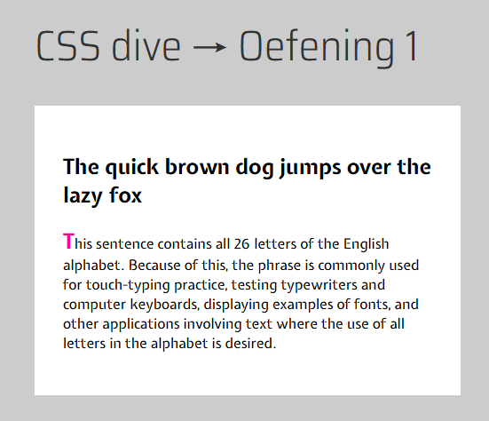
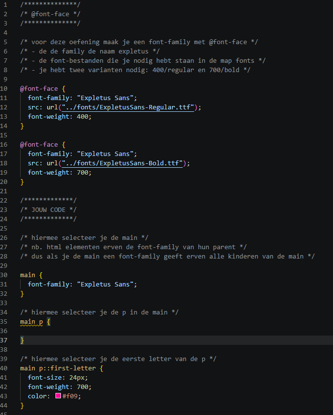

#### Huiswerk:

##### Oefening 2 – Fonts, kleur en effecten

Bij oefening 2 moest ik twee voorbeelden zo goed mogelijk namaken met CSS. Hierbij heb ik vooral gebruikgemaakt van de tips en CSS-code die al bij de oefening stonden en ben ik vanuit daar verder gaan werken.

Uit de theorie heb ik meegenomen hoe je met @font-face zelf fonts inlaadt en hoe belangrijk het is om daarbij goed met font-family, font-weight en verschillende fontvarianten te werken. Ook heb ik deze keer bewust geprobeerd om em te gebruiken in plaats van px bij de font-size. Dit ging voor mijn gevoel best goed en ik begin steeds beter te begrijpen hoe ik hiermee moet werken.

Voor de text-shadow moest ik nog wel even opzoeken hoe ik deze precies moest opbouwen, omdat ik dat alweer een beetje vergeten was. De letter-spacing heb ik vooral op gevoel aangepast om het zo dicht mogelijk op het voorbeeld te laten lijken.

Wat ik nog beter had kunnen doen is mijn @font-face completer opbouwen, bijvoorbeeld met font-style, en een fallback font toevoegen. Ook wil ik beter leren welke waardes en eenheden ik het beste kan gebruiken in plaats van deze vooral op gevoel te bepalen.

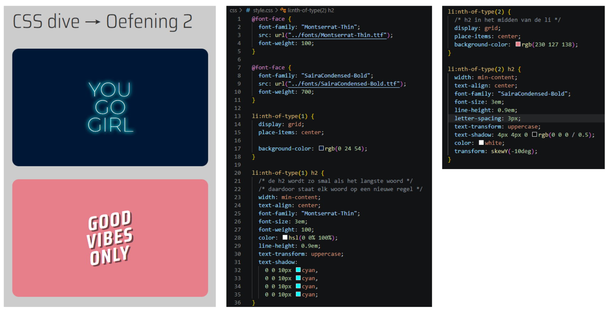

##### Oefening 3 – Fonts, kleur en effecten

<strong>Myst</strong>

Voor oefening 3 mocht ik zelf een aantal voorbeelden uitkiezen om na te maken. Ik ben begonnen met Myst, omdat dit een van de makkelijkere voorbeelden was en ik eerst even in de opdracht wilde komen. Ik heb de CSS-tips uit de opdracht aangehouden en gewerkt met onder andere text-transform en text-shadow. Door de vorige oefening wist ik nu al beter hoe een shadow was opgebouwd, waardoor ik deze dit keer zelf kon maken zonder het op te zoeken. Dit ging eigenlijk best goed, dus daarna wilde ik mezelf wat meer uitdagen.

<strong>Puff</strong>

Daarna ben ik naar een wat moeilijker voorbeeld gegaan en heb ik Puff gekozen. Hierbij heb ik opnieuw het font met @font-face toegevoegd en vanuit de CSS-tips gewerkt. De groene rand om de letters en de gele/groene glow vond ik een stuk lastiger. Ik wist nog niet hoe ik zo'n dikke rand om tekst kon maken en hoe ik het kleurverloop op de achtergrond moest aanpakken. Hiervoor heb ik opgezocht hoe -webkit-text-stroke en een radial-gradient werken. Uiteindelijk kreeg ik het effect redelijk goed nagemaakt. Hierdoor heb ik vooral geleerd dat je met CSS veel verder kunt gaan met tekst dan alleen een kleur, font en shadow.

<strong>Bananas</strong>

Omdat ik Puff nog best lastig vond, wilde ik nog een voorbeeld uit dezelfde categorie proberen. Hiervoor koos ik Bananas omdat toen ik die zag, ik geen idee had hoe ik die moest gaan maken. Ik heb eerst zoveel mogelijk zelf geprobeerd en de gegeven CSS-tips gebruikt als richting. Zo heb ik gewerkt met een background-image, background-size, border, border-radius, letter-spacing en rotate. Het lastigste vond ik het maken van de twee kleuren in het ovale vlak achter de tekst. Ik wist niet hoe ik dit moest aanpakken en heb daarom opgezocht hoe een linear-gradient werkt. De rest heb ik zoveel mogelijk zelf gemaakt.

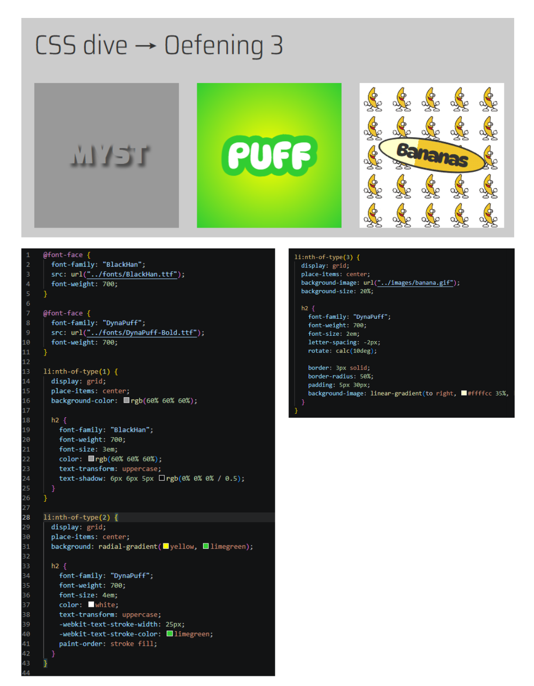

Bij deze drie oefeningen merkte ik vooral dat ik de theorie over fonts, font-weights en @font-face steeds makkelijker begin toe te passen. Ook begin ik beter te begrijpen hoe verschillende CSS-effecten gecombineerd kunnen worden om uiteindelijk een compleet ontwerp na te maken.

##### Oefening 4 – Transitions

Bij oefening 4 moest ik verder met de blokjes van oefening 3 en hier transitions aan toevoegen die zichtbaar worden wanneer je eroverheen hovert. Met transitions heb ik in het eerste jaar al best veel gewerkt, dus ik wist nog goed hoe ik dit moest aanpakken.

Ik heb daarom zelf twee verschillende effecten gemaakt. Bij de ene verandert onder andere de grootte en kleur wanneer je eroverheen hovert en bij de andere laat ik de tekst draaien. Met transition heb ik ervoor gezorgd dat deze veranderingen niet in één keer gebeuren, maar vloeiend worden uitgevoerd.

Deze oefening was voor mij vooral een goede herhaling. Ik wist nog dat transitions handig zijn om feedback te geven op een interactie. Een gebruiker kan hierdoor bijvoorbeeld duidelijker zien dat iets klikbaar of interactief is. Het kan een website daarnaast wat levendiger maken, zolang je de effecten niet te veel gebruikt.

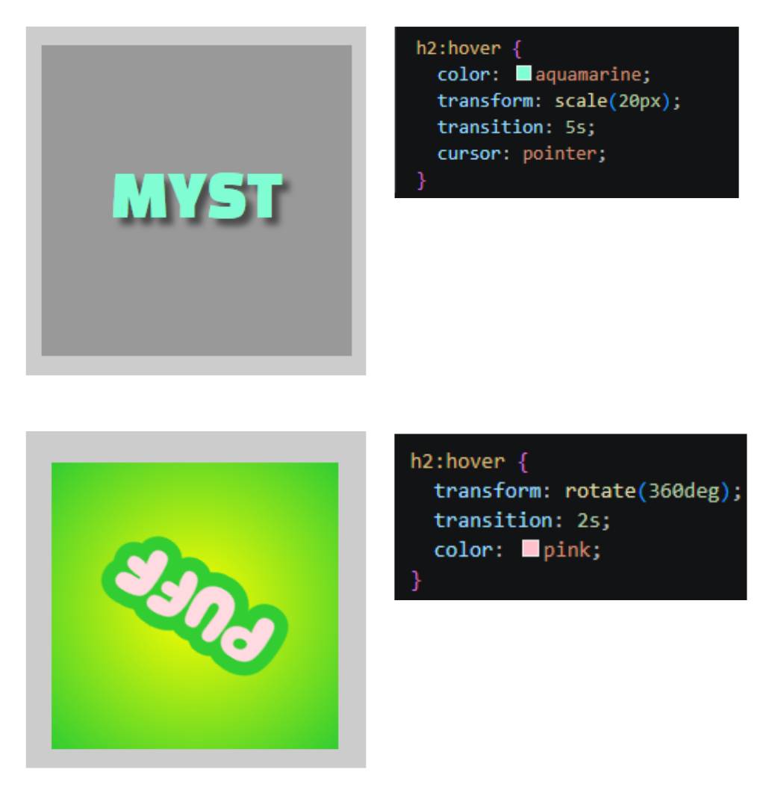

### 2 sept - Deepdives

<strong>HTML & CSS Basics</strong>

Voorbereidende vragen:

1. Hoe weet ik wanneer iets in HTML hoort en wanneer ik CSS moet gebruiken?
   -> HTML gebruik je voor de inhoud, structuur en betekenis van een website. Hiermee geef je bijvoorbeeld aan wat een titel, paragraaf, afbeelding, link of lijst is. CSS gebruik je daarna om te bepalen hoe deze onderdelen eruitzien, bijvoorbeeld de kleur, grootte, het lettertype, de achtergrond en de positie.

2. Wanneer gebruik je px en wanneer is het beter om em te gebruiken?
   -> px is handig wanneer je een vaste en specifieke grootte wilt instellen. em is vooral handig wanneer je wilt dat de grootte van een element meeschaalt met de tekstgrootte.
   Dit is bijvoorbeeld handig bij titels. Als je wilt dat een titel altijd twee keer zo groot is als de normale tekst, kun je 2em gebruiken. Wanneer je later de normale tekst groter of kleiner maakt, verandert de titel automatisch mee.

3. Wanneer is het handig om meerdere stylesheets te gebruiken in plaats van alles in één CSS-bestand te zetten?
   -> Bij een kleine website is het vaak overzichtelijk om alle CSS in één stylesheet te bewaren. Wanneer een website groter wordt en verschillende soorten pagina's heeft, kunnen meerdere stylesheets handig zijn om de code overzichtelijk te houden.

   Je kunt bijvoorbeeld een styles.css gebruiken voor de algemene vormgeving van de hele website en daarnaast een product.css voor alleen productpagina's en een blog.css voor blogpagina's.
   

### 31 aug - Kickoff

<strong>Checkout</strong>

1. Leg uit wat een source hosting platform is en voor welke jij gekozen hebt.
   Een source hosting platform is een plek waar je de code van je website online kunt opslaan en beheren. Ik heb gekozen voor GitHub.

2. Vertel welke domeinnaam jij gekozen hebt en hoe je die hebt gekoppeld aan jouw pagina.
   Ik heb mijn eigebn domeinnaam "yanaarchives.nl" gekozen en heb deze gekoppeld aan GitHub door de DNS-records van mijn domein aan te passen zoals de ip adressen.

3. Beschrijf hoe je aanpassingen aan jouw pagina kunt maken en hoe je ervoor zorgt dat die op het web gepubliceerd worden.
   Ik pas mijn website aan in VSCodium. Daarna commit ik mijn wijzigingen en sync ik ze naar GitHub. Die publiceert de nieuwe aanpassingen vervolgens op mijn website.

Een fork van de model repository gemaakt en gepubliceerd via mijn eigen Github omgeving.

